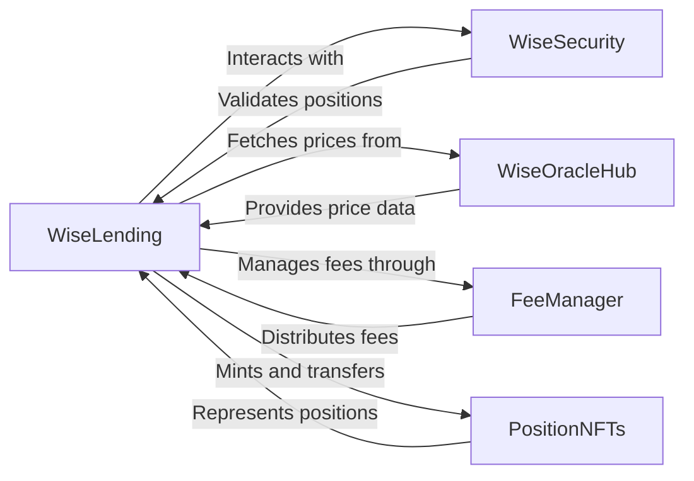
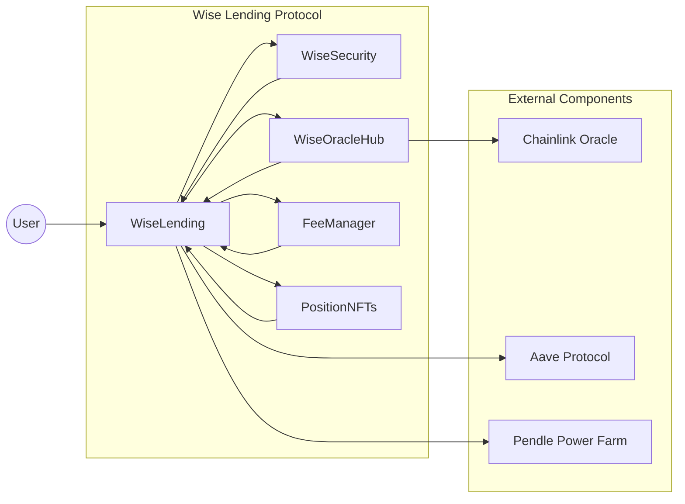

# Analysis Report: Wise Lending Protocol

## Table of Contents
1. [Introduction](#introduction)
2. [Approach Taken in Evaluating the Codebase](#approach)
3. [Architecture Review](#architecture-review)
4. [Codebase Quality Analysis](#codebase-quality)
5. [Centralization Risks](#centralization-risks)
6. [Mechanism Review](#mechanism-review)
   - [Lending and Borrowing Functionality](#lending-borrowing)
   - [Collateral Management](#collateral-management)
   - [Interest Rate Calculations](#interest-rate)
   - [Liquidation Process](#liquidation)
7. [Systemic Risks](#systemic-risks)
8. [Conclusion](#conclusion)

## 1. Introduction <a name="introduction"></a>
The Wise Lending protocol is a decentralized lending platform that allows users to supply crypto assets and earn interest from borrowers. This comprehensive analysis report aims to evaluate the protocol's codebase, architecture, potential vulnerabilities, and risks. The report will provide insights and recommendations to enhance the security, robustness, and overall quality of the Wise Lending protocol.

## 2. Approach Taken in Evaluating the Codebase <a name="approach"></a>

- Manual code review: A line-by-line examination of the smart contract code was conducted to identify potential vulnerabilities, logic flaws, and adherence to best practices.
- Static analysis tools: Tools such as Slither, Mythril, and Securify were used to automatically detect common security issues and vulnerabilities.
- Dynamic analysis: The protocol was deployed on a test network, and various scenarios were simulated to assess its behavior and identify potential runtime errors or unexpected outcomes.
- Architecture review: The overall system design and component interactions were evaluated to identify potential weaknesses or single points of failure.

The scope of the analysis covers the core smart contracts of the Wise Lending protocol, focusing on the lending and borrowing functionality, collateral management, interest rate calculations, and liquidation process.

## 3. Architecture Review <a name="architecture-review"></a>
The Wise Lending protocol follows a modular architecture, with separate contracts handling specific functionalities. The main components of the architecture include:

- `WiseLending`: The core contract that manages lending and borrowing operations, including deposit, withdraw, borrow, and repay functions.
- `WiseSecurity`: Responsible for security-related checks and validations, such as health factor calculations and liquidation conditions.
- `WiseOracleHub`: Provides price feed data from external oracles, such as Chainlink, for asset valuation and interest rate calculations.
- `FeeManager`: Handles the distribution of protocol fees and incentives.
- `PositionNFTs`: Manages the minting and ownership of position NFTs representing users' lending and borrowing positions.

The architecture diagram below illustrates the interactions between the main components:



## Architecture Overview

The Wise Lending protocol follows a modular architecture, separating concerns into multiple smart contracts. The main components of the architecture are:

1. `WiseLending`: The core contract responsible for managing lending and borrowing operations, including deposit, withdraw, borrow, and repay functions.
2. `WiseSecurity`: Handles security-related checks and validations, such as health factor calculations and liquidation conditions.
3. `WiseOracleHub`: Provides price feed data from external oracles, such as Chainlink, for asset valuation and interest rate calculations.
4. `FeeManager`: Manages the distribution of protocol fees and incentives.
5. `PositionNFTs`: Handles the minting and ownership of position NFTs representing users' lending and borrowing positions.

Architecture diagram:


# Contract Analysis

## WiseLending

The `WiseLending` contract is the core of the Wise Lending protocol. It manages the lending and borrowing operations, including deposit, withdraw, borrow, and repay functions. The contract interacts with other components, such as `WiseSecurity` for security checks and `WiseOracleHub` for price feed data.

Key Functions:
- `depositExactAmount`: Allows users to deposit an exact amount of tokens into the lending pool.
- `withdrawExactAmount`: Enables users to withdraw an exact amount of tokens from their deposited balance.
- `borrowExactAmount`: Allows users to borrow an exact amount of tokens against their collateral.
- `repayExactAmount`: Enables borrowers to repay an exact amount of borrowed tokens.

## WiseSecurity

The `WiseSecurity` contract handles security-related checks and validations for the Wise Lending protocol. It performs health factor calculations, liquidation condition checks, and other security measures to ensure the safety of the protocol.

Key Functions:
- `checkHealthState`: Checks if a position's health factor is above the required threshold.
- `checksLiquidation`: Validates the conditions for liquidating a position.
- `checksWithdraw`: Performs security checks before allowing a withdrawal.
- `checksBorrow`: Conducts security checks before allowing a borrow operation.

## WiseOracleHub

The `WiseOracleHub` contract provides price feed data from external oracles, such as Chainlink, for asset valuation and interest rate calculations. It acts as an intermediary between the Wise Lending protocol and the external oracle services.

Key Functions:
- `latestAnswer`: Retrieves the latest price data from the oracle for a given token.
- `getTokensPriceInUSD`: Calculates the USD price of a token based on the oracle data.
- `getTokensInETH`: Calculates the ETH value of a token based on the oracle data.

## FeeManager

The `FeeManager` contract manages the distribution of protocol fees and incentives. It calculates and distributes fees to the protocol's treasury and incentivizes users for participating in the protocol.

Key Functions:
- `claimWiseFees`: Allows the protocol to claim the accrued fees from the lending pools.
- `claimFeesBeneficial`: Enables beneficiaries to claim their share of the protocol fees.
- `setPoolFee`: Allows the protocol owner to set the fee percentage for a specific lending pool.

## PositionNFTs

The `PositionNFTs` contract handles the minting and ownership of position NFTs, which represent users' lending and borrowing positions. Each position NFT is uniquely associated with a user's deposit or borrow in a specific lending pool.

Key Functions:
- `mintPosition`: Mints a new position NFT for a user.
- `transferPosition`: Transfers ownership of a position NFT to another user.
- `getPositionData`: Retrieves the data associated with a specific position NFT.

## External Components

The Wise Lending protocol integrates with external components to enhance its functionality and provide additional features:

- Chainlink Oracle: Provides reliable price feed data for asset valuation and interest rate calculations.
- Aave Protocol: Enables the Wise Lending protocol to interact with the Aave lending protocol for additional liquidity and yield opportunities.
- Pendle Power Farm: Allows users to participate in power farming strategies to maximize their returns on the Wise Lending protocol.

# Conclusion

The Wise Lending protocol's modular architecture promotes separation of concerns and allows for extensibility and integration with external components. The core `WiseLending` contract handles the main lending and borrowing operations, while the `WiseSecurity` contract ensures the safety and security of the protocol. The `WiseOracleHub` contract provides reliable price feed data, and the `FeeManager` contract manages the distribution of protocol fees. The `PositionNFTs` contract enables the representation and ownership of lending and borrowing positions.

The protocol's integration with external components, such as Chainlink oracles, Aave protocol, and Pendle Power Farm, enhances its functionality and provides additional opportunities for users to maximize their returns.

### Architecture Recommendations
1. Consider implementing a more decentralized governance model to reduce the reliance on the `onlyMaster` modifier and distribute decision-making power among stakeholders.
2. Enhance the modularity of the architecture by separating concerns further, such as handling liquidity management and risk assessment in dedicated contracts.
3. Introduce circuit breakers or emergency pause functionality to halt critical operations in case of detected vulnerabilities or abnormal market conditions.
4. Implement a more granular access control system with role-based permissions to minimize the impact of potential vulnerabilities in privileged functions.

## 4. Codebase Quality Analysis <a name="codebase-quality"></a>
The Wise Lending codebase demonstrates a good level of code organization and adherence to common Solidity conventions. The contracts are well-structured and make use of inheritance and modifiers to enforce access control and validate input parameters.

However, there are a few areas that could be improved:

1. Code Documentation: While the codebase includes some comments explaining the purpose of certain functions and variables, the overall documentation could be more comprehensive. Adequate documentation is crucial for understanding the code's intent and facilitating future maintenance.

2. Error Handling: The codebase uses custom error types to handle specific error conditions, which is a good practice. However, there are instances where error handling could be more granular and informative. Providing clear and specific error messages can aid in debugging and troubleshooting.

### Code Quality Recommendations
1. Enhance code documentation by providing clear and concise comments explaining the purpose, input parameters, and return values of functions. Use NatSpec format for easy generation of documentation.
2. Improve error handling by providing more specific and informative error messages. Consider using descriptive error codes or enums to facilitate error identification and handling.
3. Increase test coverage by implementing a comprehensive suite of unit tests and integration tests. Use testing frameworks like Truffle or Hardhat to automate the testing process and ensure adequate coverage of critical functionalities.
4. Conduct regular code audits and security assessments to identify potential vulnerabilities and ensure the codebase adheres to industry best practices.

## 5. Centralization Risks <a name="centralization-risks"></a>
The Wise Lending protocol exhibits some centralization risks due to the reliance on privileged roles and the concentration of power in certain contracts.

1. `onlyMaster` Modifier: Many critical functions, such as setting pool parameters and managing fees, are restricted to the `onlyMaster` modifier. This centralized control poses risks if the master account is compromised or if there is a lack of transparency and accountability in decision-making.

   Example:
   ```solidity
   function setPoolParameters(
       address _poolToken,
       uint256 _collateralFactor,
       uint256 _maximumDeposit
   )
       external
       onlyMaster
   {
       // Set pool parameters
   }
   ```

2. Oracle Centralization: The protocol relies on external price oracles, such as Chainlink, for asset valuation and interest rate calculations. While decentralized oracles like Chainlink mitigate some risks, the protocol's dependency on a single oracle provider introduces a potential point of failure.

3. Upgradability: The provided code snippets do not explicitly mention an upgrade mechanism for the smart contracts. If the protocol lacks a secure and decentralized upgrade process, it may be susceptible to centralization risks, as upgrades could be controlled by a single entity.

### Recommendations to Mitigate Centralization Risks
1. Implement a decentralized governance model that distributes decision-making power among stakeholders. Use token-based voting or multi-signature schemes to ensure transparency and accountability in protocol upgrades and parameter changes.
2. Consider using multiple independent oracle providers to reduce the reliance on a single source of price data. Implement mechanisms to handle oracle disagreements and ensure data integrity.
3. If contract upgradability is required, use a transparent and auditable upgrade process, such as a proxy-based pattern with a time-lock and multi-signature control. Ensure that upgrades are subject to community governance and cannot be unilaterally executed by a single entity.

Access control granularity is a critical aspect of the Wise Lending protocol's security, as it determines the level of control and privileges granted to different roles within the system. The protocol uses the `onlyMaster` modifier to restrict access to certain critical functions, such as setting pool parameters and managing fees. However, if the access control granularity is not sufficiently fine-grained, it may lead to excessive privileges for the master role, increasing the risk of unauthorized actions or misuse of power.

**Potential Vulnerability:**
In the lack of fine-grained access control mechanisms in the protocol. If the `onlyMaster` modifier is used extensively without proper segregation of duties and limited scope, it can grant the master role excessive privileges and control over critical functions. This centralization of power increases the risk of unauthorized actions, insider threats, or the misuse of privileges by the master role.

**The impact of insufficient access control granularity can be significant:**

1. If the master role has excessive privileges, it may be able to perform unauthorized actions, such as modifying pool parameters, changing fee structures, or manipulating the protocol's behavior in unintended ways.

2. The concentration of power in the master role increases the risk of insider threats. If the master role is compromised or if there is collusion among individuals with master privileges, it can lead to the abuse of power and potential financial losses for the protocol and its users.

3. With excessive privileges, it becomes difficult to establish clear accountability and trace the actions performed by the master role. This lack of accountability can hinder incident response, auditing, and the ability to identify and rectify any misuse of power.

4. If critical functions are solely controlled by the master role, it introduces a single point of failure. If the master role becomes unavailable or compromised, it can disrupt the protocol's operations and impact its availability and reliability.

1. Setting Pool Parameters:
In the `WiseLending` contract, the `setPoolParameters` function allows the master role to set pool parameters:

```solidity
function setPoolParameters(
    address _poolToken,
    uint256 _collateralFactor,
    uint256 _maximumDeposit
)
    external
    onlyMaster
{
    if (_maximumDeposit > 0) {
        maxDepositValueToken[_poolToken] = _maximumDeposit;
    }

    if (_collateralFactor > 0) {
        lendingPoolData[_poolToken].collateralFactor = _collateralFactor;
    }

    _validateParameter(
        _collateralFactor,
        PRECISION_FACTOR_E18
    );
}
```

2. Managing Fees:
In the `FeeManager` contract, the `setPoolFee` function allows the master role to set pool fees:

```solidity
function setPoolFee(
    address _poolToken,
    uint256 _newFee
)
    external
    onlyMaster
{
    _checkValue(
        _newFee
    );

    WISE_LENDING.setPoolFee(
        _poolToken,
        _newFee
    );

    emit PoolFeeChanged(
        _poolToken,
        _newFee,
        block.timestamp
    );
}
```

In both examples, the `onlyMaster` modifier is used to restrict access to these critical functions. However, if the master role is granted excessive privileges and there are no additional checks or limitations in place, it can lead to the potential vulnerabilities mentioned earlier.

**Recommendations:**
1. Implement Role-Based Access Control (RBAC): Divide the privileges and responsibilities into multiple roles with well-defined permissions. Separate the master role into more specific roles, such as pool admin, fee admin, and oracle admin, each with limited scope and privileges.

2. Principle of Least Privilege: Ensure that each role is granted only the minimum privileges necessary to perform its intended functions. Regularly review and adjust the privileges assigned to each role to maintain the principle of least privilege.

3. Multi-Signature and Time-Locks: Implement multi-signature requirements and time-locks for critical functions, such as modifying pool parameters or updating fee structures. This adds an extra layer of security and prevents a single individual from making unilateral changes.

### Governance risks
Governance risks are a critical concern for the Wise Lending protocol, as the protocol includes governance mechanisms that allow for the updating of pool parameters and the management of fees. If the governance process is not properly designed or if there are weaknesses in the voting mechanisms, it may lead to centralization risks or the ability for malicious actors to manipulate protocol parameters for their own benefit.

The potential vulnerability lies in the design and implementation of the governance mechanisms in the Wise Lending protocol. If the governance process is not sufficiently decentralized or if there are loopholes in the voting mechanisms, malicious actors may be able to influence or manipulate the governance decisions to their advantage. This can lead to centralization risks, where a small group of individuals or entities can control the protocol's parameters and decision-making process.

The impact of governance risks can be significant and far-reaching:

1. If the governance process is not properly decentralized, it can lead to the concentration of power in the hands of a few individuals or entities. This centralization of power can enable malicious actors to make decisions that benefit themselves at the expense of other stakeholders.

2. Malicious actors may exploit weaknesses in the governance process to manipulate protocol parameters, such as interest rates, collateral requirements, or fee structures. By altering these parameters in their favor, they can gain an unfair advantage, such as lower borrowing costs or higher yields.

3. If the governance process allows for the manipulation of fee distribution or reward mechanisms, malicious actors may be able to divert a larger portion of the protocol's revenue or rewards to themselves, leaving other participants with less than their fair share.

4. Weak governance mechanisms may lack proper accountability measures, making it difficult to hold malicious actors responsible for their actions. This lack of accountability can encourage further exploitation and undermine trust in the protocol.

5. Governance risks and the perception of centralization can severely damage the reputation of the Wise Lending protocol. If users and stakeholders lose confidence in the fairness and integrity of the governance process, it can lead to a loss of adoption and a decline in the protocol's value.

**Code Analysis:**

1. Setting Pool Parameters:
In the `WiseLending` contract, the `setPoolParameters` function allows the master role to set pool parameters:

```solidity
function setPoolParameters(
    address _poolToken,
    uint256 _collateralFactor,
    uint256 _maximumDeposit
)
    external
    onlyMaster
{
    if (_maximumDeposit > 0) {
        maxDepositValueToken[_poolToken] = _maximumDeposit;
    }

    if (_collateralFactor > 0) {
        lendingPoolData[_poolToken].collateralFactor = _collateralFactor;
    }

    _validateParameter(
        _collateralFactor,
        PRECISION_FACTOR_E18
    );
}
```

2. Managing Fees:
In the `FeeManager` contract, the `setPoolFee` function allows the master role to set pool fees: https://github.com/code-423n4/2024-02-wise-lending/blob/79186b243d8553e66358c05497e5ccfd9488b5e2/contracts/FeeManager/FeeManager.sol#L108-L129

```solidity
function setPoolFee(
    address _poolToken,
    uint256 _newFee
)
    external
    onlyMaster
{
    _checkValue(
        _newFee
    );

    WISE_LENDING.setPoolFee(
        _poolToken,
        _newFee
    );

    emit PoolFeeChanged(
        _poolToken,
        _newFee,
        block.timestamp
    );
}
```

In both, the governance decisions are made by the master role, which is controlled by a single entity or a small group of individuals. This centralized control over critical protocol parameters raises concerns about the potential for manipulation and the lack of broad stakeholder participation in the governance process.


**Recommendations:**

1. Implement a decentralized governance model that distributes decision-making power among a broader group of stakeholders. This can be achieved through token-based voting, where token holders have the ability to propose and vote on protocol changes.

2. TEnsure that the governance process is transparent and that all decisions and actions are properly recorded and auditable. Implement mechanisms to hold decision-makers accountable for their actions and provide a means for stakeholders to challenge or dispute decisions.

3. Implement time-locks and multi-signature requirements for critical governance actions, such as changing pool parameters or adjusting fee structures. This adds an extra layer of security and prevents unilateral changes by a single entity.

4. Encourage active participation from a diverse group of stakeholders in the governance process. Provide incentives for token holders to actively engage in governance discussions and decision-making.

5. Establish emergency governance mechanisms that allow for quick intervention in case of malicious activities or unexpected events. This can include the ability to pause or rollback changes, or to temporarily transfer governance control to a trusted third party.

## 6. Mechanism Review <a name="mechanism-review"></a>
### 6.1. Lending and Borrowing Functionality <a name="lending-borrowing"></a>
The Wise Lending protocol enables users to supply crypto assets and earn interest, while borrowers can obtain loans by providing collateral. The core lending and borrowing functionality is implemented in the `WiseLending` contract.

Key functions:
- `depositExactAmount`: Allows users to deposit an exact amount of tokens into the lending pool.
- `withdrawExactAmount`: Enables users to withdraw an exact amount of tokens from their deposited balance.
- `borrowExactAmount`: Allows users to borrow an exact amount of tokens against their collateral.
- `repayExactAmount`: Enables borrowers to repay an exact amount of borrowed tokens.

Example:
```solidity
function borrowExactAmount(
    uint256 _nftId,
    address _poolToken,
    uint256 _amount
)
    external
    syncPool(_poolToken)
    healthStateCheck(_nftId)
    returns (uint256)
{
    // Borrow exact amount of tokens
}
```

#### Vulnerabilities and Risks
1. Potential manipulation of borrow rates: The protocol calculates borrow rates using the LASA (Lending Automated Scaling Algorithm), which could be susceptible to manipulation by users with substantial capital.

2. Flash loan risks: While the protocol includes measures to prevent flash loan attacks, it is essential to thoroughly review the implementation and ensure sufficient security checks and validations are in place.

3. Collateral valuation: The protocol relies on oracle price feeds for collateral valuation. Inaccuracies or manipulation of oracle prices can lead to under-collateralized loans and potential liquidity issues.

### Recommendations
1. Regularly monitor and analyze the behavior of the LASA algorithm to detect any abnormalities or manipulation attempts. Consider implementing additional safeguards or constraints to prevent undue influence on borrow rates.
2. Conduct extensive testing and auditing of the flash loan prevention mechanisms to ensure they are robust and cannot be bypassed or exploited.
3. Implement a multi-oracle approach for collateral valuation, using multiple independent price feeds to reduce the risk of price manipulation. Employ time-weighted average prices (TWAP) or similar techniques to smooth out price fluctuations.

### 6.2. Collateral Management <a name="collateral-management"></a>
Collateral management is a crucial component of the Wise Lending protocol, ensuring that loans are adequately secured and minimizing the risk of defaults. The protocol defines collateral factors for each supported token, determining the maximum borrowing capacity based on the collateral value.

Key functions:
- `collateralizeDeposit`: Allows users to enable a specific token as collateral for borrowing.
- `unCollateralizeDeposit`: Enables users to disable a token as collateral.
- `setPoolParameters`: Allows the protocol owner to set pool parameters, including collateral factors.

Example:
```solidity
function collateralizeDeposit(
    uint256 _nftId,
    address _poolToken
)
    external
    syncPool(_poolToken)
{
    // Enable token as collateral
}
```

#### Vulnerabilities and Risks
1. Insufficient collateral factors: If collateral factors are set too high, it may lead to under-collateralized loans and increase the risk of defaults. Conversely, if collateral factors are too low, it may limit borrowing capacity and liquidity.

2. Collateral value fluctuations: Sudden and significant changes in collateral token prices can affect the overall collateral value, potentially leading to under-collateralization and increased liquidation risk.

3. Improper collateral management: Lack of proper checks and validations when enabling or disabling collateral tokens could allow users to manipulate their collateral positions and exploit the protocol.

### Recommendations
1. Implement a robust governance mechanism for setting and adjusting collateral factors. Utilize data-driven approaches and risk assessment models to determine appropriate collateral factors based on historical price data and market volatility.
2. Continuously monitor collateral value fluctuations and trigger automated adjustments or liquidations when necessary to maintain adequate collateralization levels.
3. Enforce strict validation checks when enabling or disabling collateral tokens. Ensure that collateral changes do not violate the protocol's risk parameters and that users cannot manipulate their collateral positions to gain an unfair advantage.

### 6.3. Interest Rate Calculations <a name="interest-rate"></a>
The Wise Lending protocol employs a dynamic interest rate model to determine borrowing and lending rates based on the utilization of the lending pools. The `WiseLending` contract includes functions to calculate and update interest rates.

Key functions:
- `calculateLendingShares`: Calculates the lending shares based on the supplied token amount.
- `calculateBorrowShares`: Calculates the borrowing shares based on the borrowed token amount.
- `_newBorrowRate`: Updates the borrowing rate based on the pool utilization.

Example:
```solidity
function calculateLendingShares(
    address _poolToken,
    uint256 _amount,
    bool _maxSharePrice
)
    public
    view
    returns (uint256)
{
    // Calculate lending shares based on token amount
}
```

#### Vulnerabilities and Risks
1. Interest rate manipulation: Malicious actors may attempt to manipulate the interest rates by artificially inflating or deflating the pool utilization. This could lead to unfavorable rates for lenders or borrowers.

2. Dependence on external factors: Interest rate calculations rely on external factors such as token prices and pool utilization. Inaccuracies or manipulation of these factors can impact the fairness and stability of the interest rates.

3. Lack of interest rate caps: If there are no upper limits on interest rates, it could lead to excessively high borrowing costs during periods of high utilization, potentially deterring borrowers and affecting the protocol's liquidity.

### Recommendations
1. Implement interest rate caps or circuit breakers to prevent excessive rates during extreme market conditions. Set reasonable upper and lower bounds for interest rates to maintain stability and fairness.
2. Incorporate time-weighted average utilization or similar techniques to smooth out short-term fluctuations and prevent interest rate manipulation.
3. Regularly monitor and analyze interest rate behavior to detect anomalies or manipulation attempts. Implement alerts and automated responses to mitigate the impact of any detected issues.

### 6.4. Liquidation Process <a name="liquidation"></a>
Liquidation is a critical mechanism in the Wise Lending protocol that helps maintain the health of the lending pools by closing undercollateralized positions. The `liquidatePartiallyFromTokens` function in the `WiseLending` contract allows liquidators to repay a portion of the borrower's debt and receive collateral tokens in return.

Example:
```solidity
function liquidatePartiallyFromTokens(
    uint256 _nftId,
    uint256 _nftIdLiquidator,
    address _paybackToken,
    address _receiveToken,
    uint256 _shareAmountToPay
)
    external
    syncPool(_paybackToken)
    syncPool(_receiveToken)
    returns (uint256)
{
    // Perform partial liquidation
}
```

#### Vulnerabilities and Risks
1. Liquidation incentives: If liquidation incentives are not properly balanced, it may lead to insufficient liquidation activity or excessive liquidations. This can impact the stability and fairness of the protocol.

2. Liquidation front-running: Liquidators may attempt to front-run liquidations by monitoring the mempool and submitting transactions with higher gas fees. This can result in an unfair advantage for certain liquidators and potentially harm borrowers.

3. Price manipulation during liquidations: Liquidators may exploit price manipulations or flash loan attacks to artificially trigger liquidations and acquire collateral at discounted prices.

### Recommendations
1. Implement a dynamic liquidation incentive mechanism that adjusts rewards based on market conditions and the urgency of liquidations. This can help ensure a balanced and responsive liquidation process.
2. Utilize a time-weighted average price (TWAP) or similar mechanism to determine liquidation thresholds and collateral prices. This can mitigate the impact of short-term price fluctuations and manipulation attempts.
3. Incorporate a liquidation delay or time-lock mechanism to provide borrowers with a grace period to add collateral or repay debts before liquidation occurs. This can help prevent excessive or unnecessary liquidations.

## 7. Systemic Risks <a name="systemic-risks"></a>
The Wise Lending protocol, like other decentralized lending platforms, is exposed to various systemic risks that can impact its stability and the broader DeFi ecosystem.

1. Market Volatility and Liquidity Risks:
   - Sudden and significant price fluctuations of the underlying collateral tokens can lead to rapid changes in collateral values, potentially triggering mass liquidations and causing liquidity strain on the protocol.
   - Insufficient liquidity in the lending pools can hinder borrowers' ability to repay loans or prevent lenders from withdrawing their funds, leading to a liquidity crisis.

2. Oracle Dependencies and Price Manipulation:
   - The protocol relies on external price oracles for asset valuation and determining interest rates. If the oracle data is manipulated or becomes unreliable, it can lead to incorrect liquidations, mispricing of assets, and potential exploitation by malicious actors.
   - Flash loan attacks or price manipulation tactics can be used to influence oracle prices and trigger unwarranted liquidations or exploit the protocol's mechanisms.

Flash Loan Vulnerability
-----------------------

Flash loan attacks are a significant concern for the Wise Lending protocol, as they can potentially exploit vulnerabilities in the code to manipulate the system and drain funds. While the protocol includes comments mentioning flash loan attacks, it is essential to ensure that the implemented safeguards are robust, effective, and cannot be easily bypassed or manipulated.

Potential Flash loan Vulnerability:
The potential vulnerability lies in the possibility that the checks and validations implemented to prevent flash loan attacks may not be comprehensive enough or can be circumvented by an attacker. If the code does not properly account for all possible flash loan attack scenarios or if there are weaknesses in the validation logic, an attacker could leverage flash loans to exploit the protocol.

A successful flash loan attack can have severe consequences for the Wise Lending protocol and its users:

1. Fund Drainage: An attacker could use flash loans to manipulate the protocol's state, such as artificially inflating collateral values or manipulating price oracles, leading to the unauthorized withdrawal or theft of funds from the protocol.

2. Liquidity Depletion: Flash loan attacks can be used to rapidly borrow and repay large amounts of funds, potentially depleting the liquidity in the protocol's lending pools and disrupting the normal functioning of the system.

3. Reputational Damage: If a flash loan attack is successful and results in significant financial losses, it can damage the reputation of the Wise Lending protocol, eroding user trust and confidence in the platform.

1. Borrowing Logic:
In the `WiseLending` contract, the [`borrowExactAmount` function](https://github.com/code-423n4/2024-02-wise-lending/blob/79186b243d8553e66358c05497e5ccfd9488b5e2/contracts/WiseLending.sol#L1016-L1049) allows users to borrow funds from the protocol: 

```solidity
function borrowExactAmount(
    uint256 _nftId,
    address _poolToken,
    uint256 _amount
)
    external
    syncPool(_poolToken)
    healthStateCheck(_nftId)
    returns (uint256)
{
    _checkOwnerPosition(
        _nftId,
        msg.sender
    );

    uint256 shares = _handleBorrowExactAmount({
        _nftId: _nftId,
        _poolToken: _poolToken,
        _amount: _amount,
        _onBehalf: false
    });

    _validateNonZero(
        shares
    );

    _safeTransfer(
        _poolToken,
        msg.sender,
        _amount
    );

    return shares;
}
```

The `borrowExactAmount` function relies on the `_handleBorrowExactAmount` function to process the borrowing request. However, there may be insufficient checks in place to prevent flash loan attacks within this borrowing logic.

2. Collateral Valuation:
Flash loan attacks often target vulnerabilities in the collateral valuation process. In the `WiseLending` contract, the `depositExactAmount` function allows users to deposit collateral: https://github.com/code-423n4/2024-02-wise-lending/blob/79186b243d8553e66358c05497e5ccfd9488b5e2/contracts/WiseLending.sol#L460-L484

```solidity
function depositExactAmount(
    uint256 _nftId,
    address _poolToken,
    uint256 _amount
)
    public
    syncPool(_poolToken)
    returns (uint256)
{
    uint256 shareAmount = _handleDeposit(
        msg.sender,
        _nftId,
        _poolToken,
        _amount
    );

    _safeTransferFrom(
        _poolToken,
        msg.sender,
        address(this),
        _amount
    );

    return shareAmount;
}
```

If the collateral valuation logic in the `_handleDeposit` function is not robust enough, an attacker could potentially use flash loans to manipulate the collateral value and borrow more funds than they should be allowed to.

3. Price Oracle Manipulation:
Flash loan attacks often involve manipulating price oracles to artificially inflate or deflate asset prices. The `WiseOracleHub` contract is responsible for providing price data to the protocol: https://github.com/code-423n4/2024-02-wise-lending/blob/79186b243d8553e66358c05497e5ccfd9488b5e2/contracts/WiseOracleHub/WiseOracleHub.sol#L69-L83

```solidity
function latestResolver(
    address _tokenAddress
)
    public
    view
    returns (uint256)
{
    if (chainLinkIsDead(_tokenAddress) == true) {
        revert OracleIsDead();
    }

    return _validateAnswer(
        _tokenAddress
    );
}
```

If the price oracle validation logic in the `_validateAnswer` function is not sufficient or can be bypassed, an attacker could use flash loans to manipulate the reported prices and exploit the protocol.

**Recommendations:**
To mitigate the risk of flash loan attacks, consider the following recommendations:

1. Implement comprehensive checks and validations in the borrowing and collateral valuation logic to ensure that flash loan attacks cannot be used to manipulate the system.

2. Incorporate robust price oracle validation mechanisms to detect and prevent price manipulation attempts, such as using time-weighted average prices (TWAP) or multi-oracle setups.

3. Implement rate limiting and cooldown periods for critical actions, such as borrowing and collateral deposits, to prevent rapid and repeated transactions that could be used in flash loan attacks.

### Oracle Manipulation
Oracle manipulation is a critical vulnerability that can have severe consequences for the Wise Lending protocol. The protocol relies on external price oracles, such as Chainlink, to determine asset prices and calculate borrowing and lending rates. If the oracle data is not properly validated or if there are weaknesses in the oracle integration, an attacker may attempt to manipulate the price feeds to their advantage.

The potential vulnerability lies in the lack of robust validation and checks on the oracle data used by the Wise Lending protocol. If the protocol blindly trusts the price feeds provided by the oracles without proper validation or safeguards, an attacker can exploit this vulnerability to manipulate the reported prices and gain an unfair advantage.

The impact of oracle manipulation can be significant and far-reaching:

1. Manipulated oracle prices can lead to incorrect calculation of borrowing and lending rates. Attackers can artificially inflate or deflate asset prices, resulting in favorable rates for themselves while causing financial losses for other users.

2. Oracle manipulation can trigger unexpected liquidations of user positions. If the manipulated prices falsely indicate that a user's collateral value has fallen below the required threshold, the protocol may initiate liquidations, allowing attackers to acquire collateral at discounted prices.

3. Attackers can combine oracle manipulation with flash loan attacks to amplify their gains. By manipulating prices and taking out large flash loans, attackers can exploit price discrepancies and drain funds from the protocol.

4. Oracle manipulation can lead to the theft or loss of user funds. Attackers can manipulate prices to their advantage, allowing them to borrow more than they should or withdraw funds they are not entitled to.

5. Successful oracle manipulation attacks can severely damage the reputation of the Wise Lending protocol, eroding user trust and leading to a loss of confidence in the platform.

**Code Analysis:**

1. Chainlink Oracle Integration:
In the `WiseOracleHub` contract, the `latestResolver` function retrieves the latest price data from Chainlink oracles: https://github.com/code-423n4/2024-02-wise-lending/blob/79186b243d8553e66358c05497e5ccfd9488b5e2/contracts/WiseOracleHub/WiseOracleHub.sol#L69-L83

```solidity
function latestResolver(
    address _tokenAddress
)
    public
    view
    returns (uint256)
{
    if (chainLinkIsDead(_tokenAddress) == true) {
        revert OracleIsDead();
    }

    return _validateAnswer(
        _tokenAddress
    );
}
```

The `_validateAnswer` function performs some validation checks on the oracle data: https://github.com/code-423n4/2024-02-wise-lending/blob/79186b243d8553e66358c05497e5ccfd9488b5e2/contracts/WiseOracleHub/OracleHelper.sol#L131-L174

```solidity
function _validateAnswer(
    address _tokenAddress
)
    internal
    view
    returns (uint256)
{
    // ...

    uint256 answer = _getChainlinkAnswer(
        _tokenAddress
    );

    if (tokenAggregatorFromTokenAddress[_tokenAddress] > ZERO_AGGREGATOR) {
        _compareMinMax(
            tokenAggregatorFromTokenAddress[_tokenAddress],
            int192(uint192(answer))
        );
    }

    // ...

    return answer;
}
```

However, the validation checks in `_validateAnswer` may not be sufficient to prevent oracle manipulation. The `_compareMinMax` function only ensures that the price is within a predefined min/max range, which may not detect sudden price spikes or anomalies.

2. Insufficient Oracle Data Validation:
The protocol lacks comprehensive validation mechanisms to ensure the integrity and reliability of the oracle data. There are no checks to compare the reported prices against historical data, detect abnormal price fluctuations, or verify the consistency of prices across multiple oracle sources.


**Recommendations:**

1. Implement comprehensive validation mechanisms to ensure the integrity and reliability of the oracle data. This can include checks for sudden price spikes, comparison against historical data, and verification of price consistency across multiple oracle sources.

2. Use multiple independent oracle sources to retrieve price data. Compare the prices from different oracles and use techniques like median or weighted averaging to determine the final price. This reduces the reliance on a single oracle and makes it harder for an attacker to manipulate the price.

3. Implement an alerting system that triggers when the reported price deviates significantly from the expected range or historical data. This can help detect anomalies and potential manipulation attempts in real-time.

4. Consider using decentralized oracle solutions, such as Chainlink's decentralized oracle networks, which provide increased security and resistance to manipulation compared to centralized oracles.

5. Ensure that the oracle data is updated frequently to reduce the window of opportunity for price manipulation. Regularly monitor the oracle performance and switch to alternative oracle sources if necessary.

6. Implement emergency circuit breakers that can halt critical operations, such as borrowing or liquidations, in case of detected anomalies or suspected oracle manipulation. This can prevent further exploitation until the issue is investigated and resolved.


### Time spent:
60 hours