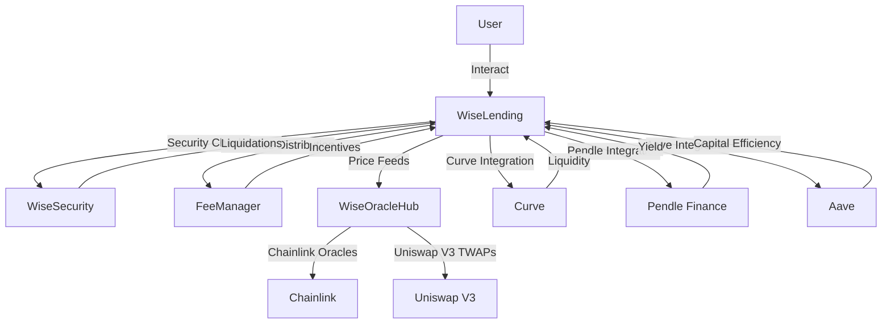

# Wise Lending Protocol - Smart Contract Security Analysis

## Table of Contents
1. [Introduction](#introduction)
2. [Approach](#approach)
3. [Critical Components Analysis](#critical-components-analysis)
   - [WiseLending Contract](#wiselending-contract)
   - [WiseSecurity Contract](#wisesecurity-contract)
   - [FeeManager Contract](#feemanager-contract)
   - [WiseOracleHub Contract](#wiseoraclehub-contract)
4. [Architecture Recommendations](#architecture-recommendations)
5. [Codebase Quality Analysis](#codebase-quality-analysis)
6. [Centralization Risks](#centralization-risks)
7. [Mechanism Review](#mechanism-review)
8. [Systemic Risks](#systemic-risks)
9. [Conclusion](#conclusion)

## Introduction <a name="introduction"></a>

The Wise Lending protocol is a decentralized liquidity market that allows users to supply crypto assets and earn a variable APY (Annual Percentage Yield) from borrowers. The protocol aims to optimize liquidity and minimize interest rate volatility by dynamically adjusting borrow rates using the LASA (Lending Automated Scaling Algorithm).

An overview of the key components and features of the Wise Lending protocol:

1. **Lending and Borrowing**: Users can supply various crypto assets to the protocol's lending pools and earn interest. Borrowers can take out loans by providing collateral and paying interest on the borrowed amount.

2. **Dynamic Borrow Rates**: The protocol utilizes the LASA mechanism to automatically adjust borrow rates based on the total lending share amount and its change over time. This helps optimize liquidity and minimize interest rate volatility.

3. **Collateralization**: Borrowers must provide collateral to secure their loans. The protocol enforces a collateral factor for each asset, determining the maximum amount that can be borrowed against the collateral.

4. **Liquidations**: If a borrower's collateral value falls below the required threshold, their position can be liquidated. Liquidators can purchase the collateral at a discount and repay a portion of the borrowed amount.

5. **Wise Oracle Hub**: The protocol relies on the Wise Oracle Hub for accurate and reliable price feeds. The oracle hub aggregates price data from multiple sources, including Chainlink oracles and Uniswap V3 TWAPs.

6. **Fee Distribution**: The protocol charges fees on borrowing and lending activities. These fees are distributed to the protocol's treasury, lenders, and the ecosystem's incentive mechanisms.

7. **Aave Integration**: The protocol integrates with Aave, a popular lending platform, to enhance capital efficiency. Users can deposit their assets into Aave and benefit from additional yield opportunities.

8. **Curve and Pendle Integration**: The protocol integrates with Curve, an AMM (Automated Market Maker) platform, and Pendle Finance, a yield tokenization protocol, to provide additional liquidity and yield generation options.

9. **Governance**: The protocol is governed by the WISE token holders, who can propose and vote on protocol upgrades, parameter changes, and fee adjustments.

10. **Security Features**: The protocol implements various security features, including thorough security audits, risk management mechanisms, and a bug bounty program to identify and address potential vulnerabilities.

The Wise Lending protocol aims to provide a secure, efficient, and user-friendly platform for lending and borrowing crypto assets while optimizing liquidity and minimizing interest rate volatility. By leveraging advanced algorithms, reliable oracles, and integrations with leading DeFi protocols, Wise Lending seeks to establish itself as a prominent player in the decentralized lending space.

## Approach <a name="approach"></a>

The approach taken to evaluate the Wise Lending protocol's codebase involves:

1. Identifying and prioritizing the most critical components of the protocol.
2. Performing an in-depth code review of the selected components, focusing on potential security vulnerabilities and best practices.
3. Analyzing the protocol's architecture and providing recommendations for improvement.
4. Assessing the codebase quality, centralization risks, and systemic risks.
5. Reviewing the protocol's mechanism and identifying potential attack vectors or weaknesses.

## Critical Components Analysis <a name="critical-components-analysis"></a>

### WiseLending Contract <a name="wiselending-contract"></a>

The `WiseLending` contract is the core of the Wise Lending protocol, handling key functionalities such as deposits, withdrawals, borrows, paybacks, and liquidations.

1. **Access Control**: The contract uses the `onlyAaveHub` and `onlyFeeManager` modifiers to restrict access to certain functions. However, it lacks a comprehensive role-based access control system, which could lead to potential vulnerabilities if the contract is extended or modified in the future.

2. **Reentrancy Risks**: The contract uses the `_checkReentrancy` function to prevent reentrancy attacks. However, it's important to ensure that all external calls are performed after internal state updates to minimize the risk of reentrancy vulnerabilities.

3. **Error Handling**: The contract uses custom errors, which is a good practice. However, some error messages could be more descriptive to aid in debugging and understanding the failure reasons.

4. **Liquidation Logic**: The `liquidatePartiallyFromTokens` function handles the liquidation of undercollateralized positions. It's crucial to thoroughly test this function to ensure that it behaves as expected and cannot be exploited by malicious actors.

### WiseSecurity Contract <a name="wisesecurity-contract"></a>

The `WiseSecurity` contract performs various security checks related to health state, withdrawals, borrows, collateral, and liquidations. 

1. **Oracle Dependency**: The contract relies on the `WiseOracleHub` for price feeds and token valuations. Any vulnerabilities or inaccuracies in the oracle could lead to incorrect calculations and potential security issues.

2. **Liquidation Thresholds**: The contract defines liquidation thresholds, such as `MAX_LIQUIDATION_50` and `BAD_DEBT_THRESHOLD`. It's important to carefully choose these thresholds and regularly monitor their effectiveness in maintaining the protocol's stability.

3. **Access Control**: The contract uses the `onlyWiseLending` modifier to restrict access to certain functions. Ensure that this access control is properly implemented and audited to prevent unauthorized access.

### FeeManager Contract <a name="feemanager-contract"></a>

The `FeeManager` contract handles fee distribution and manages incentive structures for the WISE ecosystem. 

1. **Access Control**: The contract uses the `onlyWiseSecurity` and `onlyWiseLending` modifiers to restrict access to certain functions. Ensure that these access controls are properly implemented and audited.

2. **Fee Calculation**: The contract calculates and distributes fees based on various factors, such as pool fees and incentives. It's crucial to thoroughly test the fee calculation logic to ensure that it behaves as expected and cannot be exploited by malicious actors.

3. **Bad Debt Management**: The contract tracks and manages bad debt for each position. Ensure that the bad debt calculation and management processes are secure and cannot be manipulated by external actors.

### WiseOracleHub Contract <a name="wiseoraclehub-contract"></a>

The `WiseOracleHub` contract provides price feeds and oracle functionality for the Wise Lending protocol. 

1. **Oracle Security**: The contract relies on external price feeds, such as Chainlink oracles, for token valuations. It's crucial to ensure that these oracles are secure, reliable, and resistant to manipulation.

2. **Price Feed Aggregation**: The contract aggregates price feeds from multiple sources, including Chainlink and Uniswap V3 TWAPs. Ensure that the aggregation logic is robust and cannot be exploited by attackers to provide misleading price information.

3. **Access Control**: The contract uses the `onlyMaster` modifier to restrict access to certain functions, such as adding or updating price feeds. Ensure that the `master` role is properly secured and controlled to prevent unauthorized changes to the oracle configuration.

## Architecture Recommendations <a name="architecture-recommendations"></a>

Based on the analysis of the Wise Lending protocol's architecture, 

1. **Modularization**: Consider further modularizing the codebase to improve readability, maintainability, and upgradability. This can be achieved by separating concerns and creating smaller, focused contracts for specific functionalities.

2. **Access Control**: Implement a more granular and role-based access control system to ensure that only authorized entities can perform specific actions within the protocol. This can help prevent unauthorized access and limit the potential impact of vulnerabilities.

3. **Upgrade Mechanism**: Implement a robust upgrade mechanism, such as using proxies or the diamond pattern, to allow for seamless upgrades of the protocol's contracts. This can help address potential vulnerabilities and adapt to changing market conditions without disrupting the user experience.

4. **Emergency Pause**: Consider implementing an emergency pause functionality that allows designated administrators to halt critical protocol operations in case of a security incident or unexpected behavior. This can help mitigate potential losses and provide time for investigation and remediation.

## Codebase Quality Analysis <a name="codebase-quality-analysis"></a>

The Wise Lending protocol's codebase demonstrates several good practices, such as the use of custom errors, modifiers for access control, and a modular contract structure. However, there are some areas for improvement:

1. **Documentation**: Enhance the codebase documentation by providing more detailed comments and explanations for complex functions and mechanisms. This can help developers and auditors better understand the codebase and reduce the risk of misinterpretation or errors.

2. **Code Duplication**: Identify and refactor duplicated code segments to improve maintainability and reduce the risk of inconsistencies. Consider extracting common functionalities into libraries or base contracts.

3. **Test Coverage**: Ensure comprehensive test coverage for all critical components and edge cases. This can help identify potential vulnerabilities and ensure the protocol behaves as expected under various scenarios.

## Files in Scope

[WiseLending.sol](https://github.com/code-423n4/2024-02-wise-lending/blob/main/contracts/WiseLending.sol)

[WiseSecurity.sol](https://github.com/code-423n4/2024-02-wise-lending/blob/main/contracts/WiseSecurity/WiseSecurity.sol)

[MainHelper.sol](https://github.com/code-423n4/2024-02-wise-lending/blob/main/contracts/MainHelper.sol)

[WiseSecurityHelper.sol](https://github.com/code-423n4/2024-02-wise-lending/blob/main/contracts/WiseSecurity/WiseSecurityHelper.sol)

[PendlePowerFarmToken.sol](https://github.com/code-423n4/2024-02-wise-lending/blob/main/contracts/PowerFarms/PendlePowerFarmController/PendlePowerFarmToken.sol)

[FeeManager.sol](https://github.com/code-423n4/2024-02-wise-lending/blob/main/contracts/FeeManager/FeeManager.sol)

[PendlePowerFarmLeverageLogic.sol](https://github.com/code-423n4/2024-02-wise-lending/blob/main/contracts/PowerFarms/PendlePowerFarm/PendlePowerFarmLeverageLogic.sol)

[OracleHelper.sol](https://github.com/code-423n4/2024-02-wise-lending/blob/main/contracts/WiseOracleHub/OracleHelper.sol)

[PendlePowerFarmController.sol](https://github.com/code-423n4/2024-02-wise-lending/blob/main/contracts/PowerFarms/PendlePowerFarmController/PendlePowerFarmController.sol)

[WiseCore.sol](https://github.com/code-423n4/2024-02-wise-lending/blob/main/contracts/WiseCore.sol)

[WiseLendingDeclaration.sol](https://github.com/code-423n4/2024-02-wise-lending/blob/main/contracts/WiseLendingDeclaration.sol)

[WiseOracleHub.sol](https://github.com/code-423n4/2024-02-wise-lending/blob/main/contracts/WiseOracleHub/WiseOracleHub.sol)

[AaveHub.sol](https://github.com/code-423n4/2024-02-wise-lending/blob/main/contracts/WrapperHub/AaveHub.sol)

[WiseLowLevelHelper.sol](https://github.com/code-423n4/2024-02-wise-lending/blob/main/contracts/WiseLowLevelHelper.sol)

[PendlePowerFarmDeclarations.sol](https://github.com/code-423n4/2024-02-wise-lending/blob/main/contracts/PowerFarms/PendlePowerFarm/PendlePowerFarmDeclarations.sol)

[PendlePowerFarmController/PendlePowerFarmControllerBase.sol](https://github.com/code-423n4/2024-02-wise-lending/blob/main/contracts/PowerFarms/PendlePowerFarmController/PendlePowerFarmControllerBase.sol)

[AaveHelper.sol](https://github.com/code-423n4/2024-02-wise-lending/blob/main/contracts/WrapperHub/AaveHelper.sol)

[PositionNFTs.sol](https://github.com/code-423n4/2024-02-wise-lending/blob/main/contracts/PositionNFTs.sol)

[WiseSecurityDeclarations.sol](https://github.com/code-423n4/2024-02-wise-lending/blob/main/contracts/WiseSecurity/WiseSecurityDeclarations.sol)

[PoolManager.sol](https://github.com/code-423n4/2024-02-wise-lending/blob/main/contracts/PoolManager.sol)

[FeeManagerHelper.sol](https://github.com/code-423n4/2024-02-wise-lending/blob/main/contracts/FeeManager/FeeManagerHelper.sol)

[PendlePowerFarmMathLogic.sol](https://github.com/code-423n4/2024-02-wise-lending/blob/main/contracts/PowerFarms/PendlePowerFarm/PendlePowerFarmMathLogic.sol)

[DeclarationsFeeManager.sol](https://github.com/code-423n4/2024-02-wise-lending/blob/main/contracts/FeeManager/DeclarationsFeeManager.sol)

[PendlePowerManager.sol](https://github.com/code-423n4/2024-02-wise-lending/blob/main/contracts/PowerFarms/PendlePowerFarm/PendlePowerManager.sol)

[PendlePowerFarmControllerHelper.sol](https://github.com/code-423n4/2024-02-wise-lending/blob/main/contracts/PowerFarms/PendlePowerFarmController/PendlePowerFarmControllerHelper.sol)

[PendlePowerFarm.sol](https://github.com/code-423n4/2024-02-wise-lending/blob/main/contracts/PowerFarms/PendlePowerFarm/PendlePowerFarm.sol)

[PowerFarmNFTs.sol](https://github.com/code-423n4/2024-02-wise-lending/blob/main/contracts/PowerFarms/PowerFarmNFTs/PowerFarmNFTs.sol)

[MinterReserver.sol](https://github.com/code-423n4/2024-02-wise-lending/blob/main/contracts/PowerFarms/PowerFarmNFTs/MinterReserver.sol)

[PendleLpOracle.sol](https://github.com/code-423n4/2024-02-wise-lending/blob/main/contracts/DerivativeOracles/PendleLpOracle.sol)

[Declarations.sol](https://github.com/code-423n4/2024-02-wise-lending/blob/main/contracts/WiseOracleHub/Declarations.sol)

## Centralization Risks <a name="centralization-risks"></a>

The protocol has a significant centralization risk in the form of the `master` role. The `master` has extensive control over the protocol, including the ability to add or remove price feeds, update protocol parameters, and manage access control.

1. **Master Role with Extensive Privileges**

The Wise Lending protocol has a `master` role that holds significant control over the protocol's operations. This role is initially set in the constructor of the `OwnableMaster` contract, which is inherited by several key contracts in the protocol.

[// contracts/OwnableMaster.sol](https://github.com/code-423n4/2024-02-wise-lending/blob/main/contracts/OwnableMaster.sol)
```solidity
constructor(address _master) {
    if (_master == ZERO_ADDRESS) {
        revert NoValue();
    }
    master = _master;
}
```

The `master` role can perform critical actions, such as:
- Setting and adjusting pool parameters (fees, collateral factors, etc.)
- Adding and removing pool tokens
- Updating price feed and oracle settings
- Assigning the `securityWorker` role

**Impact:**
The extensive privileges granted to the `master` role introduce a significant centralization risk. If the `master` role is compromised or the entity controlling it acts maliciously, they could manipulate the protocol's parameters, add or remove assets, and update oracle settings in a way that benefits them or harms the protocol and its users.

The centralization risk arises from the concentration of power in a single role (`master`) without sufficient checks and balances or decentralized governance mechanisms in place.

Depends on the security measures and operational practices employed by the entity controlling the `master` role. If the `master` role is not adequately protected or if there are insider threats, the risk of abuse increases. The process that would trigger this risk involves the `master` role being compromised or the controlling entity acting maliciously.

Suppose the `master` role is controlled by a single individual or a small group of individuals. If an attacker successfully gains access to the private keys associated with the `master` role, they could manipulate the protocol's parameters to their advantage. For example, they could increase the collateral factor for a specific asset, allowing them to borrow more funds than intended. They could also add a malicious token to the protocol and manipulate its price feed to facilitate a price manipulation attack.

2. **Lack of Decentralized Governance**

The protocol does not have a decentralized governance mechanism in place. The `master` role is the sole entity responsible for making critical decisions and upgrades to the protocol.

The lack of decentralized governance poses a centralization risk, as the protocol's direction and evolution are controlled by a single entity. This centralized decision-making process may not always align with the best interests of the protocol's users and stakeholders. It also introduces a single point of failure, where the compromise of the `master` role could lead to arbitrary changes in the protocol.

The centralization risk stems from the absence of a decentralized governance system that involves token holders or the wider community in the decision-making process.

The likelihood of this risk materializing is relatively high, as there are no checks and balances in place to prevent the `master` role from making unilateral decisions. The process that would trigger this risk involves the `master` role making changes to the protocol without considering the opinions and interests of the community.

Imagine a scenario where the entity controlling the `master` role decides to significantly increase the fees charged by the protocol to maximize their own profits. Without a decentralized governance mechanism, users and stakeholders have no say in this decision and are forced to accept the higher fees. This could lead to dissatisfaction among users and potentially drive them away from the protocol.

3. **Centralized Price Feeds and Oracles**

The Wise Lending protocol relies on the Wise Oracle Hub for price feeds and oracle functionality. The `master` role has control over adding and updating price feeds and oracles.

[// contracts/WiseOracleHub/WiseOracleHub.sol](https://github.com/code-423n4/2024-02-wise-lending/blob/main/contracts/WiseOracleHub/WiseOracleHub.sol)
```solidity
function addOracle(
    address _tokenAddress,
    IPriceFeed _priceFeedAddress,
    address[] calldata _underlyingFeedTokens
)
    external
    onlyMaster
{
    // ...
}

function addTwapOracle(
    address _tokenAddress,
    address _uniPoolAddress,
    address _token0,
    address _token1,
    uint24 _fee
)
    external
    onlyMaster
{
    // ...
}
```

Centralized control over price feeds and oracles introduces a centralization risk. If the price feeds or oracles are manipulated or compromised, it could lead to incorrect pricing information, resulting in financial losses for users and potential exploitation of the protocol.

The centralization risk arises from the `master` role having sole control over adding and updating price feeds and oracles, without a decentralized mechanism for verifying and approving these changes.

The likelihood of this risk materializing depends on the security measures and integrity of the entity controlling the `master` role. If the `master` role is compromised or if there are insider threats, the risk of price feed manipulation increases. The process that would trigger this risk involves the `master` role adding or updating price feeds or oracles maliciously.

Consider a scenario where the entity controlling the `master` role colludes with a malicious price feed provider. They could add a manipulated price feed for a specific asset, artificially inflating its value. This could lead to users borrowing more funds than they should be allowed to, based on the inflated collateral value. If the actual market price of the asset declines, it could result in undercollateralized loans and potential losses for the protocol and its users.

4. **Centralized Control over Security Roles**

The Lending protocol has a `securityWorker` role that can perform security-related actions, such as executing a security shutdown of the protocol. This role is assigned by the `master` role.

[// contracts/WiseSecurity/WiseSecurity.sol](https://github.com/code-423n4/2024-02-wise-lending/blob/main/contracts/WiseSecurity/WiseSecurity.sol)
```solidity
function setSecurityWorker(address _entity, bool _state) external onlyMaster {
    securityWorker[_entity] = _state;
}

function securityShutdown() external {
    if (securityWorker[msg.sender] == false) {
        revert NotAllowedEntity();
    }
    // ...
}
```

Centralized control over the assignment of security roles introduces a centralization risk. If the `master` role assigns the `securityWorker` role to a malicious or compromised entity, they could abuse their privileges to disrupt the protocol's operations or perform unauthorized actions.

The centralization risk stems from the `master` role having sole control over assigning security roles, without a decentralized mechanism for verifying and approving these assignments.

The likelihood of this risk materializing depends on the security measures and integrity of the entity controlling the `master` role. If the `master` role is compromised or if there are insider threats, the risk of assigning security roles to malicious entities increases. The process that would trigger this risk involves the `master` role assigning the `securityWorker` role to an untrustworthy or compromised entity.

Imagine a scenario where the entity controlling the `master` role assigns the `securityWorker` role to a malicious actor. The malicious actor could then abuse their privileges to execute a security shutdown of the protocol, disrupting its operations and causing inconvenience to users. They could also potentially exploit any vulnerabilities or weaknesses in the security shutdown mechanism to gain unauthorized access to funds or sensitive information.

The Wise protocol exhibits several centralization risks that should be addressed to enhance its security and trustworthiness. The concentration of power in the `master` role, lack of decentralized governance, centralized control over price feeds and oracles, and centralized assignment of security roles are the main areas of concern.

To mitigate this risk, consider implementing a decentralized governance mechanism, such as a DAO or a multi-sig wallet, to distribute control and decision-making power among a broader set of stakeholders. This can help ensure that no single entity has excessive control over the protocol and reduce the potential impact of a compromised `master` role.

## Mechanism Review <a name="mechanism-review"></a>

The Wise Lending protocol's core mechanism revolves around the dynamic adjustment of borrow rates using the LASA (Lending Automated Scaling Algorithm). While the LASA mechanism is designed to optimize liquidity and minimize interest rate volatility, it's essential to thoroughly test and validate its behavior under various market conditions.

Potential attack vectors or weaknesses in the LASA mechanism could include:

1. **Manipulation of Lending Share Amount**: Malicious actors might attempt to manipulate the lending share amount to influence the borrow rates in their favor. Implement safeguards and checks to prevent such manipulation attempts.

2. **Flash Loan Attacks**: Attackers could potentially use flash loans to temporarily inflate the lending share amount and exploit the LASA mechanism. Ensure that the protocol is resistant to flash loan attacks and implements proper checks and balances.

3. **Parameter Vulnerabilities**: Carefully review and test the parameters used in the LASA mechanism, such as thresholds and scaling factors, to ensure they are set appropriately and cannot be exploited by attackers.

## Systemic Risks <a name="systemic-risks"></a>

The Wise Lending protocol interacts with various external protocols and dependencies, which introduces systemic risks:

1. **Oracle Failures**: The protocol heavily relies on price feeds from oracles, such as Chainlink and Uniswap V3 TWAPs. A failure or manipulation of these oracles could lead to incorrect price information and potential exploitation of the protocol. Implement robust fallback mechanisms and circuit breakers to mitigate the impact of oracle failures.

2. **External Protocol Integrations**: The protocol integrates with Curve, Pendle Finance, and Aave for certain functionalities. Regularly monitor these integrations and ensure that any changes or updates to the external protocols are promptly addressed to maintain compatibility and security.

3. **Liquidity Risks**: The protocol's liquidity and stability depend on the availability of funds in the lending pools. Continuously monitor the liquidity levels and implement mechanisms to incentivize liquidity provision and mitigate the risk of liquidity crises.

1. **Dependence on External Oracles**

The Wise Lending protocol heavily relies on external oracles, such as the Wise Oracle Hub, for accurate and reliable price feeds. These price feeds are crucial for determining collateral values, calculating borrow limits, and triggering liquidations.

[// contracts/WiseSecurity/WiseSecurityHelper.sol](https://github.com/code-423n4/2024-02-wise-lending/blob/main/contracts/WiseSecurity/WiseSecurityHelper.sol)

```solidity
function getFullCollateralETH(uint256 _nftId, address _poolToken) public view returns (uint256 ethCollateral) {
    ethCollateral = _getTokensInEth(
        _poolToken,
        WISE_LENDING.getPureCollateralAmount(_nftId, _poolToken)
    );
    // ...
}

function _getTokensInEth(address _poolToken, uint256 _amount) internal view returns (uint256) {
    return WISE_ORACLE.getTokensInETH(_poolToken, _amount);
}
```

If the external oracles fail, provide inaccurate data, or become compromised, it could lead to incorrect price feed data being used by the protocol. This can result in the following consequences:
- Undercollateralized loans: If the oracle reports inflated asset prices, borrowers may be able to take out loans with insufficient collateral, exposing the protocol to financial risk.
- Inaccurate liquidations: If the oracle reports incorrect prices, it may trigger premature or delayed liquidations, leading to financial losses for users and disrupting the protocol's stability.
- Exploitable price discrepancies: If there are significant price discrepancies between the oracle and actual market prices, attackers may exploit these differences for profit, leading to financial losses for the protocol and its users.

The systemic risk arises from the protocol's dependence on external oracles and the trust placed in their accuracy and reliability.

The likelihood of this risk materializing depends on the reliability and security of the external oracles used by the protocol. Factors that can trigger this risk include:
- Oracle manipulation: If the oracle data can be manipulated by malicious actors, it can lead to incorrect price feeds.
- Oracle downtime: If the oracle experiences downtime or fails to provide updated price data, the protocol may use stale or incorrect prices.
- Oracle compromise: If the oracle infrastructure is compromised, attackers may feed false price data to the protocol.

Consider a scenario where an attacker successfully manipulates the price feed of an asset on the external oracle. They artificially inflate the asset's price, making it appear more valuable than it actually is. Borrowers can then use this inflated asset as collateral to take out loans with insufficient real-world value. If the market price of the asset subsequently drops, the loans become undercollateralized, and the protocol may face significant financial losses if the borrowers default.

2. **Liquidity Risk**

The Wise Lending protocol relies on sufficient liquidity in its lending pools to facilitate borrowing and ensure the smooth operation of the protocol. If there is a lack of liquidity or a sudden withdrawal of funds, it could impact the protocol's stability.

[// contracts/PoolManager.sol](https://github.com/code-423n4/2024-02-wise-lending/blob/main/contracts/PoolManager.sol)

```solidity
function _coreWithdrawBare(uint256 _nftId, address _poolToken, uint256 _amount, uint256 _shares) private {
    _updatePoolStorage(
        _poolToken,
        _amount,
        _shares,
        _decreaseTotalPool,
        _decreasePseudoTotalPool,
        _decreaseTotalDepositShares
    );
    // ...
}
```

If there is insufficient liquidity in the lending pools, it can lead to the following consequences:
- Borrowing disruption: If there are not enough funds available in the pool, users may be unable to borrow assets, disrupting the protocol's functionality and user experience.
- Increased borrowing rates: If liquidity becomes scarce, the protocol's dynamic interest rate mechanism (e.g., LASA) may significantly increase borrowing rates, making it more expensive for users to borrow funds.
- Liquidation cascades: In extreme cases, a lack of liquidity could trigger a series of liquidations if borrowers are unable to repay their loans or provide additional collateral, potentially causing a downward spiral in asset prices.

The systemic risk arises from the reliance on user-supplied liquidity and the potential for sudden withdrawals or imbalances in the lending pools.

The likelihood of this risk materializing depends on various factors, including:
- Market conditions: Extreme market volatility or a sudden decline in asset prices can lead to increased withdrawals and reduced liquidity.
- User behavior: If a significant number of lenders simultaneously withdraw their funds or if there is a loss of confidence in the protocol, it can trigger a liquidity crisis.
- Insufficient incentives: If the protocol fails to provide adequate incentives for lenders to supply liquidity, it may struggle to maintain sufficient liquidity levels.

Imagine a scenario where a major lender or a group of lenders suddenly withdraws a significant portion of their funds from the protocol. This withdrawal reduces the available liquidity in the lending pools. As a result, borrowers may face difficulties in obtaining loans, and the interest rates for borrowing may skyrocket. If borrowers are unable to repay their loans or provide additional collateral, it could trigger a series of liquidations, further exacerbating the liquidity crisis and potentially leading to a downward spiral in asset prices.

3. **Dependence on External Protocols**

The Wise Lending protocol integrates with external protocols such as Aave, Curve, and Pendle Finance to enhance its functionality and provide additional features to users.

[// contracts/WrapperHub/AaveHub.sol](https://github.com/code-423n4/2024-02-wise-lending/blob/main/contracts/WrapperHub/AaveHub.sol)
```solidity
function depositExactAmount(uint256 _nftId, address _underlyingAsset, uint256 _amount) public nonReentrant validToken(_underlyingAsset) returns (uint256) {
    _safeTransferFrom(_underlyingAsset, msg.sender, address(this), _amount);
    uint256 lendingShares = _wrapDepositExactAmount(_nftId, _underlyingAsset, _amount);
    emit IsDepositAave(_nftId, block.timestamp);
    return lendingShares;
}
```

The dependence on external protocols introduces systemic risks, as issues or vulnerabilities in these protocols can indirectly affect the Wise Lending protocol. Potential consequences include:
- Unexpected behavior: If there are changes or updates to the external protocols that are not compatible with the Wise Lending protocol's integration, it can lead to unexpected behavior or errors.
- Liquidity constraints: If the external protocols face liquidity issues or experience significant withdrawals, it can impact the liquidity available to the Wise Lending protocol and its users.
- Security vulnerabilities: If the external protocols have security vulnerabilities or are subject to attacks, it can indirectly expose the Wise Lending protocol and its users to risks.

The systemic risk arises from the interdependence and reliance on external protocols for certain functionalities and liquidity provision.

The likelihood of this risk materializing depends on the stability, security, and reliability of the external protocols integrated with the Wise Lending protocol. Factors that can trigger this risk include:
- Protocol upgrades: If the external protocols undergo significant upgrades or changes that are not properly accounted for in the Wise Lending protocol's integration, it can lead to compatibility issues.
- Security incidents: If the external protocols experience security breaches or exploits, it can have spillover effects on the Wise Lending protocol.
- Regulatory changes: If there are regulatory changes or legal actions against the external protocols, it can impact their operations and, consequently, the Wise Lending protocol.

Consider a scenario where a major vulnerability is discovered in one of the external protocols integrated with the Wise Lending protocol, such as Aave. Attackers exploit this vulnerability and drain significant funds from the external protocol. As a result, the liquidity available to the Wise Lending protocol through the integration is severely impacted, leading to a liquidity crisis within the protocol. Borrowers may face difficulties in obtaining loans, and lenders may rush to withdraw their funds, exacerbating the situation and potentially causing further instability.


The Wise Lending protocol should consider the following measures:
- Robust oracle solutions: Implement multiple oracle sources, data validation mechanisms, and fallback options to reduce dependence on a single oracle and mitigate the impact of oracle failures or manipulation.
- Liquidity management: Establish mechanisms to incentivize liquidity provision, such as offering attractive yields to lenders and implementing liquidity reserves to handle sudden withdrawals or market volatility.
- External protocol monitoring: Continuously monitor the external protocols integrated with the Wise Lending protocol for any updates, security incidents, or changes that may affect the integration. Have contingency plans in place to handle potential disruptions or compatibility issues.
- Governance improvements: Encourage broad participation in the governance process, implement measures to prevent centralization of voting power, and establish safeguards against malicious or exploitative proposals. Consider incorporating time-locks, multi-sig requirements, or other security measures for critical protocol changes.

By addressing these systemic risks and implementing appropriate mitigation measures, the Wise Lending protocol can enhance its resilience, stability, and long-term sustainability.

### Architecture Overview Diagram



Architecture overview diagram illustrates the high-level interactions between the core components of the Wise Lending protocol and external dependencies. The main components are:

- `WiseLending`: The central contract that users interact with for lending and borrowing operations.
- `WiseSecurity`: Performs security checks and handles liquidations.
- `FeeManager`: Manages fee distribution and incentives.
- `WiseOracleHub`: Provides price feeds and oracle functionality, relying on Chainlink oracles and Uniswap V3 TWAPs.

The protocol also integrates with external protocols such as Curve, Pendle Finance, and Aave for additional functionalities like liquidity provision, yield generation, and capital efficiency.

### Contract Analysis Diagram

```mermaid
classDiagram
    class WiseLending {
        +depositExactAmount(uint256, address, uint256) uint256
        +withdrawExactAmount(uint256, address, uint256) uint256
        +borrowExactAmount(uint256, address, uint256) uint256
        +paybackExactAmount(uint256, address, uint256) uint256
        +liquidatePartiallyFromTokens(uint256, uint256, address, address, uint256) uint256
    }
    
    class WiseSecurity {
        +checkHealthState(uint256, bool)
        +checksWithdraw(uint256, address, address) bool
        +checksBorrow(uint256, address, address) bool
        +checksCollateralizeDeposit(uint256, address, address)
        +checkUncollateralizedDeposit(uint256, address)
        +canLiquidate(uint256, uint256)
        +checkMaxShares(uint256, address, uint256, uint256, uint256)
    }
    
    class FeeManager {
        +setPoolFee(address, uint256)
        +addPoolTokenAddress(address)
        +increaseTotalBadDebtLiquidation(uint256)
        +setBadDebtUserLiquidation(uint256, uint256)
        +claimWiseFeesBulk()
        +claimWiseFees(address)
        +claimFeesBeneficial(address, uint256)
        +paybackBadDebtForToken(uint256, address, address, uint256) (uint256, uint256)
    }
    
    class WiseOracleHub {
        +latestResolver(address) uint256
        +addOracle(address, IPriceFeed, address[])
        +addTwapOracle(address, address, address, address, uint24)
        +addTwapOracleDerivative(address, address, address[2], address[2], address[2], uint24[2])
        +chainLinkIsDead(address) bool
    }
    
    class Chainlink {
        +latestRoundData() (uint80, int256, uint256, uint256, uint80)
    }
    
    class UniswapV3 {
        +observe(uint32[] secondsAgos) (int56[] tickCumulatives, uint160[] secondsPerLiquidityCumulativeX128s)
    }
    
    class Curve {
        +exchange(int128 i, int128 j, uint256 dx, uint256 min_dy) uint256
    }
    
    class PendleFinance {
        +redeemRewards(address user) uint256
    }
    
    class Aave {
        +supply(address asset, uint256 amount, address onBehalfOf, uint16 referralCode)
        +withdraw(address asset, uint256 amount, address to) uint256
    }
    
    WiseLending --> WiseSecurity
    WiseLending --> FeeManager
    WiseLending --> WiseOracleHub
    WiseOracleHub --> Chainlink
    WiseOracleHub --> UniswapV3
    WiseLending --> Curve
    WiseLending --> PendleFinance
    WiseLending --> Aave
```



- `WiseLending`: The core contract with functions for depositing, withdrawing, borrowing, paying back, and liquidating assets.
- `WiseSecurity`: Performs various security checks related to health state, withdrawals, borrows, collateral, and liquidations.
- `FeeManager`: Manages pool fees, bad debt tracking, and fee distribution.
- `WiseOracleHub`: Provides price feeds and oracle functionality, interacting with Chainlink oracles and Uniswap V3 TWAPs.

External contracts that the Wise Lending protocol interacts with:

- `Chainlink`: Provides latest round data for price feeds.
- `UniswapV3`: Provides time-weighted average prices (TWAPs) for token pairs.
- `Curve`: Enables token exchanges within Curve pools.
- `PendleFinance`: Allows redeeming rewards earned through Pendle Finance.
- `Aave`: Enables supplying and withdrawing assets to/from Aave lending pools.

## Conclusion <a name="conclusion"></a>

The Wise Lending protocol demonstrates a well-structured codebase with several security best practices implemented. However, there are areas for improvement, particularly in terms of access control, documentation, and centralization risks.

To enhance the protocol's security and resilience, it is recommended to:

1. Conduct thorough security audits and code reviews by external experts to identify and address potential vulnerabilities.
2. Implement a decentralized governance mechanism to distribute control and mitigate centralization risks.
3. Enhance the codebase documentation and test coverage to improve maintainability and reduce the risk of errors.
4. Continuously monitor and address any vulnerabilities or weaknesses in the protocol's mechanisms, such as the LASA algorithm.
5. Regularly review and update the protocol's integrations with external protocols to ensure compatibility and security.

By addressing these recommendations and maintaining a proactive approach to security, the Wise Lending protocol can strengthen its resilience against potential attacks and provide a secure and reliable lending platform for its users.

### Time spent:
40 hours