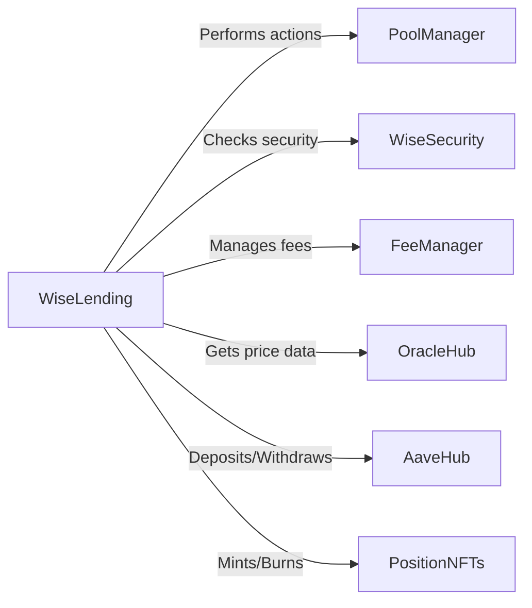

# Analysis Report: Wise Lending

## Table of Contents
1. Introduction
2. Approach
3. Architecture Review
   3.1. System Overview
   3.2. Contract Interactions
   3.3. Architecture Recommendations
4. Codebase Quality Analysis
   4.1. Code Structure and Readability
   4.2. Gas Optimization
   4.3. Error Handling and Validation
5. Security Analysis
   5.1. Access Control and Authorization
   5.2. Reentrancy and External Calls
   5.3. Oracle Dependence and Manipulation
   5.4. Flash Loan Attacks
   5.5. Centralization Risks
6. Mechanism Review
   6.1. Lending and Borrowing
   6.2. Liquidations
   6.3. Interest Rate Model
   6.4. Fee Management
7. Integration Risks
   7.1. Aave Integration
   7.2. Curve Integration
8. Systemic Risks
   8.1. Liquidity Risks
   8.2. Cascade Effects
   8.3. Governance Risks
9. Recommendations and Best Practices
10. Conclusion

## 1. Introduction
Wise Lending is a decentralized lending protocol that allows users to supply, borrow, and manage their positions using various tokens. The protocol integrates with external platforms like Aave and Curve to optimize capital efficiency and provide additional functionalities. This report presents a comprehensive analysis of the Wise Lending codebase, focusing on its architecture, code quality, security, and potential risks.

## 2. Approach
The analysis of the Wise Lending codebase was conducted using a systematic approach, which included:
1. Reviewing the system architecture and contract interactions.
2. Analyzing the codebase quality, including structure, readability, gas optimization, and error handling.
3. Identifying potential security vulnerabilities and risks.
4. Examining the protocol's mechanisms, such as lending, borrowing, liquidations, and interest rate models.
5. Assessing the risks associated with external integrations and systemic factors.

## 3. Architecture Review

### 3.1. System Overview
The Wise Lending protocol consists of multiple interacting contracts, including:
- WiseLending: The main contract for lending, borrowing, and position management.
- PoolManager: Manages lending pools and implements the Lending Automated Scaling Algorithm (LASA).
- WiseSecurity: Performs security checks and validations for various actions.
- FeeManager: Handles fee distribution and incentive mechanisms.
- OracleHub: Provides price feed data for asset valuation and calculations.
- AaveHub: Integrates with Aave for earning yield on idle funds.
- PositionNFTs: Represents users' lending positions as non-fungible tokens (NFTs).

### 3.2. Contract Interactions
The contracts in the Wise Lending protocol interact with each other to facilitate lending, borrowing, and position management.



### 3.3. Architecture Recommendations
1. Consider modularizing the codebase further to improve maintainability and upgradability.
2. Implement a more decentralized governance model to reduce centralization risks.
3. Explore the use of a multi-oracle approach to mitigate the risk of a single oracle failure.
4. Implement circuit breakers and emergency stop mechanisms to handle unexpected events.

## 4. Codebase Quality Analysis

### 4.1. Code Structure and Readability
The Wise Lending codebase follows a modular structure, with separate contracts for different functionalities. The code is generally well-organized and follows a consistent naming convention. However, some contracts, such as WiseLending, have a high level of complexity, which could be improved by further modularization.

### 4.2. Gas Optimization
The codebase demonstrates efforts to optimize gas usage, such as using `unchecked` blocks for certain arithmetic operations. However, there are still opportunities for further gas optimization, such as:
- Reducing the number of storage reads and writes.
- Using `calldata` instead of `memory` for function arguments when appropriate.
- Optimizing loops and minimizing the use of expensive operations.

### 4.3. Error Handling and Validation
The codebase includes various error handling mechanisms, such as custom error definitions and require statements. However, there are instances where more specific error messages could be provided to improve debugging and user experience. Additionally, input validation could be further enhanced to prevent unexpected behavior.

## 5. Security Analysis

### 5.1. Access Control and Authorization
The Wise Lending protocol utilizes access control modifiers like `onlyMaster` and `onlyWiseLending` to restrict access to certain functions. However, the centralization of control in the `master` account poses a risk if the account is compromised. Consider implementing a multi-signature wallet or a decentralized governance model to mitigate this risk.

### 5.2. Reentrancy and External Calls
The codebase uses the `nonReentrant` modifier from OpenZeppelin to prevent reentrancy attacks. However, it is essential to review all external calls and ensure that they are protected against reentrancy risks. Additionally, consider using the Checks-Effects-Interactions pattern to prevent unexpected behavior.

### 5.3. Oracle Dependence and Manipulation
The protocol heavily relies on the OracleHub contract for price feed data. If the oracle is compromised or manipulated, it could lead to incorrect liquidations and financial losses. Consider implementing additional safeguards, such as:
- Using multiple oracle sources and a price aggregation mechanism.
- Implementing price deviation checks and circuit breakers.
- Regularly monitoring and updating the oracle infrastructure.

### 5.4. Flash Loan Attacks
Flash loan attacks have been a common vulnerability in DeFi protocols. Although the Wise Lending codebase does not explicitly use flash loans, it is essential to review the protocol's design and ensure that it is not susceptible to flash loan exploits. Consider implementing measures like flash loan-resistant price oracles and liquidity checks.

1. External Integrations (Aave and Curve)

The WiseLending integrates with external protocols such as Aave for earning yield on idle funds and Curve for using special pools as collateral. While these integrations offer capital efficiency and expanded functionality, they also introduce potential risks.

a. Aave Integration:
   - The AaveHub contract interacts with the Aave lending pool to deposit and withdraw funds. The security of the Aave protocol itself is critical, as any vulnerabilities or exploits in Aave could impact the funds deposited by WiseLending.
   - The `depositExactAmount` and `withdrawExactAmount` functions in the AaveHub contract rely on the correct functioning of Aave's deposit and withdraw mechanisms. If there are any issues or unexpected behavior in Aave's contracts, it could lead to loss of funds or incorrect accounting.

[function depositExactAmount](https://github.com/code-423n4/2024-02-wise-lending/blob/79186b243d8553e66358c05497e5ccfd9488b5e2/contracts/WrapperHub/AaveHub.sol#L122-L151)
```solidity
function depositExactAmount(
    uint256 _nftId,
    address _underlyingAsset,
    uint256 _amount
)
    public
    nonReentrant
    validToken(_underlyingAsset)
    returns (uint256)
{
    _safeTransferFrom(
        _underlyingAsset,
        msg.sender,
        address(this),
        _amount
    );

    uint256 lendingShares = _wrapDepositExactAmount(
        _nftId,
        _underlyingAsset,
        _amount
    );

    emit IsDepositAave(
        _nftId,
        block.timestamp
    );

    return lendingShares;
}
```

b. Curve Integration:
   - The WiseSecurity contract includes functions to prepare Curve pools for use as collateral. The security of the Curve pools and their underlying tokens is crucial, as any issues in the Curve contracts or the pool's token balances could affect the collateral value and liquidations.
   - The `prepareCurvePools` function in the WiseSecurity contract approves token transfers and sets up the necessary data structures for Curve interactions. Any errors or vulnerabilities in this setup process could lead to incorrect collateral calculations or unauthorized token transfers.

[function prepareCurvePools](https://github.com/code-423n4/2024-02-wise-lending/blob/79186b243d8553e66358c05497e5ccfd9488b5e2/contracts/WiseSecurity/WiseSecurity.sol#L142-L187)
```solidity
function prepareCurvePools(
    address _poolToken,
    CurveSwapStructData calldata _curveSwapStructData,
    CurveSwapStructToken calldata _curveSwapStructToken
)
    external
    onlyWiseLending
{
    curveSwapInfoData[_poolToken] = _curveSwapStructData;
    curveSwapInfoToken[_poolToken] = _curveSwapStructToken;

    address curvePool = curveSwapInfoData[_poolToken].curvePool;
    uint256 tokenIndexForApprove = _curveSwapStructToken.curvePoolTokenIndexFrom;

    _safeApprove(
        ICurve(curvePool).coins(tokenIndexForApprove),
        curvePool,
        0
    );

    _safeApprove(
        ICurve(curvePool).coins(tokenIndexForApprove),
        curvePool,
        UINT256_MAX
    );

    // ...
}
```

To mitigate the risks associated with external integrations, it is essential to:
-----------------------------------------------------------------------------

- Monitor for any reported vulnerabilities or incidents related to these protocols and have contingency plans in place.
- Implement proper error handling and safety checks when interacting with external contracts to handle unexpected behaviors gracefully.
- Regularly update and adapt the integration code to accommodate any changes or upgrades in the external protocols.

2. Oracle Security and Manipulation Risks

The WiseLending heavily relies on the OracleHub contract for price feed data to calculate collateral values, borrow limits, and perform liquidations. The security and integrity of the oracle data are critical to ensure the proper functioning of the protocol.

Potential Oracle Manipulation Risks:
-----------------------------------
- If the price feed data provided by the OracleHub is manipulated or becomes unreliable, it can lead to incorrect collateral calculations, enabling users to borrow more than they should or preventing liquidations of undercollateralized positions.
- An attacker could attempt to manipulate the oracle prices by exploiting vulnerabilities in the oracle infrastructure, flash loan attacks, or by taking advantage of any delays in price updates.

[function getTokensInETH](https://github.com/code-423n4/2024-02-wise-lending/blob/79186b243d8553e66358c05497e5ccfd9488b5e2/contracts/WiseOracleHub/WiseOracleHub.sol#L143-L168)
```solidity
function getTokensInETH(
    address _tokenAddress,
    uint256 _tokenAmount
)
    public
    view
    returns (uint256)
{
    if (_tokenAddress == WETH_ADDRESS) {
        return _tokenAmount;
    }

    uint8 tokenDecimals = _tokenDecimals[
        _tokenAddress
    ];

    return _decimalsETH < tokenDecimals
        ? _tokenAmount
            * latestResolver(_tokenAddress)
            / 10 ** decimals(_tokenAddress)
            / 10 ** (tokenDecimals - _decimalsETH)
        : _tokenAmount
            * 10 ** (_decimalsETH - tokenDecimals)
            * latestResolver(_tokenAddress)
            / 10 ** decimals(_tokenAddress);
}
```

The `getTokensInETH` function in the OracleHub contract relies on the `latestResolver` function to fetch the latest price data for a given token. If the `latestResolver` returns manipulated or incorrect prices, it can lead to incorrect ETH valuations and affect the protocol's integrity.

To mitigate oracle-related risks:
--------------------------------
- Use decentralized oracle networks like Chainlink, which aggregate data from multiple reliable sources, reducing the risk of manipulation.
- Implement price deviation checks to detect and prevent the use of prices that significantly differ from historical or external reference prices.
- Utilize multiple independent price feeds and compare them to identify anomalies or inconsistencies.

3. System Architecture and Attack Vectors

The WiseLending consists of multiple interacting contracts, including WiseLending, PoolManager, WiseSecurity, FeeManager, and OracleHub. The complexity of the system architecture and the interactions between these contracts can introduce potential attack vectors.

Potential Attack Vectors:
----------------------
- Reentrancy Attacks: If the protocol's contracts are not adequately protected against reentrancy, an attacker could exploit the vulnerability to drain funds or manipulate the system's state.
- Flash Loan Attacks: An attacker could utilize flash loans to manipulate market prices or exploit vulnerabilities in the protocol's logic, leading to financial losses.
- Governance Attacks: If the protocol's governance mechanisms are not secure or properly implemented, an attacker could gain control over critical functions and make malicious changes to the system.

To mitigate architectural risks:
----------------------------

- Implement proper reentrancy guards, such as the Checks-Effects-Interactions pattern or the use of reentrancy guard libraries, to prevent reentrancy attacks.
- Utilize flash loan-resistant price oracles and implement checks to prevent the use of manipulated prices in critical functions.
- Ensure secure governance mechanisms, such as multi-signature controls and time-locks, to prevent unauthorized changes to the protocol.

4. Access Control and Privilege Escalation

The WiseLending 
utilizes various access control mechanisms, such as the `onlyMaster` modifier and the `securityWorker` role, to restrict access to critical functions and ensure proper authorization.

Potential Risks:
--------------

- If the private keys associated with the `master` account or the `securityWorker` role are compromised, an attacker could gain unauthorized access to privileged functions and manipulate the protocol's behavior.
- Inadequate access control checks or improper permission management could allow attackers to escalate their privileges and perform unauthorized actions.

The `onlyMaster` modifier is used to restrict access to certain functions only to the designated `master` account. If the `master` account is compromised, an attacker could exploit this access to make malicious changes to the protocol.

To mitigate access control risks:
----------------------------

- Implement secure key management practices, such as using multi-signature wallets or hardware security modules (HSMs), to protect the private keys associated with privileged accounts.
- Follow the principle of least privilege and grant access permissions only to the minimum necessary entities.
- Implement time-locks and multi-signature requirements for critical functions to prevent unauthorized changes and provide time for detection and response.

### 5.5. Centralization Risks
The protocol currently has a significant reliance on the `master` account, which poses centralization risks. If the `master` account is compromised, it could lead to unauthorized changes and potential loss of funds. Consider implementing a decentralized governance model and multi-signature controls to mitigate these risks.

Centralization Risks: Reliance on the `master` Account
--------------------------------------------------------

The Wise Lending protocol heavily relies on a single `master` account for critical operations and decision-making. The `master` account is granted extensive permissions and controls over various aspects of the protocol, such as adding or removing pool tokens, setting fee percentages, and managing access control roles.

This centralization of power in the `master` account poses significant risks to the protocol's security and integrity. If the private key associated with the `master` account is compromised, either through hacking, phishing, or other means, an attacker could gain unauthorized access to the protocol's core functionalities.

**Impact:**
The compromise of the `master` account can have severe consequences for the Wise Lending protocol and its users:

1. **Unauthorized Changes:** An attacker with access to the `master` account could make arbitrary changes to the protocol's parameters, such as modifying fee percentages, altering lending pool configurations, or changing access control permissions. This could disrupt the protocol's intended behavior and potentially harm users' interests.

2. **Fund Manipulation:** The `master` account has the ability to manage pool tokens and perform critical operations related to fund management. An attacker could exploit these privileges to manipulate fund allocations, withdraw funds to unauthorized addresses, or interfere with the protocol's financial operations, leading to significant financial losses for users and the protocol itself.

3. **Loss of User Confidence**: If the `master` account is compromised and unauthorized actions are performed, it would severely undermine user confidence in the protocol. Users may lose trust in the security and reliability of the platform, leading to a potential exodus of users and a decline in the protocol's adoption and value.

An attacker could attempt to gain access to the `master` account through various means, such as:
- Social engineering attacks, like phishing emails or fake websites, to trick the account owner into revealing the private key.
- Exploiting vulnerabilities in the key storage or management system, such as weak encryption or insecure access controls.
- Conducting targeted attacks on the individuals or systems responsible for managing the `master` account.

**Possibility and Scenario:**
Let's consider a scenario where an attacker successfully compromises the `master` account of the Wise Lending protocol. The attacker gains access to the private key associated with the account and starts exploiting the privileges granted to the `master` role.

The attacker begins by modifying critical protocol parameters. They change the fee percentages to maximize their own profits and manipulate the lending pool configurations to their advantage. This disrupts the protocol's economic model and harms the interests of regular users.

Next, the attacker targets the protocol's fund management capabilities. They start withdrawing funds from the protocol's reserves to their own wallet, effectively stealing from the protocol and its users. The attacker may also manipulate the pool token allocations, causing further financial losses and disrupting the protocol's liquidity.

As users notice the unauthorized changes and suspicious fund movements, panic spreads within the community. Users start withdrawing their funds en masse, leading to a run on the protocol. The protocol's reputation is severely damaged, and its value plummets as a result of the security breach.

The centralization risks stem from the extensive use of the `onlyMaster` modifier throughout the Wise Lending codebase.

1. In the `WiseLending` contract: [function createPool](https://github.com/code-423n4/2024-02-wise-lending/blob/79186b243d8553e66358c05497e5ccfd9488b5e2/contracts/PoolManager.sol#L135-L144)
```solidity
function createPool(
    CreatePool calldata _params
)
    external
    onlyMaster
{
    _createPool(
        _params
    );
}
```

2. In the `WiseSecurity` contract: [function setLiquidationSettings](https://github.com/code-423n4/2024-02-wise-lending/blob/79186b243d8553e66358c05497e5ccfd9488b5e2/contracts/WiseSecurity/WiseSecurity.sol#L85-L100)
```solidity
function setLiquidationSettings(
    uint256 _baseReward,
    uint256 _baseRewardFarm,
    uint256 _newMaxFeeETH,
    uint256 _newMaxFeeFarmETH
)
    external
    onlyMaster
{
    _setLiquidationSettings(
        _baseReward,
        _baseRewardFarm,
        _newMaxFeeETH,
        _newMaxFeeFarmETH
    );
}
```

3. In the `FeeManager` contract: [function setPoolFee](https://github.com/code-423n4/2024-02-wise-lending/blob/79186b243d8553e66358c05497e5ccfd9488b5e2/contracts/FeeManager/FeeManager.sol#L108-L129)
```solidity
function setPoolFee(
    address _poolToken,
    uint256 _newFee
)
    external
    onlyMaster
{
    _checkValue(
        _newFee
    );

    WISE_LENDING.setPoolFee(
        _poolToken,
        _newFee
    );

    emit PoolFeeChanged(
        _poolToken,
        _newFee,
        block.timestamp
    );
}
```

**To mitigate the centralization risks, the Wise Lending protocol should consider implementing a more decentralized governance model. This could involve:**
1. Multisignature Wallets: Require multiple authorized signers to approve critical operations, reducing the risk of a single point of failure.
2. Timelocks: Introduce time delays for executing significant changes, allowing the community to review and potentially intervene if necessary.
3. Decentralized Governance: Implement a decentralized governance mechanism, such as a DAO (Decentralized Autonomous Organization), where token holders can vote on important protocol decisions.
4. Role Separation: Separate the responsibilities of the `master` account into multiple roles with different levels of permissions, reducing the impact of a single compromised account.
5. Secure Key Management: Employ robust security measures to protect the private keys associated with critical accounts, such as using hardware wallets, multi-factor authentication, and secure key rotation processes.

## 6. Mechanism Review

### 6.1. Lending and Borrowing
The lending and borrowing mechanisms in the Wise Lending protocol are implemented in the WiseLending contract. Users can supply assets to the protocol and borrow against their collateral. The protocol uses a collateral factor to determine the maximum borrowing capacity for each asset.

### 6.2. Liquidations
Liquidations occur when a borrower's collateral value falls below the required threshold. The liquidation process is handled by the WiseLending contract and involves repaying a portion of the borrowed assets and seizing the collateral. The liquidation mechanism could be further optimized to handle edge cases and ensure fair liquidation prices.

### 6.3. Interest Rate Model
The Wise Lending protocol uses the Lending Automated Scaling Algorithm (LASA) to determine the interest rates for borrowing. The algorithm adjusts the rates based on the utilization of each lending pool. However, the algorithm's effectiveness and responsiveness to market conditions should be closely monitored and adjusted if necessary.

### 6.4. Fee Management
The FeeManager contract handles the distribution of fees and incentives within the protocol. It allows for the configuration of fee percentages and supports the claiming of fees by authorized entities. The fee management mechanism could be further enhanced by implementing a more decentralized fee distribution model and providing greater transparency on fee usage.

## 7. Integration Risks

### 7.1. Aave Integration
The Wise Lending protocol integrates with Aave to optimize capital efficiency by depositing idle funds. However, this integration introduces risks, such as:
- Dependency on Aave's security and reliability.
- Potential impact of Aave's liquidity on the protocol's operations.
- Exposure to any vulnerabilities or exploits in the Aave protocol.

It is crucial to regularly monitor Aave's performance and security, and have contingency plans in place to handle any issues that may arise.

### 7.2. Curve Integration
The protocol also integrates with Curve to provide additional functionality and use Curve pools as collateral. The risks associated with the Curve integration include:
- Dependency on the security and stability of the Curve protocol.
- Exposure to any vulnerabilities or exploits in the Curve contracts.
- Potential impact of Curve pool liquidity on the protocol's operations.

Regular audits and monitoring of the Curve integration are necessary to mitigate these risks.

## 8. Systemic Risks

### 8.1. Liquidity Risks
The Wise Lending protocol faces liquidity risks if there is a significant imbalance between the supply and demand of assets. If a large number of users simultaneously withdraw their funds or if there is a sudden decrease in liquidity, it could lead to a liquidity crisis and affect the protocol's stability.

### 8.2. Cascade Effects
Given the interconnected nature of DeFi protocols, any issues or failures in the Wise Lending protocol could have cascading effects on other protocols that interact with it. This could lead to a broader systemic risk in the DeFi ecosystem.

### 8.3. Governance Risks
The protocol's governance model plays a crucial role in its long-term sustainability and decision-making processes. If the governance mechanisms are not properly designed or if there is a concentration of voting power, it could lead to centralization risks and potential misalignment of incentives.

Complexity and Intercontract Dependencies
------------------------------------------

The WiseLending has a complex architecture involving multiple interacting contracts, including WiseLending, PoolManager, WiseSecurity, FeeManager, WiseCore, PositionNFTs, AaveHub, and OracleHub. Each contract has its own responsibilities and interacts with other contracts to perform various functions related to lending, borrowing, fee management, position tracking, and integration with external protocols like Aave.

> The high level of complexity and interdependencies among the contracts increases the attack surface and makes it challenging to ensure the overall security of the system. If a vulnerability or unexpected behavior is introduced in one contract, it can propagate and impact the functioning of other dependent contracts. This can lead to potential exploits, loss of funds, or disruption of the protocol's intended behavior.

The complexity and intercontract dependencies are spread throughout the WiseLending code.

1. WiseLending contract interacting with WiseSecurity for security checks: [function borrowExactAmount](https://github.com/code-423n4/2024-02-wise-lending/blob/79186b243d8553e66358c05497e5ccfd9488b5e2/contracts/WiseLending.sol#L1016-L1049)
```solidity
function borrowExactAmount(
    uint256 _nftId,
    address _poolToken,
    uint256 _amount
)
    external
    syncPool(_poolToken)
    healthStateCheck(_nftId)
    returns (uint256)
{
    _checkOwnerPosition(
        _nftId,
        msg.sender
    );

    uint256 shares = _handleBorrowExactAmount({
        _nftId: _nftId,
        _poolToken: _poolToken,
        _amount: _amount,
        _onBehalf: false
    });

    _validateNonZero(
        shares
    );

    _safeTransfer(
        _poolToken,
        msg.sender,
        _amount
    );

    return shares;
}
```

2. WiseCore contract containing core logic used by WiseLending and other contracts: [function _coreBorrowTokens](https://github.com/code-423n4/2024-02-wise-lending/blob/79186b243d8553e66358c05497e5ccfd9488b5e2/contracts/WiseCore.sol#L349-L421)
```solidity
    function _coreBorrowTokens(
        address _caller,
        uint256 _nftId,
        address _poolToken,
        uint256 _amount,
        uint256 _shares,
        bool _onBehalf
    )
        internal
    {
        (
            address[] memory lendTokens,
            address[] memory borrowTokens
        ) = _prepareAssociatedTokens(
            _nftId,
            ZERO_ADDRESS,
            _poolToken
        );


        powerFarmCheck = WISE_SECURITY.checksBorrow(
            _nftId,
            _caller,
            _poolToken
        );


        _updatePoolStorage(
            _poolToken,
            _amount,
            _shares,
            _increasePseudoTotalBorrowAmount,
            _decreaseTotalPool,
            _increaseTotalBorrowShares
        );


        _increaseMappingValue(
            userBorrowShares,
            _nftId,
            _poolToken,
            _shares
        );


        _addPositionTokenData(
            _nftId,
            _poolToken,
            hashMapPositionBorrow,
            positionBorrowTokenData
        );


        if (_onBehalf == true) {
            emit FundsBorrowedOnBehalf(
                _caller,
                _nftId,
                _poolToken,
                _amount,
                _shares,
                block.timestamp
            );
        } else {
            emit FundsBorrowed(
                _caller,
                _nftId,
                _poolToken,
                _amount,
                _shares,
                block.timestamp
            );
        }


        _curveSecurityChecks(
            lendTokens,
            borrowTokens
        );
    }
```

3. AaveHub contract interacting with WiseLending for deposit and withdrawal: [function depositExactAmountMint](https://github.com/code-423n4/2024-02-wise-lending/blob/79186b243d8553e66358c05497e5ccfd9488b5e2/contracts/WrapperHub/AaveHub.sol#L103-L115), [function depositExactAmount](https://github.com/code-423n4/2024-02-wise-lending/blob/79186b243d8553e66358c05497e5ccfd9488b5e2/contracts/WrapperHub/AaveHub.sol#L122-L151)
```solidity
function depositExactAmountMint(
    address _underlyingAsset,
    uint256 _amount
)
    external
    returns (uint256)
{
    return depositExactAmount(
        _reservePosition(),
        _underlyingAsset,
        _amount
    );
}

function depositExactAmount(
    uint256 _nftId,
    address _underlyingAsset,
    uint256 _amount
)
    public
    nonReentrant
    validToken(_underlyingAsset)
    returns (uint256)
{
    _safeTransferFrom(
        _underlyingAsset,
        msg.sender,
        address(this),
        _amount
    );

    uint256 lendingShares = _wrapDepositExactAmount(
        _nftId,
        _underlyingAsset,
        _amount
    );

    emit IsDepositAave(
        _nftId,
        block.timestamp
    );

    return lendingShares;
}
```
The complexity arises from the need to coordinate and ensure the correctness of these interactions across multiple contracts.

To mitigate the risks associated with complexity and intercontract dependencies, it is essential to:
-----------------

. Clearly define and document the expected behavior and assumptions for each contract and their interactions.
. Implement robust error handling and input validation to handle unexpected scenarios and prevent unintended behavior.
. Use modular and decoupled design patterns to minimize dependencies and make the codebase more maintainable.
. Regularly review and update the contracts to address any changes in the external contracts or protocols being integrated.


Oracle Dependence and Manipulation
-------------------------------------

The WiseLending heavily relies on the OracleHub contract for accurate price feed data to calculate collateral values, borrow limits, and perform other critical functions. The OracleHub contract acts as a central source of truth for asset prices, and the protocol assumes that the price data provided by the oracle is reliable and up-to-date.

> If the price feed data provided by the OracleHub is manipulated or becomes unreliable, it can have severe consequences for the WiseLending. Incorrect price data can lead to the following issues:
1. Undercollateralized Positions: If the oracle reports inflated asset prices, users may be able to borrow more than they should, leading to undercollateralized positions. In the event of a price drop, the protocol may not have sufficient collateral to cover the outstanding loans, resulting in potential losses.
2. Liquidation Failures: Manipulated oracle prices can prevent the timely liquidation of undercollateralized positions. If the oracle reports inflated prices, the protocol may fail to detect positions that should be liquidated, allowing them to remain open and exposing the protocol to further risk.
3. Exploitable Price Discrepancies: If an attacker can manipulate the oracle prices, they may be able to exploit price discrepancies between the oracle and actual market prices. This could lead to profitable arbitrage opportunities at the expense of the protocol and its users.

1. Retrieving the latest price data from the oracle: [function latestResolver](https://github.com/code-423n4/2024-02-wise-lending/blob/79186b243d8553e66358c05497e5ccfd9488b5e2/contracts/WiseOracleHub/WiseOracleHub.sol#L69-L83)
```solidity
function latestResolver(
    address _tokenAddress
)
    public
    view
    returns (uint256)
{
    if (chainLinkIsDead(_tokenAddress) == true) {
        revert OracleIsDead();
    }

    return _validateAnswer(
        _tokenAddress
    );
}
```

2. Calculating the collateral value in ETH using oracle prices: [function getTokensInETH](https://github.com/code-423n4/2024-02-wise-lending/blob/79186b243d8553e66358c05497e5ccfd9488b5e2/contracts/WiseOracleHub/WiseOracleHub.sol#L143-L168)
```solidity
function getTokensInETH(
    address _tokenAddress,
    uint256 _tokenAmount
)
    public
    view
    returns (uint256)
{
    if (_tokenAddress == WETH_ADDRESS) {
        return _tokenAmount;
    }

    uint8 tokenDecimals = _tokenDecimals[
        _tokenAddress
    ];

    return _decimalsETH < tokenDecimals
        ? _tokenAmount
            * latestResolver(_tokenAddress)
            / 10 ** decimals(_tokenAddress)
            / 10 ** (tokenDecimals - _decimalsETH)
        : _tokenAmount
            * 10 ** (_decimalsETH - tokenDecimals)
            * latestResolver(_tokenAddress)
            / 10 ** decimals(_tokenAddress);
}
```

3. Usage of OracleHub in the WiseSecurity contract for calculating borrow limits: [function safeLimitPosition](https://github.com/code-423n4/2024-02-wise-lending/blob/79186b243d8553e66358c05497e5ccfd9488b5e2/contracts/WiseSecurity/WiseSecurity.sol#L641-L689)
```solidity
function safeLimitPosition(
    uint256 _nftId
)
    external
    view
    returns (uint256)
{
    uint256 len = WISE_LENDING.getPositionLendingTokenLength(
        _nftId
    );

    if (len == 0) {
        return 0;
    }

    uint256 i;
    address token;
    uint256 buffer;

    while (i < len) {

        token = WISE_LENDING.getPositionLendingTokenByIndex(
            _nftId,
            i
        );

        unchecked {
            ++i;
        }

        if (checkHeartbeat(token) == false) {
            continue;
        }

        if (wasBlacklisted[token] == true) {
            continue;
        }

        buffer += WISE_LENDING.lendingPoolData(token).collateralFactor
            * getFullCollateralETH(
                _nftId,
                token
            ) / PRECISION_FACTOR_E18;
    }

    return buffer
        * BORROW_PERCENTAGE_CAP
        / PRECISION_FACTOR_E18;
}
```

These code snippets demonstrate how the OracleHub contract is used to retrieve price data and calculate collateral values in ETH. The `latestResolver` function is called to get the latest price for a given token, and the `getTokensInETH` function uses the oracle price to convert token amounts to their ETH equivalent.

The `safeLimitPosition` function in the WiseSecurity contract relies on the oracle prices to calculate the borrow limit for a given position. It retrieves the collateral tokens associated with the position and calculates their collateral value using the `getFullCollateralETH` function, which internally uses the OracleHub's price data.

To mitigate the risks associated with oracle dependence and manipulation, the following measures can be implemented:
-----------------------------------------------------------------------------------------------------------------------
1. Decentralized Oracle Networks: Instead of relying on a single oracle source, consider using decentralized oracle networks like Chainlink, which aggregate price data from multiple reliable sources. This reduces the risk of a single point of failure and makes it more difficult for an attacker to manipulate prices.
2. Oracle Price Deviation Checks: Implement checks to detect significant deviations in oracle prices compared to historical data or external reference prices. If the deviation exceeds a certain threshold, the protocol can trigger circuit breakers or emergency measures to prevent exploits.
3. Delayed Price Updates: Introduce a delay between the time when oracle prices are updated and when they are used by the protocol. This provides a window for detecting and mitigating potential price manipulations before they can be exploited.
4. Redundant Price Sources: Use multiple independent price sources and compare their data to identify inconsistencies or anomalies. If there is a significant discrepancy between the sources, the protocol can halt operations or use the most conservative price to err on the side of caution.
5. Robust Liquidation Mechanisms: Ensure that the liquidation mechanisms are robust and can handle scenarios where oracle prices may be manipulated. Implement safeguards such as using conservative price estimates or requiring a minimum liquidation threshold to prevent unnecessary liquidations.


Liquidity and Solvency Risks
--------------------------

The WiseLending integrates with Aave to optimize capital efficiency by depositing unutilized funds into the Aave lending pool. This integration allows the protocol to earn additional yield on idle funds. **However, the reliance on Aave for liquidity management introduces liquidity and solvency risks.**

> These risks lies in the assumption that funds deposited into Aave will always be available for withdrawal when needed. If there are issues with Aave, such as a security breach, smart contract vulnerability, or a significant decline in the value of the deposited assets, it could impact the liquidity available to the WiseLending.

Furthermore, if a large number of users simultaneously decide to withdraw their funds from the WiseLending, it could lead to a liquidity crunch. The protocol may not have sufficient liquid assets available to meet all withdrawal requests promptly, especially if the funds are locked up in the Aave lending pool.

**Insufficient liquidity can have severe consequences for the WiseLending and its users:**
1. Withdrawal Failures: If the protocol lacks the necessary liquidity to process user withdrawals, users may be unable to access their funds when needed. This can lead to a loss of user confidence and reputational damage to the protocol.
2. Run on the Protocol: If users perceive that the protocol is facing liquidity issues, it could trigger a panic-driven run on the protocol. Users may rush to withdraw their funds, exacerbating the liquidity problem and potentially leading to a collapse of the protocol.
3. Solvency Risks: Prolonged liquidity issues can evolve into solvency risks. If the protocol is unable to meet its financial obligations or if the value of its assets declines significantly, it may become insolvent. This could result in substantial losses for users and the protocol itself.
4. Contagion Effects: Liquidity and solvency issues in the WiseLending can have spillover effects on other interconnected protocols or the wider DeFi ecosystem. If the protocol holds a significant amount of assets or has dependencies on other protocols, its liquidity problems can trigger a chain reaction of liquidity events.

1. Depositing funds into Aave: [function depositExactAmount](https://github.com/code-423n4/2024-02-wise-lending/blob/79186b243d8553e66358c05497e5ccfd9488b5e2/contracts/WrapperHub/AaveHub.sol#L122-L151)
```solidity
function depositExactAmount(
    uint256 _nftId,
    address _underlyingAsset,
    uint256 _amount
)
    public
    nonReentrant
    validToken(_underlyingAsset)
    returns (uint256)
{
    _safeTransferFrom(
        _underlyingAsset,
        msg.sender,
        address(this),
        _amount
    );

    uint256 lendingShares = _wrapDepositExactAmount(
        _nftId,
        _underlyingAsset,
        _amount
    );

    emit IsDepositAave(
        _nftId,
        block.timestamp
    );

    return lendingShares;
}
```

2. Withdrawing funds from Aave: [function withdrawExactAmount](https://github.com/code-423n4/2024-02-wise-lending/blob/79186b243d8553e66358c05497e5ccfd9488b5e2/contracts/WrapperHub/AaveHub.sol#L202-L232)
```solidity
function withdrawExactAmount(
    uint256 _nftId,
    address _underlyingAsset,
    uint256 _withdrawAmount
)
    external
    nonReentrant
    validToken(_underlyingAsset)
    returns (uint256)
{
    _checkOwner(
        _nftId
    );

    (
        uint256 withdrawnShares
        ,
    ) = _wrapWithdrawExactAmount(
        _nftId,
        _underlyingAsset,
        msg.sender,
        _withdrawAmount
    );

    emit IsWithdrawAave(
        _nftId,
        block.timestamp
    );

    return withdrawnShares;
}
```

The deposit and withdrawal functions in the AaveHub contract. The `depositExactAmount` function transfers the specified amount of the underlying asset from the user to the AaveHub contract and then calls the internal `_wrapDepositExactAmount` function to deposit the funds into Aave. The `withdrawExactAmount` function allows users to withdraw a specific amount of the underlying asset from Aave.

While the integration with Aave provides capital efficiency benefits, _it also introduces liquidity risks. If Aave experiences issues or if there is a sudden surge in withdrawal requests, the WiseLending may struggle to meet the liquidity demands._

To mitigate these risks, the WiseLending can consider the following measures:
------------------------------------------------------------------------------------------

1. Diversification of Liquidity Sources: Instead of relying solely on Aave for liquidity management, the protocol can explore integrating with multiple lending protocols or liquidity providers. This diversification can help spread the risk and provide alternative sources of liquidity.
2. Liquidity Reserves: Maintain a portion of the protocol's funds as liquid reserves that can be quickly accessed to meet unexpected withdrawal demands. These reserves should be held in highly liquid assets and regularly adjusted based on the protocol's liquidity needs.
3. Liquidity Stress Testing: Conduct regular stress tests to assess the protocol's ability to handle various liquidity scenarios, including extreme withdrawal events. This can help identify potential vulnerabilities and guide the development of contingency plans.
4. Liquidity Monitoring and Risk Management: Implement robust liquidity monitoring and risk management systems to proactively identify and address liquidity risks. This includes monitoring key metrics such as the protocol's liquidity ratios, Aave's liquidity, and market conditions.
5. Clear Communication and Transparency: Provide clear communication to users about the protocol's liquidity management practices and the risks associated with the Aave integration. Transparency about the protocol's financial health and risk management strategies can help maintain user confidence.
6. Emergency Mechanisms: Develop and test emergency mechanisms that can be triggered in the event of severe liquidity issues. These mechanisms may include temporary withdrawal limitations, circuit breakers, or the ability to quickly liquidate assets to meet withdrawal demands.

By implementing these measures and continuously monitoring and managing liquidity risks, the WiseLending can mitigate the potential impact of liquidity and solvency issues arising from the Aave integration. 


Access Control and Permissions
-----------------------------

The WiseLending utilizes various access control mechanisms and permissions to restrict certain critical functions to authorized entities. These access controls are implemented using modifiers such as `onlyMaster` and roles like `securityWorker`. The purpose of these access controls is to ensure that sensitive operations can only be performed by trusted parties.

However, the security of the protocol heavily relies on the integrity of these access control mechanisms. If the private keys associated with the `master` account or the `securityWorker` role are compromised, or if there are vulnerabilities in the implementation of the access control logic, it could lead to unauthorized access and potential exploits.

Compromised access control can have severe consequences for the WiseLending and its users:
------------------------------------------------------------------------------------------------------------
1. Unauthorized Parameter Manipulation: If an attacker gains access to the `master` account or the `securityWorker` role, they could manipulate critical protocol parameters such as interest rates, collateral factors, or liquidation thresholds. This could disrupt the economic incentives of the protocol and lead to financial losses for users.
2. Theft of Funds: With unauthorized access, an attacker could potentially drain funds from the protocol by exploiting functions that allow the transfer or withdrawal of assets. This could result in significant financial losses for the protocol and its users.
3. Disruption of Protocol Functionality: An attacker with access to privileged roles could disrupt the normal functioning of the protocol by modifying or disabling critical components. This could lead to a loss of user confidence and damage the protocol's reputation.
4. Bypass of Security Checks: If the access control mechanisms are bypassed, an attacker could circumvent important security checks and validations implemented in the protocol. This could allow them to perform malicious actions or exploit vulnerabilities that would otherwise be prevented.

1. `onlyMaster` modifier in the WiseSecurity contract:
```solidity

```

2. `securityWorker` role in the WiseSecurity contract: [function setSecurityWorker](https://github.com/code-423n4/2024-02-wise-lending/blob/79186b243d8553e66358c05497e5ccfd9488b5e2/contracts/WiseSecurity/WiseSecurity.sol#L995-L1003), [function securityShutdown](https://github.com/code-423n4/2024-02-wise-lending/blob/79186b243d8553e66358c05497e5ccfd9488b5e2/contracts/WiseSecurity/WiseSecurity.sol#L1011-L1026)
```solidity
function setSecurityWorker(
    address _entitiy,
    bool _state
)
    external
    onlyMaster
{
    securityWorker[_entitiy] = _state;
}

function securityShutdown()
    external
{
    if (securityWorker[msg.sender] == false) {
        revert NotAllowedEntity();
    }

    _setPoolState(
        true
    );

    emit SecurityShutdown(
        msg.sender,
        block.timestamp
    );
}
```

3. Access control in the FeeManager contract:
```solidity

```

To mitigate the risks associated with access control and permissions, the WiseLending can implement the following measures:
-------------------------------------------------------------------------------------------------------------------------------------

1. Secure Key Management: Ensure that the private keys associated with the `master` account and other privileged roles are securely stored and managed. Use hardware wallets or multi-signature schemes to reduce the risk of key compromise.
2. Principle of Least Privilege: Follow the principle of least privilege and grant access permissions only to the minimum necessary entities. Regularly review and audit the access control configurations to ensure that permissions are appropriately restricted.
3. Timely Access Revocation: Implement mechanisms to promptly revoke access for compromised or unauthorized accounts. Have an incident response plan in place to quickly mitigate the impact of unauthorized access.
4. Multi-Signature and Timelocks: Consider implementing multi-signature requirements for critical operations, such as modifying protocol parameters or transferring significant funds. Use timelocks to introduce a delay between the initiation and execution of sensitive actions, allowing time for detection and intervention.
system. Engage reputable third-party auditors to identify and address any vulnerabilities or weaknesses.
6. Robust Monitoring and Alerting: Implement comprehensive monitoring and alerting systems to detect and notify relevant parties of any suspicious activities or unauthorized access attempts. Prompt detection can help minimize the impact of potential exploits.
7. Decentralized Governance: Consider transitioning to a decentralized governance model where protocol upgrades and parameter changes are decided through community voting or a decentralized autonomous organization (DAO). This can help distribute control and reduce the reliance on a single central authority.


Position NFT Security
------------------

The WiseLending uses the PositionNFTs contract to represent a user's lending position. Each user must have a unique position NFT to interact with the protocol, and the ownership of this NFT determines the user's ability to perform actions such as depositing, withdrawing, borrowing, and repaying funds.

The security of user positions heavily relies on the integrity and security of the PositionNFTs contract. If there are vulnerabilities in the NFT contract or if the NFTs are stolen or compromised, it could lead to unauthorized access to user positions and potential financial losses.

Compromised or stolen position NFTs can have severe consequences for users and the protocol as a whole:
-------------------------------------------------------------------------------------------------------------

1. Unauthorized Position Manipulation: If an attacker gains control of a user's position NFT, they could perform unauthorized actions on behalf of the user. This includes depositing or withdrawing funds, borrowing additional assets, or modifying the position's collateral or debt.
2. Forced Liquidations: An attacker with access to a position NFT could intentionally manipulate the position to trigger a liquidation. By reducing the collateral or increasing the debt, the attacker could force the liquidation of the position, potentially at unfavorable terms for the original user.
3. Theft of Funds: If the position NFT is compromised, an attacker could withdraw funds from the user's position, leading to the theft of the user's assets. This could result in significant financial losses for the affected users.
4. Loss of User Confidence: If position NFTs are frequently compromised or if there are known vulnerabilities in the NFT contract, it could erode user confidence in the protocol. Users may hesitate to entrust their funds to the protocol, damaging its reputation and adoption.

1. Minting of position NFTs: [function mintPosition](https://github.com/code-423n4/2024-02-wise-lending/blob/79186b243d8553e66358c05497e5ccfd9488b5e2/contracts/PositionNFTs.sol#L142-L149), [function mintPositionForUser](https://github.com/code-423n4/2024-02-wise-lending/blob/79186b243d8553e66358c05497e5ccfd9488b5e2/contracts/PositionNFTs.sol#L174-L191), [function _mintPositionForUser](https://github.com/code-423n4/2024-02-wise-lending/blob/79186b243d8553e66358c05497e5ccfd9488b5e2/contracts/PositionNFTs.sol#L193-L220)
```solidity
function mintPosition()
    external
    returns (uint256)
{
    return _mintPositionForUser(
        msg.sender
    );
}

function mintPositionForUser(
    address _user
)
    external
    returns (uint256)
{
    if (isApprovedForAll(
            _user,
            msg.sender
        ) == false
    ) {
        revert NotPermitted();
    }

    return _mintPositionForUser(
        _user
    );
}

function _mintPositionForUser(
    address _user
)
    internal
    returns (uint256)
{
    uint256 nftId = reserved[
        _user
    ];

    if (nftId > 0) {
        delete reserved[
            _user
        ];

        totalReserved--;

    } else {
        nftId = getNextExpectedId();
    }

    _mint(
        _user,
        nftId
    );

    return nftId;
}
```

2. Checking ownership of position NFTs: [function isOwner](https://github.com/code-423n4/2024-02-wise-lending/blob/79186b243d8553e66358c05497e5ccfd9488b5e2/contracts/PositionNFTs.sol#L222-L243)
```solidity
function isOwner(
    uint256 _nftId,
    address _owner
)
    external
    view
    returns (bool)
{
    if (_nftId == FEE_MANAGER_NFT) {
        return feeManager == _owner;
    }

    if (reserved[_owner] == _nftId) {
        return true;
    }

    if (ownerOf(_nftId) == _owner) {
        return true;
    }

    return false;
}
```
To mitigate the risks associated with position NFT security, the WiseLending can consider the following measures:
-----------------------------------------------------------------------------------------------------------------------------

1. Secure NFT Contract: Ensure that the PositionNFTs contract follows best practices for secure contract development. This includes proper access control, input validation, and protection against common vulnerabilities such as reentrancy attacks and integer overflows.
2. Thorough Testing and Auditing: Conduct extensive testing and security audits of the PositionNFTs contract to identify and address any vulnerabilities or weaknesses. Engage reputable third-party auditors to perform a comprehensive security assessment of the NFT contract.
3. Secure NFT Storage: Educate users about the importance of securely storing their position NFTs. Encourage the use of hardware wallets or secure non-custodial wallets to minimize the risk of NFT theft or compromise.
4. Robust Ownership Verification: Implement strict ownership verification mechanisms within the protocol to ensure that only the rightful owner of a position NFT can perform actions on the corresponding position. This can include additional checks beyond the standard ERC721 ownership functions.
5. Emergency Pause and Recovery: Implement emergency pause and recovery mechanisms that allow the protocol administrators to quickly halt NFT transfers or freeze compromised positions in case of a security incident. This can help prevent further damage and provide time for investigation and resolution.
6. User Education and Awareness: Educate users about the risks associated with position NFTs and provide clear guidelines on securing their NFTs. Encourage users to regularly monitor their positions and promptly report any suspicious activities.
7. Insurance and Compensation: Consider implementing insurance mechanisms or a compensation fund to protect users against potential losses due to NFT compromise or protocol vulnerabilities. This can help mitigate the financial impact on affected users and maintain trust in the protocol.


## 9. Recommendations and Best Practices
1. Implement a robust governance framework with decentralized decision-making and multi-signature controls.
2. Conduct regular security audits and code reviews to identify and address potential vulnerabilities.
3. Establish a bug bounty program to encourage the community to report any issues or vulnerabilities.
4. Implement comprehensive risk management strategies, including stress testing, circuit breakers, and emergency response plans.
5. Provide clear and transparent documentation on the protocol's mechanisms, risks, and governance processes.
6. Foster a strong community and encourage active participation in the protocol's development and governance.

## 10. Conclusion
The Wise Lending protocol offers a comprehensive lending and borrowing solution with various features and integrations. However, the complexity of the system and its dependence on external protocols introduce several risks and challenges. By addressing the identified issues, implementing best practices, and continuously monitoring and improving the protocol, Wise Lending can enhance its security, reliability, and long-term sustainability in the DeFi ecosystem.

### Time spent:
41 hours