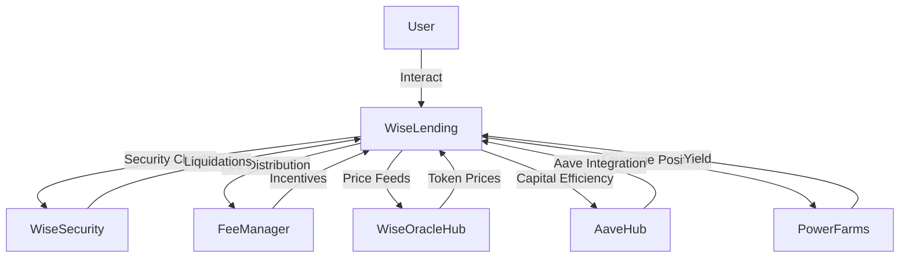

# Wise Lending Protocol - Comprehensive Analysis Report

## Table of Contents
1. [Introduction](#introduction)
2. [Approach](#approach)
3. [Architecture Overview](#architecture-overview)
4. [Codebase Quality Analysis](#codebase-quality-analysis)
5. [Centralization Risks](#centralization-risks)
6. [Mechanism Review](#mechanism-review)
7. [Systemic Risks](#systemic-risks)
8. [Recommendations](#recommendations)
9. [Conclusion](#conclusion)

## Introduction <a name="introduction"></a>

The Wise Lending protocol is a decentralized liquidity market that enables users to supply crypto assets and earn a variable APY from borrowers. The protocol determines the borrow rate dynamically using the Lending Automated Scaling Algorithm (LASA), which takes into account the total lending share amount and its change over time.

## Contract Overview

The Wise Lending protocol consists of several key contracts that work together to facilitate lending, borrowing, liquidations, and other essential operations.

1. [**WiseLending**](https://github.com/code-423n4/2024-02-wise-lending/blob/main/contracts/WiseLending.sol): This is the central contract of the protocol, responsible for managing lending pools, user positions, and interactions with other components. It handles functions such as depositing, withdrawing, borrowing, and repaying assets. The contract also integrates with external protocols like Aave, Curve, and Pendle Finance to enhance capital efficiency and liquidity.

2. [**WiseSecurity**](https://github.com/code-423n4/2024-02-wise-lending/blob/main/contracts/WiseSecurity/WiseSecurity.sol): The WiseSecurity contract is responsible for performing various security checks and validations related to user actions. It ensures that users meet the necessary criteria for withdrawing, borrowing, and collateralizing assets. The contract also handles liquidations of undercollateralized positions and implements the protocol's health factor system.

3. [**FeeManager**](https://github.com/code-423n4/2024-02-wise-lending/blob/main/contracts/FeeManager/FeeManager.sol): The FeeManager contract manages the protocol's fee system and incentive structures. It calculates and distributes fees collected from lending and borrowing activities to the protocol's treasury, lenders, and ecosystem participants. The contract also handles the management of bad debt and tracks the protocol's overall financial health.

4. [**WiseOracleHub**](https://github.com/code-423n4/2024-02-wise-lending/blob/main/contracts/WiseOracleHub/WiseOracleHub.sol): The WiseOracleHub contract serves as the central hub for price feeds and oracle functionality. It aggregates price data from multiple sources, including Chainlink oracles and Uniswap V3 time-weighted average prices (TWAPs). The contract provides reliable and up-to-date price information for various assets, which is crucial for calculating collateral values, borrowing limits, and liquidation thresholds.

5. [**PoolManager**](https://github.com/code-423n4/2024-02-wise-lending/blob/main/contracts/PoolManager.sol): The PoolManager contract is responsible for managing the protocol's lending pools and implementing the Lending Automated Scaling Algorithm (LASA). LASA dynamically adjusts the borrow interest rates based on the utilization of each lending pool, aiming to optimize liquidity and minimize interest rate volatility.

6. [**AaveHub**](https://github.com/code-423n4/2024-02-wise-lending/blob/main/contracts/WrapperHub/AaveHub.sol): The AaveHub contract integrates the Wise Lending protocol with the Aave lending platform. It allows users to seamlessly interact with Aave's lending pools and earn additional yield on their supplied assets. The contract handles the deposit and withdrawal of assets to and from Aave, as well as the management of Aave's aTokens.

7. **PowerFarms**: The PowerFarms contracts enable users to leverage their supplied assets and earn boosted yields through yield farming strategies. These contracts integrate with external protocols like Curve and Pendle Finance to provide additional liquidity and yield generation opportunities.

These contracts work together to create a comprehensive lending and borrowing ecosystem within the Wise Lending protocol. They handle various aspects of the protocol's functionality, including asset management, security, fee distribution, price oracles, interest rate optimization, and integrations with external protocols.

The Wise Lending protocol also incorporates a governance system, where WISE token holders can propose and vote on protocol upgrades, parameter changes, and other important decisions. The governance system ensures that the protocol remains decentralized and responsive to the needs of its community.

## Approach <a name="approach"></a>

The approach taken to evaluate the Wise Lending protocol's codebase includes:

1. Reviewing the provided smart contract code and understanding the protocol's functionality.
2. Examining the project's gitbook and LASA whitepaper for additional context and architectural details.
3. Analyzing the codebase quality, including readability, modularity, and adherence to best practices.
4. Identifying potential centralization risks and evaluating the roles and permissions within the protocol.
5. Conducting a mechanism review to assess the protocol's economic incentives and potential vulnerabilities.
6. Evaluating systemic risks that may impact the protocol's stability and users' funds.

## Architecture Overview <a name="architecture-overview"></a>

The Wise Lending protocol's architecture consists of several key components:

1. **WiseLending**: The main contract responsible for managing lending pools, user positions, and interactions with other components.
2. **WiseSecurity**: Handles security checks for withdrawals, borrows, paybacks, and liquidations.
3. **FeeManager**: Organizes fee distribution and manages incentive structures for the WISE ecosystem.
4. **WiseOracleHub**: Provides price feeds and oracle functionality for the protocol.
5. **AaveHub**: Integrates with the Aave protocol to optimize capital efficiency (not used on Ethereum mainnet).
6. **PowerFarms**: Enables users to leverage their positions and earn additional yield.

The following diagram illustrates the high-level architecture of the Wise Lending protocol:



### Architecture Overview Diagram


### Contract Analysis Diagram

```mermaid
classDiagram
    class WiseLending {
        +depositExactAmount(uint256, address, uint256)
        +withdrawExactAmount(uint256, address, uint256)
        +borrowExactAmount(uint256, address, uint256)
        +paybackExactAmount(uint256, address, uint256)
        +liquidatePartiallyFromTokens(uint256, uint256, address, address, uint256)
    }
    
    class WiseSecurity {
        +checkHealthState(uint256, bool)
        +checksWithdraw(uint256, address, address) bool
        +checksBorrow(uint256, address, address) bool
        +checksCollateralizeDeposit(uint256, address, address)
        +checkUncollateralizedDeposit(uint256, address)
        +canLiquidate(uint256, uint256)
        +checkMaxShares(uint256, address, uint256, uint256, uint256)
    }
    
    class FeeManager {
        +setPoolFee(address, uint256)
        +addPoolTokenAddress(address)
        +increaseTotalBadDebtLiquidation(uint256)
        +setBadDebtUserLiquidation(uint256, uint256)
        +claimWiseFeesBulk()
        +claimWiseFees(address)
        +claimFeesBeneficial(address, uint256)
        +paybackBadDebtForToken(uint256, address, address, uint256)
    }
    
    class WiseOracleHub {
        +latestResolver(address)
        +addOracle(address, IPriceFeed, address[])
        +addTwapOracle(address, address, address, address, uint24)
        +addTwapOracleDerivative(address, address, address[2], address[2], address[2], uint24[2])
        +chainLinkIsDead(address) bool
    }
    
    class AaveHub {
        +depositExactAmount(uint256, address, uint256)
        +withdrawExactAmount(uint256, address, uint256)
        +borrowExactAmount(uint256, address, uint256)
        +paybackExactAmount(uint256, address, uint256)
        +getLendingRate(address)
    }
    
    class PowerFarms {
        +enterFarm(bool, uint256, uint256, uint256)
        +exitFarm(uint256, uint256, bool)
        +manuallyPaybackShares(uint256, uint256)
        +manuallyWithdrawShares(uint256, uint256)
        +liquidatePartiallyFromToken(uint256, uint256, uint256)
    }
    
    WiseLending --> WiseSecurity
    WiseLending --> FeeManager
    WiseLending --> WiseOracleHub
    WiseLending --> AaveHub
    WiseLending --> PowerFarms
    
    WiseSecurity --|> WiseLending
    FeeManager --|> WiseLending
    WiseOracleHub --|> WiseLending
    AaveHub --|> WiseLending
    PowerFarms --|> WiseLending
```



- `WiseLending`: The core contract handling deposits, withdrawals, borrows, paybacks, and liquidations.
- `WiseSecurity`: Performs security checks related to health state, withdrawals, borrows, collateral, and liquidations.
- `FeeManager`: Manages pool fees, bad debt tracking, and fee distribution.
- `WiseOracleHub`: Provides price feed and oracle functionalities for the protocol.
- `AaveHub`: Integrates with the Aave protocol for additional capital efficiency.
- `PowerFarms`: Enables users to leverage their positions and earn yield.

The diagram shows the relationships between the contracts, with `WiseLending` serving as the central contract interacting with the other components. The other contracts inherit from or are tightly coupled with `WiseLending` to provide the necessary functionalities for the Wise Lending protocol.

## Codebase Quality Analysis <a name="codebase-quality-analysis"></a>

The Wise Lending protocol's codebase demonstrates good practices in terms of modularity and separation of concerns. The main contracts, such as `WiseLending`, `WiseSecurity`, and `FeeManager`, have clearly defined roles and responsibilities. This modular approach enhances the codebase's readability and maintainability.

However, there are some areas where the codebase could be improved:

1. **Naming Conventions**: Some variable and function names are not intuitive or descriptive enough, which may hinder code comprehension. For example, `_byPassCase` in `WiseLowLevelHelper.sol` could be renamed to `_isIsolationPoolOrPowerFarm` for clarity.

2. **Documentation**: While the code includes some comments, more detailed documentation explaining the purpose and functionality of each contract and function would be beneficial for developers and auditors.

3. **Code Duplication**: There are instances of code duplication across different contracts, such as the `_prepareCollaterals` and `_prepareBorrows` functions in `FeeManagerHelper.sol` and `WiseLowLevelHelper.sol`. Refactoring these common functions into a shared library or base contract could reduce duplication and improve maintainability.

4. **Error Handling**: The codebase uses custom errors, which is a good practice. However, some error messages could be more descriptive to aid in debugging and understanding the failure reasons.

## Centralization Risks <a name="centralization-risks"></a>

The Wise Lending protocol has a `master` role, which will be controlled by a timelock contract. The `master` has significant control over the protocol, including:

1. Setting and adjusting pool parameters, such as fees and collateral factors.
2. Adding and removing pool tokens.
3. Assigning the `securityWorker` role, which can perform security locks.
4. Updating price feed and oracle settings.

While the use of a timelock contract mitigates some centralization risks by introducing a delay before changes take effect, the concentration of power in the `master` role is still a potential concern. If the `master` role is compromised or misused, it could lead to severe consequences for the protocol and its users.

To further reduce centralization risks, consider implementing a multi-sig wallet or a decentralized governance mechanism for managing the `master` role and making critical protocol decisions.

1. **Concentration of Power in the `master` Role**

The `master` role in Wise Lending has significant control over critical protocol parameters and functions. This concentration of power poses a centralization risk, as the `master` role can unilaterally make changes that affect the entire protocol and its users.

```solidity
modifier onlyMaster() {
    _onlyMaster();
    _;
}

function _onlyMaster() private view {
    if (msg.sender == master) {
        return;
    }
    revert NotMaster();
}
```

The `onlyMaster` modifier, used throughout the protocol's contracts, restricts access to certain functions only to the `master` role. This means that the `master` role has the ability to perform actions such as:

- Setting and adjusting pool parameters (e.g., fees, collateral factors)
- Adding and removing pool tokens
- Assigning the `securityWorker` role
- Updating price feed and oracle settings

This centralization risk is significant. If the `master` role is compromised or misused, it could lead to severe consequences for the protocol and its users, such as:

- Manipulation of pool parameters: The `master` role could set unfavorable fees or collateral factors that benefit themselves or harm users.
- Addition of malicious tokens: The `master` role could add fraudulent or manipulated tokens to the protocol, exposing users to financial risk.
- Abuse of the `securityWorker` role: The `master` role could assign the `securityWorker` role to a malicious entity, enabling them to perform unauthorized actions or disrupt the protocol's operations.
- Manipulation of price feeds and oracles: The `master` role could update price feeds or oracle settings in a way that benefits themselves or allows for price manipulation.

2. **Timelock Contract Limitations**

Wise Lending uses a timelock contract to introduce a delay before changes made by the `master` role take effect. While this mechanism provides some mitigation against sudden and unexpected changes, it has limitations in terms of preventing centralization risks.

```solidity
function schedule(address target, uint256 value, bytes memory data, bytes32 predecessor, bytes32 salt, uint256 delay) public virtual onlyRole(PROPOSER_ROLE) {
    bytes32 id = hashOperation(target, value, data, predecessor, salt);
    _schedule(id, delay);
    emit CallScheduled(id, 0, target, value, data, predecessor, delay);
}

function _schedule(bytes32 id, uint256 delay) private {
    require(!isOperation(id), "TimelockController: operation already scheduled");
    require(delay >= getMinDelay(), "TimelockController: insufficient delay");
    _timestamps[id] = block.timestamp.add(delay);
}
```

The timelock contract allows the `master` role (assuming it has the `PROPOSER_ROLE`) to schedule actions with a specified delay. Once the delay period has passed, the action can be executed.

While the timelock contract introduces a delay before changes take effect, it does not fundamentally prevent the centralization risks associated with the `master` role. The impact of this limitation includes:

- Delayed execution of malicious actions: Even with the timelock delay, a compromised or malicious `master` role can still schedule and execute harmful actions after the delay period.
- Insufficient time for community response: The delay period may not provide sufficient time for the community to detect, analyze, and respond to potentially harmful actions proposed by the `master` role.
- Lack of community input: The timelock contract does not inherently provide a mechanism for community input or governance in the decision-making process.

3. **Lack of Decentralized Governance**

Wise Lending protocol currently lacks a decentralized governance mechanism for managing the `master` role and making critical protocol decisions. This absence of decentralized governance exacerbates the centralization risks associated with the `master` role.

The impact of lacking decentralized governance includes:

- Concentration of decision-making power: The `master` role has sole control over critical protocol decisions, without the participation or consensus of the wider community.
- Lack of accountability: The actions and decisions of the `master` role are not subject to community oversight or accountability, increasing the risk of misuse or abuse of power.
- Reduced community engagement: The absence of a decentralized governance mechanism may discourage community participation and limit the diversity of perspectives in the protocol's decision-making process.

To mitigate these centralization risks, consider the following recommendations:

1. Implement a decentralized governance mechanism, such as a DAO (Decentralized Autonomous Organization) or a multi-sig wallet, for managing the `master` role and making critical protocol decisions. This would distribute control and decision-making power among a broader set of stakeholders, reducing the reliance on a single entity.

2. Establish clear guidelines and criteria for the actions and decisions that the `master` role can make unilaterally, and require community approval or consensus for significant changes to the protocol.

3. Increase transparency by regularly communicating the actions and decisions made by the `master` role to the community and providing opportunities for community feedback and input.

4. Implement additional security measures, such as secure key management systems and regular audits, to reduce the risk of unauthorized access to the `master` role's private keys.

5. Consider implementing a mechanism for the community to vote on and potentially veto or delay actions proposed by the `master` role, providing an additional layer of checks and balances.
6. 
## Mechanism Review <a name="mechanism-review"></a>

The Wise Lending protocol's core mechanism revolves around the dynamic determination of borrow rates using the LASA algorithm. LASA aims to optimize liquidity and minimize interest rate volatility by adjusting the borrow rate based on the total lending share amount and its change over time.

The LASA mechanism is implemented in the `PoolManager` contract, specifically in the `_scalingAlgorithm` function:

```solidity
function _scalingAlgorithm(
    address _poolToken
)
    internal
{
    uint256 totalShares = lendingPoolData[_poolToken].totalDepositShares;

    if (algorithmData[_poolToken].maxValue <= totalShares) {

        _newMaxPoolShares(
            _poolToken,
            totalShares
        );

        _saveUp(
            _poolToken,
            totalShares
        );

        return;
    }

    _resonanceOutcome(_poolToken, totalShares) == true
        ? _resetResonanceFactor(_poolToken, totalShares)
        : _updateResonanceFactor(_poolToken, totalShares);

    _saveUp(
        _poolToken,
        totalShares
    );
}
```

The LASA mechanism appears to be well-designed and follows the principles outlined in the LASA whitepaper. However, there are a few considerations:

1. **Parameter Tuning**: The effectiveness of the LASA mechanism depends on the appropriate tuning of various parameters, such as `THRESHOLD_SWITCH_DIRECTION`, `THRESHOLD_RESET_RESONANCE_FACTOR`, and `NORMALISATION_FACTOR`. Ensure that these parameters are carefully chosen and regularly monitored to maintain the desired behavior.

2. **Economic Incentives**: While LASA aims to optimize liquidity and minimize interest rate volatility, it's essential to analyze the economic incentives for lenders and borrowers under different market conditions. Conduct thorough simulations and stress tests to ensure that the mechanism remains stable and incentive-compatible.

3. **Flash Loan Resistance**: Assess the protocol's resilience against flash loan attacks that could potentially manipulate the borrow rates or exploit the LASA mechanism. Implement necessary safeguards and checks to prevent such attacks.

## Systemic Risks <a name="systemic-risks"></a>

The Wise Lending protocol integrates with various external protocols and dependencies, which may introduce systemic risks:

1. **Oracle Failures**: The protocol relies on price feeds from the `WiseOracleHub` for determining token prices and calculating collateral values. If the oracle fails or provides inaccurate data, it could lead to incorrect liquidations, undercollateralized loans, or other issues. Implement robust error handling, fallback mechanisms, and oracle health checks to mitigate this risk.

2. **Curve and Pendle Integration**: The protocol integrates with Curve and Pendle Finance for certain functionalities. Thoroughly review the integration code and ensure that any changes or updates to these external protocols are promptly addressed to avoid compatibility issues or potential vulnerabilities.

3. **AaveHub Integration**: For deployments on networks other than Ethereum mainnet, the protocol integrates with the Aave protocol through the `AaveHub` contract. Regularly monitor the Aave protocol for any changes or updates that may affect the integration and adapt the codebase accordingly.

4. **Liquidation and Bad Debt**: The protocol includes liquidation mechanisms to handle undercollateralized positions and tracks bad debt. Ensure that the liquidation process is thoroughly tested and resilient against potential gaming or manipulation attempts. Regularly monitor and manage bad debt to prevent it from accumulating and affecting the protocol's solvency.

## Recommendations <a name="recommendations"></a>

Based on the analysis, here are some recommendations to improve the Wise Lending protocol:

1. **Code Quality**:
   - Improve naming conventions to enhance code readability and comprehension.
   - Provide more detailed documentation for contracts, functions, and the overall protocol architecture.
   - Refactor common code into shared libraries or base contracts to reduce duplication and improve maintainability.
   - Enhance error messages to provide more context and aid in debugging.

2. **Decentralization**:
   - Consider implementing a multi-sig wallet or a decentralized governance mechanism for managing the `master` role and critical protocol decisions.
   - Regularly review and audit the privileges and permissions granted to the `master` role and other critical roles.

3. **Mechanism Design**:
   - Conduct thorough simulations and stress tests to validate the LASA mechanism's effectiveness under various market conditions.
   - Regularly monitor and adjust LASA parameters to ensure optimal performance and stability.
   - Implement safeguards and checks to protect against flash loan attacks and other potential exploits.

4. **Risk Management**:
   - Implement robust error handling and fallback mechanisms for oracle failures and external protocol integrations.
   - Regularly monitor and adapt to changes in integrated protocols (Curve, Pendle, Aave) to ensure compatibility and security.
   - Establish processes for monitoring and managing bad debt to maintain the protocol's solvency.

5. **Security Best Practices**:
   - Implement a comprehensive test suite covering various scenarios and edge cases.
   - Establish an incident response plan and a bug bounty program to quickly identify and address security issues.

## Conclusion <a name="conclusion"></a>

The Wise Lending protocol presents a novel approach to decentralized lending and borrowing, with the LASA mechanism aiming to optimize liquidity and minimize interest rate volatility. The codebase demonstrates good practices in terms of modularity and separation of concerns, but there are areas for improvement in code quality, documentation, and centralization risks.

To ensure the protocol's success and long-term sustainability, it is crucial to address the identified risks and implement the recommended improvements. Regular audits, thorough testing, and continuous monitoring will be essential to maintain the protocol's security and stability.

By adopting a proactive approach to risk management, decentralization, and code quality, the Wise Lending protocol can establish itself as a reliable and innovative solution in the decentralized finance (DeFi) landscape.

### Time spent:
39 hours