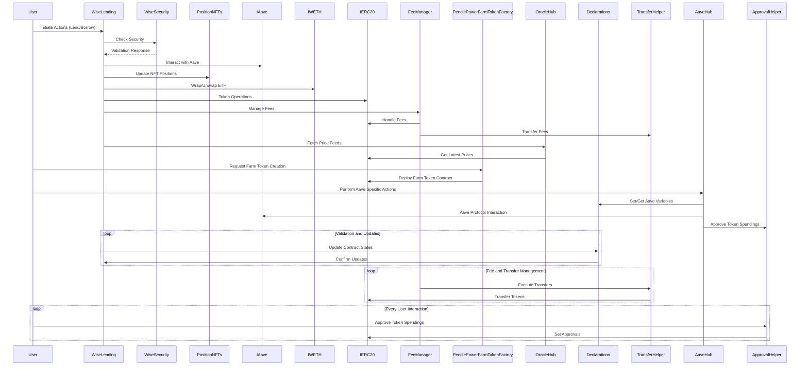

| Serial No. | Topic                                           |
|------------|-------------------------------------------------|
| 01        | Overview of Wise Lending                         |
| 02        | Architecture view (Sequence Diagram)             |
| 03        | Protocol Roles                                   |
| 04        | Approach Taken in auditing Wise Lending          |
| 05        | Contract Analysis                                |
| 06        | Codebase Quality (Table)                         |
| 07        | Centralization Risks                             |
| 08        | Systematic Risks                                 |
| 09        | Architectural Improvement                        |
| 10        | Time spent                                       |


# Overview of Wise Lending


The WISE (Wise Intelligent Swap Engine) lending platform is a cutting-edge decentralized finance (DeFi) protocol that revolutionizes the way users can collateralize their assets and borrow tokens. Built on the Ethereum blockchain, WISE offers a sophisticated and user-centric approach to lending and borrowing, empowering users with enhanced capital efficiency, flexibility, and control over their financial positions.

At the core of the WISE lending lies the innovative Lending Automated Scaling Algorithm (LASA), which dynamically adjusts the borrow rates based on the utilization of each asset pool. LASA ensures optimal capital efficiency by employing a family of bonding curves that react to market conditions and user behavior. This algorithmic approach minimizes the need for manual interventions and provides a seamless and adaptive lending experience for users.

One of the standout features of the WISE lending is its integration with position NFTs (non-fungible tokens). Users can save their collaterals and borrows inside a position NFT, enabling them to trade their entire positions or use them in second-layer contracts. This functionality opens up new avenues for liquidity provision and risk management, as users can easily transfer or leverage their positions across various DeFi protocols.

```solidity
contract PositionNFTs is ERC721Enumerable, OwnableMaster {
    // ...
    function mintPosition() external returns (uint256) {
        return _mintPositionForUser(msg.sender);
    }
    // ...
}
```

It offers a wide range of interaction modes to cater to different user preferences and strategies. In addition to the standard deposit, withdraw, borrow, and payback functions, WISE introduces unique features like solely deposit and withdraw. This allows users to keep their funds private, enabling them to withdraw even when the pools are borrowed empty. Furthermore, the integration with Aave pools enables users to earn Aave supply APY on unborrowed funds, maximizing their capital efficiency.

```solidity
contract AaveHub is AaveHelper, TransferHelper, ApprovalHelper {
    // ...
    function depositExactAmount(uint256 _nftId, address _underlyingAsset, uint256 _amount)
        public nonReentrant validToken(_underlyingAsset) returns (uint256)
    {
        // ...
        uint256 lendingShares = _wrapDepositExactAmount(_nftId, _underlyingAsset, _amount);
        // ...
    }
    // ...
}
```

The platform's support for special curve pools inside Beefy farms opens up new possibilities for using these asset types as collateral. Users can seamlessly pay back their borrows using lending shares of the same asset type, simplifying the management of their positions.

Security is a top priority in the WISE lending platform. The WiseSecurity contract performs rigorous checks and validations for various operations, such as withdrawals, borrows, paybacks, and liquidations. It ensures the integrity and safety of user funds by enforcing strict security measures and preventing unauthorized access or manipulation.

```solidity
contract WiseSecurity is WiseSecurityHelper, ApprovalHelper {
    // ...
    function checksLiquidation(uint256 _nftIdLiquidate, address _tokenToPayback, uint256 _shareAmountToPay)
        external view
    {
        // ...
        canLiquidate(borrowETHTotal, weightedCollateralETH);
        checkMaxShares(_nftIdLiquidate, _tokenToPayback, borrowETHTotal, unweightedCollateralETH, _shareAmountToPay);
    }
    // ...
}
```

It also incorporates a robust fee management system through the FeeManager contract. It organizes fee distribution from the platform, allowing the feeManager to claim fees in the form of shares from each pool. Additionally, the FeeManager contract implements incentive structures to bootstrap the WISE ecosystem and tracks the bad debt of each position, providing mechanisms for users to pay back their bad debt through incentives.

```solidity
contract FeeManager is FeeManagerHelper {
    // ...
    function claimWiseFees(address _poolToken) public {
        // ...
        uint256 tokenAmount = WISE_LENDING.withdrawExactShares(FEE_MANAGER_NFT, _poolToken, shares);
        // ...
    }
    // ...
}
```

It is built with a focus on extensibility and composability. The modular architecture allows for seamless integration with other DeFi protocols and enables the development of additional features and services on top of the core functionalities. This flexibility ensures that the platform can adapt to the evolving needs of the DeFi ecosystem and provide a future-proof lending and borrowing experience for users.


# Architecture view (Sequence Diagram):
If the sequence diagram is not showing or just showing mermaid code of the diagram, please [CLICK HERE](https://mermaid.live/edit#pako:eNqNVV1P2zAU_SuWnzapQPloaPyAxKBdkbZR0QLS1Bfj3FKL1M4cl9Ih_vuu81WnSdHyktg-5_rce4-ddyp0BJTRFP6sQAm4lvzZ8OVMEXwSbqwUMuHKkvsUTHP25lGm8ANUJNUz4SnxhnvAExArI-2mRJfjFvhYp9JKrX4Np6mD--MW-CV_hbZNB9NRy_Tg7uqk25wfAvzkij-3JTvGxGIY6zWYITfLqX4BNeTCatOi_tZwEcNo9dRcugYRc8NdKi15TA1X6RzMCOKkTYVLszXsZZIY_crjkpgjXN8OLi78RjFyo7CQ3AK5FJkK8sUtHX3Txuj115zoM8oAZbMYuVqAeCH15tUgB41NH3gsoyxrcgdpgttC-04uQ6fRAtbQkrW0C7Jt7i7adwUj90nk8sJBZZd0Tz7oC0YeDU-O7tUaX6Qyyi408wojWcPJLRaX74-7NRAj-YfzVIHdLnphR9zZah-qbgdW2cPD7yionMcQY8WCjI0UWfyoIFQIT8V3sOQHli61OT7dMdAn5mfYT7w9kOlWijJdGciqlAf5hO1puIYk1ptaFK2sM8GOmOIMMIxr5hrRboJMEhByLkXp6pxSYJHlnzuG3rVHLumM-sCN5E8xNDiFGTPQ2GirhY4ra1bpbfH1Q8iKQwlFOqgw61JV3FjrxD8YaIXCwoWSlv7W0ygMXxaKTGyd7KMbRxJZc4nlq22JizV5aJxMV-W83JxLUHa7zaeeHbzhpYAiy3lPXh3qH7Zyt6xye6QNXsFsMlM0e-Lb5X-bUvLqBE_VBLb3rK_JfdAOXYJZchnh__Tdzc2oXWCdZpThZ8TNy4zO1Afi-MrqyUYJyqxZQYeusvoX_95yEi_131r7Q8re6RtlB2enZ4dBcBp0g17QP8Yn6NANZb1u_7B_ft47PTs-CU96_bD30aF_sxDHh0G3F4Zhr98PHTMMPv4Brbuvsg)



# Protocol Roles:

The WISE lending platform involves several key roles that interact with the protocol and perform various functions. Let's explore each role in detail:

**Master:** The master role is the highest-level authority in the WISE lending platform. It is responsible for critical administrative tasks and has the power to modify important parameters and settings. The master address is set during the contract deployment and can be transferred to a new address using the `transferMastership` function in the `OwnableMaster` contract.

`Example`: Setting pool parameters using the `setParamsLASA` function in the `PoolManager` contract.
     ```solidity
     function setParamsLASA(
         address _poolToken,
         uint256 _poolMulFactor,
         uint256 _upperBoundMaxRate,
         uint256 _lowerBoundMaxRate,
         bool _steppingDirection,
         bool _isFinal
     ) external onlyMaster {
         // ...
     }
     ```

**User:** Users are the primary participants in the WISE lending platform who interact with the protocol to lend, borrow, and manage their positions. They can deposit collateral, borrow tokens, and perform various actions using their position NFTs.

`Example`: Depositing collateral using the `depositExactAmount` function in the `AaveHub` contract.
```solidity
     function depositExactAmount(
         uint256 _nftId,
         address _underlyingAsset,
         uint256 _amount
     ) public nonReentrant validToken(_underlyingAsset) returns (uint256) {
         // ...
     }
```

**Position NFT Owner:** Position NFT owners are users who hold position NFTs, which represent their lending and borrowing positions in the WISE platform. They have the ability to manage their positions, such as depositing additional collateral, withdrawing funds, or trading their position NFTs.

`Example`: Minting a new position NFT using the `mintPosition` function in the `PositionNFTs` contract.
```solidity
     function mintPosition() external returns (uint256) {
         return _mintPositionForUser(msg.sender);
     }
```

**Liquidator:** Liquidators are entities that can initiate the liquidation process for undercollateralized positions. They can call the `liquidatePartiallyFromTokens` function in the `WiseLending` contract to liquidate a position and receive a portion of the collateral as a reward.
`Example`: Liquidating a position using the `liquidatePartiallyFromTokens` function.
```solidity
     function liquidatePartiallyFromTokens(
         uint256 _nftId,
         uint256 _nftIdLiquidator,
         address _paybackToken,
         address _receiveToken,
         uint256 _shareAmountToPay
     ) external returns (uint256) {
         // ...
     }
```

**Fee Manager:** The fee manager is responsible for collecting and distributing fees generated by the WISE lending platform. It can claim fees from the protocol in the form of shares and distribute them according to predefined rules.

`Example`: Claiming fees using the `claimWiseFees` function in the `FeeManager` contract.
```solidity
     function claimWiseFees(address _poolToken) public {
         // ...
     }
```

**Oracle:** Oracles provide external data to the WISE lending platform, such as token prices and market data. The WISE platform integrates with oracle solutions to fetch accurate and reliable data for making informed decisions.

`Example`: Retrieving token prices using the `latestResolverTwap` function in the `OracleHelper` contract.
```solidity
     function latestResolverTwap(address _tokenAddress) public view returns (uint256) {
         // ...
     }
```

**Pool Manager:** The pool manager is responsible for creating and managing the asset pools in the WISE lending platform. It can set pool parameters, create new pools, and perform pool-related operations.

`Example`: Creating a new pool using the `createPool` function in the `PoolManager` contract.
```solidity
     function createPool(CreatePool calldata _params) external onlyMaster {
         _createPool(_params);
     }
```

These roles interact with each other and the WISE lending platform to enable the various functionalities and services offered by the protocol. The separation of roles and responsibilities ensures a clear division of tasks and maintains the security and integrity of the platform.

# Approach Taken in auditing Wise Lending

1. Reading the Whitepaper and High-Level Code Review (Days 1-3):
   - I started by thoroughly reading the WISE whitepaper to gain a comprehensive understanding of the project's goals, architecture, and functionalities.
   - I familiarized myself with the key components of the WISE lending platform, such as the position NFTs, LASA (Lending Automated Scaling Algorithm), and the integration with Aave pools.
   - I performed a high-level review of the codebase to get an overview of the contract structure, dependencies, and the flow of interactions between different contracts.

2. Creating Sequence Diagrams (Days 4-5):
   - Based on my understanding from the documentation and high-level code review, I created detailed sequence diagrams for each actor and role in the WISE lending platform.
   - I mapped out the interactions between users, the WiseLending contract, AaveHub, position NFTs, and other relevant contracts.
   - The sequence diagrams helped me visualize the flow of funds, data, and control throughout the system, making it easier to understand the complex relationships and dependencies.

3. Line-by-Line Code Review (Days 6-8):
   - I conducted a thorough, line-by-line review of the entire codebase, focusing on the core contracts such as WiseLending, AaveHub, PoolManager, and WiseSecurity.
   - I analyzed the implementation of key functions like deposit, withdraw, borrow, and payback, ensuring they aligned with the intended behavior described in the whitepaper.
   - I paid close attention to the use of modifiers, access control, and potential security vulnerabilities like reentrancy attacks, arithmetic overflows/underflows, and improper input validation.

4. Addressing Questions and Clarifications (Days 9-11):
   - I revisited all the notes and questions I had collected during the previous steps, systematically addressing each one.
   - I cross-referenced my understanding of the whitepaper with the actual implementation in the codebase, seeking clarifications where necessary.
   - I investigated any discrepancies or ambiguities, ensuring that the codebase accurately reflected the intended behavior and logic described in the whitepaper.

5. Hands-on Testing with Foundry and Solodit (Days 12-13):
   - I set up a local development environment using Foundry to interact with the WISE lending platform contracts.
   - I explored some Lending and Borrowing protocol's audit reports on Solodit to gain some inspiration and caught some scenario.
   - I experimented with different input values, edge cases, and potential attack vectors to identify any vulnerabilities or unexpected behavior.

6. Attempting to Break Flows and Functionalities (Days 14-17):
   - Building upon my hands-on testing, I focused on trying to break the flows and functionalities of the WISE lending platform.
   - I simulated different user actions, such as depositing, withdrawing, borrowing, and paying back funds, under various conditions and scenarios.
   - I tested the platform's resilience against potential attacks, such as flashloan attacks, oracle manipulation, and liquidity drains.
   - I paid special attention to the interactions between the WiseLending contract, AaveHub, and the position NFTs, ensuring they were secure and behaved as intended.

7. Documenting Findings and Analysis Report (Days 18-19):
   - After completing my in-depth review and testing, I compiled all my findings and observations into a comprehensive analysis report.
   - I documented any potential vulnerabilities, bugs, or deviations from the intended behavior described in the whitepaper.
   - I provided detailed explanations of each finding, along with recommendations for fixes or improvements where applicable.
   - My report covered all aspects of the WISE lending platform, including the core contracts, integration with Aave, position NFTs, and the overall security and functionality of the system.

By following this systematic approach, I was able to gain a deep understanding of the WISE lending platform's codebase, architecture, and functionality. My thorough review, hands-on testing, and attempt to break the system from various angles helped identify potential issues and vulnerabilities, ensuring a comprehensive and reliable audit of the platform.


# Contract Analysis:

Here are I'll describe some most important Contrats of the Wise Lending protocol (in scope) and It's key function's functionality:

### WiseLending.sol
WiseLending is an automated lending platform that allows users to collateralize assets and borrow tokens against them. It uses a variable borrow rate determined by the utilization of the pool and adjusted by the Lending Automated Scaling Algorithm (LASA). Users can deposit, withdraw, borrow, and pay back funds using various modes like solely deposit/withdraw, Aave pools, and special curve pools. Collaterals and borrows are saved inside a position NFT, enabling trading and usage in second-layer contracts.
```solidity
contract WiseLending is PoolManager {
    // ...
}
```

**Key Function's Functionality:**

a. `depositExactAmount`:
- Allows users to supply a specific amount of `_poolToken` and decide if it should be collateralized.
- Updates the pool's state using the `syncPool` modifier before executing the deposit logic.
- Transfers the deposited tokens from the user to the contract.
```solidity
function depositExactAmount(
    uint256 _nftId,
    address _poolToken,
    uint256 _amount
) public syncPool(_poolToken) returns (uint256) {
    uint256 shareAmount = _handleDeposit(msg.sender, _nftId, _poolToken, _amount);
    _safeTransferFrom(_poolToken, msg.sender, address(this), _amount);
    return shareAmount;
}
```

b. `withdrawExactAmount`:
- Allows users to withdraw a specific amount of publicly deposited ERC20 funds.
- Checks the health state of the position using the `healthStateCheck` modifier.
- Handles the withdrawal logic and transfers the withdrawn tokens from the contract to the user.
```solidity
function withdrawExactAmount(
    uint256 _nftId,
    address _poolToken,
    uint256 _withdrawAmount
) external syncPool(_poolToken) healthStateCheck(_nftId) returns (uint256) {
    uint256 withdrawShares = _handleWithdrawAmount({_caller: msg.sender, _nftId: _nftId, _poolToken: _poolToken, _amount: _withdrawAmount, _onBehalf: false});
    _validateNonZero(withdrawShares);
    _safeTransfer(_poolToken, msg.sender, _withdrawAmount);
    return withdrawShares;
}
```

c. `borrowExactAmount`:
- Allows users to borrow a specific amount of ERC20 funds, requiring collateral.
- Checks the ownership of the position and updates the pool's state.
- Handles the borrowing logic and transfers the borrowed tokens from the contract to the user.
```solidity
function borrowExactAmount(
    uint256 _nftId,
    address _poolToken,
    uint256 _amount
) external syncPool(_poolToken) healthStateCheck(_nftId) returns (uint256) {
    _checkOwnerPosition(_nftId, msg.sender);
    uint256 shares = _handleBorrowExactAmount({_nftId: _nftId, _poolToken: _poolToken, _amount: _amount, _onBehalf: false});
    _validateNonZero(shares);
    _safeTransfer(_poolToken, msg.sender, _amount);
    return shares;
}
```

d. `paybackExactAmount`:
- Allows users to pay back ERC20 loans by providing the exact payback amount.
- Calculates the payback shares based on the provided amount.
- Handles the payback logic and transfers the payback tokens from the user to the contract.
```solidity
function paybackExactAmount(
    uint256 _nftId,
    address _poolToken,
    uint256 _amount
) external syncPool(_poolToken) returns (uint256) {
    uint256 paybackShares = calculateBorrowShares({_poolToken: _poolToken, _amount: _amount, _maxSharePrice: false});
    _validateNonZero(paybackShares);
    _handlePayback(msg.sender, _nftId, _poolToken, _amount, paybackShares);
    _safeTransferFrom(_poolToken, msg.sender, address(this), _amount);
    return paybackShares;
}
```

### WiseSecurity.sol
WiseSecurity is a core contract for the WiseLending platform, responsible for performing security checks for various operations like withdrawals, borrows, paybacks, and liquidations. It inherits from `WiseSecurityHelper` and `ApprovalHelper` contracts. The contract includes modifiers like `onlyWiseLending` and `onlyMaster` to restrict access to specific functions. It provides several read-only functions to retrieve data related to positions, such as debt ratios, APYs, and maximum withdraw/borrow amounts.
```solidity
contract WiseSecurity is WiseSecurityHelper, ApprovalHelper {
    // ...
}
```

**Key Function's Functionality:**

a. `getLiveDebtRatio`:
- Retrieves the current debt ratio of a position in normal mode.
- Calculates the ratio by dividing the overall ETH borrow by the overall weighted ETH collaterals.
- Returns the debt ratio as a percentage with a precision of 1E16 (1% = 1E16).
```solidity
function getLiveDebtRatio(uint256 _nftId) external view returns (uint256) {
    // ...
}
```

b. `checksLiquidation`:
- Performs checks for the liquidation logic.
- Retrieves the weighted and unweighted collateral ETH amounts and the total borrowed ETH for a given position.
- Verifies if the position can be liquidated based on the borrowed ETH and weighted collateral ETH.
- Checks if the provided share amount to pay is within the allowed maximum shares for liquidation.
```solidity
function checksLiquidation(uint256 _nftIdLiquidate, address _tokenToPayback, uint256 _shareAmountToPay) external view {
    // ...
}
```

c. `checkHealthState`:
- Checks if a user's position is healthy.
- Calls the internal `_checkHealthState` function, passing the position ID and a boolean indicating if it's a power farm position.
```solidity
function checkHealthState(uint256 _nftId, bool _isPowerFarm) external view {
    _checkHealthState(_nftId, _isPowerFarm);
}
```

d. `overallNetAPY`:
- Calculates the total net APY of a position.
- Retrieves the borrowed and deposited tokens for the position and calculates the ETH values and rates for each token.
- Determines the net APY by subtracting the debt value from the gain value and dividing by the total ETH supply.
- Returns the net APY as a percentage (1% = 1E16) and a boolean indicating if it's negative.
```solidity
function overallNetAPY(uint256 _nftId) external view returns (uint256, bool) {
    // ...
}
```

These are just a few examples of the key functions in the WiseSecurity contract. The contract provides various other functions for security checks, setting liquidation settings, preparing curve pools, and performing safety shutdowns. It plays a crucial role in ensuring the security and integrity of the WiseLending platform.


### MainHelper.sol
MainHelper is an abstract contract that serves as a helper for the main WiseLending platform. It provides various utility functions for calculating shares, amounts, and updating pool data. The contract includes functions for managing position lending and borrowing data, as well as updating pseudo total amounts. It also contains the implementation of the Lending Automated Scaling Algorithm (LASA) for adjusting borrow rates and maximizing pool shares.
```solidity
abstract contract MainHelper is WiseLowLevelHelper {
    // ...
}
```

**Key Function's Functionality:**

a. `calculateLendingShares` and `calculateBorrowShares`:
- These functions calculate the lending or borrowing shares for a given pool token and amount.
- They use the `_calculateShares` internal function to perform the actual calculation based on the pool's total shares and pseudo total amounts.
```solidity
function calculateLendingShares(address _poolToken, uint256 _amount, bool _maxSharePrice) public view returns (uint256) {
    return _calculateShares(lendingPoolData[_poolToken].totalDepositShares * _amount, lendingPoolData[_poolToken].pseudoTotalPool, _maxSharePrice);
}
```

b. `_updatePseudoTotalAmounts`:
- This internal function updates the pseudo total amounts for a given pool token.
- It calculates the bare increase based on the borrow rate and time elapsed since the last update.
- It updates the pseudo total borrow amount and pseudo total pool, and prints fee shares for the fee manager proportional to the pool's fee percentage.
```solidity
function _updatePseudoTotalAmounts(address _poolToken) private {
    // ...
    _increasePseudoTotalBorrowAmount(_poolToken, amountInterest);
    _increasePseudoTotalPool(_poolToken, amountInterest);
    // ...
}
```

c. `_scalingAlgorithm`:
- This function implements the Lending Automated Scaling Algorithm (LASA) for adjusting borrow rates and maximizing pool shares.
- It compares the current total deposit shares with the maximum value and updates the resonance factor accordingly.
- The algorithm reacts to negative and positive feedback by changing the resonance factor of the pool, similar to one-parameter Monte Carlo methods.
```solidity
function _scalingAlgorithm(address _poolToken) internal {
    // ...
    _resonanceOutcome(_poolToken, totalShares) == true
        ? _resetResonanceFactor(_poolToken, totalShares)
        : _updateResonanceFactor(_poolToken, totalShares);
    // ...
}
```

d. `_corePayback`:
- This function handles the core logic for paying back borrowed funds.
- It updates the pool storage by increasing the total pool, decreasing the pseudo total borrow amount, and decreasing the total borrow shares.
- It also decreases the position's borrow shares and removes the position data if the borrow shares become zero.
```solidity
function _corePayback(uint256 _nftId, address _poolToken, uint256 _amount, uint256 _shares) internal {
    _updatePoolStorage(_poolToken, _amount, _shares, _increaseTotalPool, _decreasePseudoTotalBorrowAmount, _decreaseTotalBorrowShares);
    _decreasePositionMappingValue(userBorrowShares, _nftId, _poolToken, _shares);
    // ...
}
```

These are just a few examples of the key functions in the MainHelper contract. The contract provides various other utility functions for managing pool data, updating borrow rates, and performing calculations related to lending and borrowing in the WiseLending platform.


### PendlePowerFarmToken.sol
PendlePowerFarmToken is an ERC20 token contract that interacts with the Pendle platform. It allows users to deposit LP tokens and receive PendlePowerFarmTokens in return, representing their share in the underlying assets. The contract integrates with the Pendle controller and market contracts to manage the underlying LP assets and distribute rewards. It implements a mint fee mechanism, where a portion of the minted tokens is sent to the Pendle power farm controller.
```solidity
contract PendlePowerFarmToken is SimpleERC20, TransferHelper {
    // ...
}
```

**Key Function's Functionality:**

a. `depositExactAmount`:
- Allows users to deposit a specific amount of underlying LP assets and receive PendlePowerFarmTokens in return.
- Calculates the number of shares to mint based on the deposited amount and the current underlying LP assets.
- Applies a mint fee, where a portion of the minted shares is sent to the Pendle power farm controller.
- Updates the underlying LP assets and transfers the LP tokens from the user to the Pendle power farm controller.
```solidity
function depositExactAmount(uint256 _underlyingLpAssetAmount) external syncSupply returns (uint256, uint256) {
    // ...
    _mint(msg.sender, reducedShares);
    _mint(PENDLE_POWER_FARM_CONTROLLER, feeShares);
    underlyingLpAssetsCurrent += _underlyingLpAssetAmount;
    _safeTransferFrom(UNDERLYING_PENDLE_MARKET, msg.sender, PENDLE_POWER_FARM_CONTROLLER, _underlyingLpAssetAmount);
    // ...
}
```

b. `withdrawExactShares`:
- Allows users to withdraw a specific number of shares and receive the corresponding underlying LP assets.
- Calculates the amount of LP assets to withdraw based on the number of shares and the current underlying LP assets.
- Burns the shares from the user's balance and updates the underlying LP assets.
- Withdraws the LP tokens from the Pendle power farm controller and transfers them to the user.
```solidity
function withdrawExactShares(uint256 _shares) external syncSupply returns (uint256) {
    // ...
    uint256 tokenAmount = previewAmountWithdrawShares(_shares, underlyingLpAssetsCurrent);
    underlyingLpAssetsCurrent -= tokenAmount;
    _burn(msg.sender, _shares);
    _withdrawLp(msg.sender, tokenAmount);
    // ...
}
```

c. `addCompoundRewards`:
- Allows adding compound rewards to the contract, increasing the total LP assets to distribute.
- Updates the contract's state by syncing the supply and calculating the additional assets to distribute.
- Transfers the LP tokens from the caller to the Pendle power farm controller if the caller is not the controller itself.
```solidity
function addCompoundRewards(uint256 _amount) external syncSupply {
    // ...
    totalLpAssetsToDistribute += _amount;
    if (msg.sender != PENDLE_POWER_FARM_CONTROLLER) {
        _safeTransferFrom(UNDERLYING_PENDLE_MARKET, msg.sender, PENDLE_POWER_FARM_CONTROLLER, _amount);
    }
}
```

d. `initialize`:
- Initializes the contract with the necessary parameters, such as the underlying Pendle market, controller, token name, and symbol.
- Sets up the initial state of the contract, including the total supply, underlying LP assets, mint fee, and initial timestamp.
- Validates that the Pendle market is not expired and retrieves the necessary interfaces for interaction.
```solidity
function initialize(address _underlyingPendleMarket, address _pendleController, string memory _tokenName, string memory _symbolName, uint16 _maxCardinality) external {
    // ...
    PENDLE_MARKET = IPendleMarket(_underlyingPendleMarket);
    PENDLE_CONTROLLER = IPendleController(_pendleController);
    // ...
    _totalSupply = 1;
    underlyingLpAssetsCurrent = 1;
    mintFee = 3000;
    INITIAL_TIME_STAMP = block.timestamp;
}
```

These are the key functions in the PendlePowerFarmToken contract. The contract also includes various helper functions for syncing the supply, updating rewards, calculating share prices, and interacting with the Pendle platform. It uses modifiers like `onlyController` and `syncSupply` to enforce access control and ensure the contract's state is properly updated before executing the main functionality.


### FeeManager.sol
FeeManager is a contract responsible for organizing fee distribution from the WiseLending platform. It acquires fee tokens in the form of shares from each pool and allows claiming them using the `claimWiseFees` function. The contract includes two incentive structures (beneficial and incentiveOwner roles) to bootstrap the WISE ecosystem. It keeps track of the bad debt of each position and provides a mechanism to pay them back via incentives funded by the gathered fees.
```solidity
contract FeeManager is FeeManagerHelper {
    // ...
}
```

**Key Function's Functionality:**

a. `claimWiseFees`:
- Allows claiming fees from the WiseLending platform for a specific pool token.
- Retrieves the fee manager's lending shares for the pool token and withdraws the corresponding token amount.
- If the pool token is an Aave token, it withdraws the underlying token from Aave.
- Distributes the claimed fees as incentives if there is no total bad debt.
- Increases the fee tokens balance for the underlying token.
```solidity
function claimWiseFees(address _poolToken) public {
    // ...
    uint256 tokenAmount = WISE_LENDING.withdrawExactShares(FEE_MANAGER_NFT, _poolToken, shares);
    if (isAaveToken[_poolToken] == true) {
        underlyingTokenAddress = underlyingToken[_poolToken];
        tokenAmount = AAVE.withdraw(underlyingTokenAddress, tokenAmount, address(this));
    }
    if (totalBadDebtETH == 0) {
        tokenAmount = _distributeIncentives(tokenAmount, _poolToken, underlyingTokenAddress);
    }
    _increaseFeeTokens(underlyingTokenAddress, tokenAmount);
    // ...
}
```

b. `paybackBadDebtForToken`:
- Allows paying back the bad debt of a position by choosing the payback token, receiving token, and shares.
- Updates the position's current bad debt and checks if there is any bad debt to be paid back.
- Calculates the payback amount based on the provided shares and calls the `corePaybackFeeManager` function of WiseLending.
- Updates the user's bad debt and calculates the receiving token amount based on the payback amount.
- Decreases the fee tokens balance for the receiving token and transfers the payback and receiving amounts to the caller.
```solidity
function paybackBadDebtForToken(uint256 _nftId, address _paybackToken, address _receivingToken, uint256 _shares) external returns (uint256 paybackAmount, uint256 receivingAmount) {
    // ...
    paybackAmount = WISE_LENDING.paybackAmount(_paybackToken, _shares);
    WISE_LENDING.corePaybackFeeManager(_paybackToken, _nftId, paybackAmount, _shares);
    _updateUserBadDebt(_nftId);
    receivingAmount = getReceivingToken(_paybackToken, _receivingToken, paybackAmount);
    _decreaseFeeTokens(_receivingToken, receivingAmount);
    _safeTransferFrom(_paybackToken, msg.sender, address(WISE_LENDING), paybackAmount);
    _safeTransfer(_receivingToken, msg.sender, receivingAmount);
    // ...
}
```

c. `claimFeesBeneficial`:
- Allows a beneficial address to claim gathered fees for a specific fee token.
- Checks if there is no existing bad debt and if the caller is allowed to claim the fee token.
- Decreases the fee tokens balance for the claimed token and transfers the amount to the caller.
```solidity
function claimFeesBeneficial(address _feeToken, uint256 _amount) external {
    // ...
    if (totalBadDebtETH > 0) {
        revert ExistingBadDebt();
    }
    if (allowedTokens[caller][_feeToken] == false) {
        revert NotAllowed();
    }
    _decreaseFeeTokens(_feeToken, _amount);
    _safeTransfer(_feeToken, caller, _amount);
    // ...
}
```

d. `setBeneficial` and `revokeBeneficial`:
- Allow the contract master to set or revoke an address as a beneficial for specific fee tokens.
- Update the `allowedTokens` mapping to grant or revoke the beneficial status for the given address and fee tokens.
```solidity
function setBeneficial(address _user, address[] calldata _feeTokens) external onlyMaster {
    // ...
    for (uint256 i = 0; i < _feeTokens.length; i++) {
        _setAllowedTokens(_user, _feeTokens[i], true);
    }
    // ...
}

function revokeBeneficial(address _user, address[] memory _feeTokens) external onlyMaster {
    // ...
    for (uint256 i = 0; i < _feeTokens.length; i++) {
        _setAllowedTokens(_user, _feeTokens[i], false);
    }
    // ...
}
```

These are the key functions in the FeeManager contract. The contract also includes functions for managing pool tokens, updating incentive amounts, setting pool fees, and handling bad debt liquidation. It interacts with the WiseLending and Aave contracts to facilitate fee distribution and manage the overall ecosystem.


### PendlePowerFarmLeverageLogic.sol
PendlePowerFarmLeverageLogic is an abstract contract that extends PendlePowerFarmMathLogic and implements the IFlashLoanRecipient interface. It provides functionality for executing leveraged positions using Balancer flashloans and Pendle's liquidity provision. The contract includes functions for opening and closing positions, as well as liquidating positions. It interacts with various external contracts, including Balancer Vault, Pendle Router, Pendle SY, and WiseLending.
```solidity
abstract contract PendlePowerFarmLeverageLogic is PendlePowerFarmMathLogic, IFlashLoanRecipient {
    // ...
}
```

**Key Function's Functionality:**

a. `receiveFlashLoan`:
- This function is called by the Balancer Vault after a flashloan is executed.
- It decodes the user data passed from the `_executeBalancerFlashLoan` function.
- Based on the decoded parameters, it either calls `_logicOpenPosition` to open a new position or `_logicClosePosition` to close an existing position.
```solidity
function receiveFlashLoan(IERC20[] memory _flashloanToken, uint256[] memory _flashloanAmounts, uint256[] memory _feeAmounts, bytes memory _userData) external {
    // ...
    if (initialAmount > 0) {
        _logicOpenPosition(isAave, nftId, _flashloanAmounts[0] + initialAmount, totalDebtBalancer, allowedSpread);
    } else {
        _logicClosePosition(nftId, borrowShares, lendingShares, totalDebtBalancer, allowedSpread, caller, ethBack, isAave);
    }
}
```

b. `_logicOpenPosition`:
- This function executes the logic for opening a new leveraged position.
- It converts the deposited ETH into the entry asset (e.g., stETH on Ethereum, USDT on Arbitrum) using Uniswap V3 or Curve.
- It deposits the entry asset into Pendle SY, adds liquidity to the Pendle market, and receives Pendle LP tokens.
- The received Pendle LP tokens are deposited into the PendleChild contract and then into WiseLending.
- Finally, it borrows the flashloan token (WETH) from WiseLending or AaveHub to pay back the Balancer flashloan.
```solidity
function _logicOpenPosition(bool _isAave, uint256 _nftId, uint256 _depositAmount, uint256 _totalDebtBalancer, uint256 _allowedSpread) internal {
    // ...
    uint256 syReceived = PENDLE_SY.deposit({...});
    uint256 netLpOut = PENDLE_ROUTER.addLiquiditySingleSy({...});
    uint256 receivedShares = IPendleChild(PENDLE_CHILD).depositExactAmount(netLpOut);
    WISE_LENDING.depositExactAmount(_nftId, PENDLE_CHILD, receivedShares);
    _borrowExactAmount(_isAave, _nftId, _totalDebtBalancer);
    // ...
}
```

c. `_logicClosePosition`:
- This function executes the logic for closing an existing leveraged position.
- It pays back the borrowed shares using `_paybackExactShares` by interacting with WiseLending or AaveHub.
- It withdraws the Pendle LP tokens from WiseLending and the PendleChild contract.
- The withdrawn Pendle LP tokens are removed from the Pendle market, and the received SY tokens are redeemed for the underlying asset (e.g., stETH, USDT).
- The redeemed asset is converted back to ETH using Uniswap V3 or Curve.
- Finally, it transfers the ETH or the entry asset back to the caller and repays the Balancer flashloan.
```solidity
function _logicClosePosition(uint256 _nftId, uint256 _borrowShares, uint256 _lendingShares, uint256 _totalDebtBalancer, uint256 _allowedSpread, address _caller, bool _ethBack, bool _isAave) private {
    // ...
    _paybackExactShares(_isAave, _nftId, _borrowShares);
    uint256 withdrawnLpsAmount = _withdrawPendleLPs(_nftId, _lendingShares);
    uint256 netSyOut = PENDLE_ROUTER.removeLiquiditySingleSy({...});
    uint256 tokenOutAmount = PENDLE_SY.redeem({...});
    uint256 ethAmount = _getEthBack(tokenOutAmount, {...});
    if (_ethBack) {
        _closingRouteETH(ethAmount, _totalDebtBalancer, _caller);
    } else {
        _closingRouteToken(ethAmount, _totalDebtBalancer, _caller);
    }
}
```

d. `_coreLiquidation`:
- This function performs the liquidation of a leveraged position.
- It checks if the debt ratio of the position is too low, indicating that it can be liquidated.
- It calculates the payback amount based on the provided shares to pay.
- It calls the `coreLiquidationIsolationPools` function of WiseLending to execute the liquidation.
- The liquidator receives a portion of the Pendle LP tokens as a reward for liquidating the position.
```solidity
function _coreLiquidation(uint256 _nftId, uint256 _nftIdLiquidator, uint256 _shareAmountToPay) internal returns (uint256 paybackAmount, uint256 receivingAmount) {
    // ...
    if (_checkDebtRatio(_nftId) == true) {
        revert DebtRatioTooLow();
    }
    paybackAmount = WISE_LENDING.paybackAmount(paybackToken, _shareAmountToPay);
    receivingAmount = WISE_LENDING.coreLiquidationIsolationPools(_nftId, _nftIdLiquidator, msg.sender, paybackToken, PENDLE_CHILD, paybackAmount, _shareAmountToPay);
}
```

These are the key functions in the PendlePowerFarmLeverageLogic contract. The contract uses Balancer flashloans to enable leveraged positions on Pendle's liquidity provision. It interacts with various external contracts to manage the opening, closing, and liquidation of positions. The contract also includes several helper functions for converting assets, calculating amounts, and performing safety checks.


### OracleHelper.sol
OracleHelper is an abstract contract that extends the Declarations contract. It provides functionality for managing price feeds, TWAP oracles, and aggregators for various tokens. The contract includes functions for adding oracles, retrieving prices, and validating oracle data. It interacts with external contracts such as Chainlink price feeds, Uniswap V3 pools, and the Uniswap V3 factory.
```solidity
abstract contract OracleHelper is Declarations {
    // ...
}
```

**Key Function's Functionality:**

a. `_addOracle`:
- Allows adding a price feed for a given token address.
- Stores the price feed address, token decimals, and underlying feed tokens in the respective mappings.
- Reverts if the oracle for the token is already set.
```solidity
function _addOracle(address _tokenAddress, IPriceFeed _priceFeedAddress, address[] calldata _underlyingFeedTokens) internal {
    // ...
    priceFeed[_tokenAddress] = _priceFeedAddress;
    _tokenDecimals[_tokenAddress] = IERC20(_tokenAddress).decimals();
    underlyingFeedTokens[_tokenAddress] = _underlyingFeedTokens;
    // ...
}
```

b. `latestResolverTwap`:
- Retrieves the latest TWAP (time-weighted average price) value for a given token address.
- If the token is a Uniswap pool, it fetches the TWAP price directly from the pool using the `_getTwapPrice` function.
- If the token is a derivative, it calculates the TWAP price using the `_getTwapDerivatePrice` function.
- The function adjusts the price based on the token and WETH decimals.
```solidity
function latestResolverTwap(address _tokenAddress) public view returns (uint256) {
    UniTwapPoolInfo memory uniTwapPoolInfoStruct = uniTwapPoolInfo[_tokenAddress];
    if (uniTwapPoolInfoStruct.isUniPool == true) {
        return _getTwapPrice(_tokenAddress, uniTwapPoolInfoStruct.oracle) / 10 ** (_decimalsWETH - decimals(_tokenAddress));
    }
    return _getTwapDerivatePrice(_tokenAddress, uniTwapPoolInfoStruct) / 10 ** (_decimalsWETH - decimals(_tokenAddress));
}
```

c. `_validateAnswer`:
- Validates the price answer for a given token address.
- If a TWAP oracle is set for the token, it fetches the TWAP value using `latestResolverTwap`.
- Retrieves the Chainlink price answer using `_getChainlinkAnswer`.
- If an aggregator is set for the token, it compares the answer with the aggregator's min and max values.
- If a TWAP value is available, it calculates the relative difference between the Chainlink answer and the TWAP value and compares it with the allowed difference.
```solidity
function _validateAnswer(address _tokenAddress) internal view returns (uint256) {
    // ...
    uint256 fetchTwapValue;
    if (uniTwapPoolInfoStruct.oracle > ZERO_ADDRESS) {
        fetchTwapValue = latestResolverTwap(_tokenAddress);
    }
    uint256 answer = _getChainlinkAnswer(_tokenAddress);
    if (tokenAggregatorFromTokenAddress[_tokenAddress] > ZERO_AGGREGATOR) {
        _compareMinMax(tokenAggregatorFromTokenAddress[_tokenAddress], int192(uint192(answer)));
    }
    if (fetchTwapValue > 0) {
        uint256 relativeDifference = _getRelativeDifference(answer, fetchTwapValue);
        _compareDifference(relativeDifference);
    }
    return answer;
}
```

d. `_chainLinkIsDead`:
- Checks if the Chainlink feed for a given token address is considered "dead" or outdated.
- Retrieves the latest round ID and timestamp for the token's price feed.
- Calculates the time difference between the current block timestamp and the latest round timestamp.
- Returns true if the time difference exceeds the expected heartbeat interval for the token.
```solidity
function _chainLinkIsDead(address _tokenAddress) internal view returns (bool) {
    // ...
    uint80 latestRoundId = getLatestRoundId(_tokenAddress);
    uint256 upd = _getRoundTimestamp(_tokenAddress, latestRoundId);
    unchecked {
        upd = block.timestamp < upd ? block.timestamp : block.timestamp - upd;
        return upd > heartBeat[_tokenAddress];
    }
}
```

These are the key functions in the OracleHelper contract. The contract provides various utility functions for interacting with price feeds, TWAP oracles, and aggregators. It includes functions for adding and validating oracles, retrieving prices, and checking the health of Chainlink feeds. The contract also implements logic for calculating TWAP prices for Uniswap pools and derivative tokens.


### PendlePowerFarmController.sol
PendlePowerFarmController is a contract that manages Pendle power farms and interacts with Pendle markets. It extends the PendlePowerFarmControllerHelper contract and deploys the PendlePowerFarmTokenFactory contract. The contract includes functions for withdrawing LP tokens, exchanging rewards for compounding, locking Pendle tokens, and voting. It also provides functionality for adding Pendle markets, updating reward tokens, and managing incentives.
```solidity
contract PendlePowerFarmController is PendlePowerFarmControllerHelper {
    PendlePowerFarmTokenFactory public immutable PENDLE_POWER_FARM_TOKEN_FACTORY;
    // ...
}
```

**Key Function's Functionality:**

a. `withdrawLp`:
- Allows a child contract to withdraw LP tokens from a Pendle market.
- Transfers the specified amount of LP tokens to the given recipient address.
- Emits the WithdrawLp event.
```solidity
function withdrawLp(address _pendleMarket, address _to, uint256 _amount) external onlyChildContract(_pendleMarket) {
    _safeTransfer(_pendleMarket, _to, _amount);
    emit WithdrawLp(_pendleMarket, _to, _amount);
}
```

b. `exchangeRewardsForCompoundingWithIncentive`:
- Allows exchanging reward tokens for compounding with an incentive.
- Checks if there are enough rewards reserved for compounding and transfers the rewards to the caller.
- Adds the compounded rewards to the Pendle power farm token and transfers the LP tokens to the caller.
- Emits the ExchangeRewardsForCompounding event.
```solidity
function exchangeRewardsForCompoundingWithIncentive(address _pendleMarket, address _rewardToken, uint256 _rewardAmount) external syncSupply(_pendleMarket) returns (uint256) {
    // ...
    uint256 sendingAmount = _getAmountToSend(_pendleMarket, _getTokensInETH(_rewardToken, _rewardAmount));
    childInfo.reservedForCompound[index] -= _rewardAmount;
    pendleChildCompoundInfo[_pendleMarket] = childInfo;
    _safeTransferFrom(_pendleMarket, msg.sender, address(this), sendingAmount);
    IPendlePowerFarmToken(pendleChildAddress[_pendleMarket]).addCompoundRewards(sendingAmount);
    _safeTransfer(childInfo.rewardTokens[index], msg.sender, _rewardAmount);
    // ...
}
```

c. `lockPendle`:
- Allows locking Pendle tokens for a specified duration.
- Calculates the expiry timestamp based on the provided number of weeks.
- Increases the lock position in the Pendle lock contract and syncs the supply.
- If called from inside the contract, it updates the reserved Pendle balance for locking.
- Emits the LockPendle event.
```solidity
function lockPendle(uint256 _amount, uint128 _weeks, bool _fromInside, bool _sameExpiry) external onlyMaster returns (uint256 newVeBalance) {
    // ...
    newVeBalance = PENDLE_LOCK.increaseLockPosition(uint128(_amount), expiry);
    syncAllSupply();
    if (_fromInside == false) {
        return newVeBalance;
    }
    if (_amount > 0) {
        reservedPendleForLocking -= _amount;
    }
    emit LockPendle(_amount, expiry, newVeBalance, _fromInside, _sameExpiry, block.timestamp);
}
```

d. `addPendleMarket`:
- Allows adding a new Pendle market to the controller.
- Deploys a new Pendle power farm token using the PendlePowerFarmTokenFactory.
- Sets up the reward tokens, last index, and reserved amounts for compounding.
- Checks the price feed for the market and reward tokens.
- Adds the market to the list of active Pendle markets.
- Emits the AddPendleMarket event.
```solidity
function addPendleMarket(address _pendleMarket, string memory _tokenName, string memory _symbolName, uint16 _maxCardinality) external onlyMaster {
    // ...
    address pendleChild = PENDLE_POWER_FARM_TOKEN_FACTORY.deploy(_pendleMarket, _tokenName, _symbolName, _maxCardinality);
    pendleChildAddress[_pendleMarket] = pendleChild;
    _setRewardTokens(_pendleMarket, _getRewardTokens(_pendleMarket));
    // ...
    activePendleMarkets.push(_pendleMarket);
    emit AddPendleMarket(_pendleMarket, pendleChild);
}
```

These are the key functions in the PendlePowerFarmController contract. The contract provides various functions for managing Pendle power farms, including withdrawing LP tokens, exchanging rewards for compounding, locking Pendle tokens, and voting. It also allows adding new Pendle markets, updating reward tokens, and managing incentives. The contract interacts with other contracts such as PendlePowerFarmTokenFactory, PendleLock, and PendleVoter to perform these operations.


### AaveHub.sol
AaveHub is a contract that optimizes capital efficiency by integrating with Aave pools. It allows users to deposit and withdraw funds from Aave pools while managing the accounting using position NFTs. The contract interacts with the WiseLending contract to perform lending and borrowing operations. It inherits from AaveHelper, TransferHelper, and ApprovalHelper contracts.

**Key Function's Functionality:**

   a. `depositExactAmount` and `depositExactAmountETH`:
      - Allows users to deposit ERC20 tokens or ETH to WiseLending through Aave pools.
      - Transfers the specified amount of tokens from the user to the AaveHub contract.
      - Wraps the deposit logic using the `_wrapDepositExactAmount` internal function.
      - Mints a position NFT if the `depositExactAmountMint` or `depositExactAmountETHMint` function is called.
      - Emits the `IsDepositAave` event.

   b. `withdrawExactAmount`, `withdrawExactAmountETH`, `withdrawExactShares`, and `withdrawExactSharesETH`:
      - Allows users to withdraw deposited ERC20 tokens or ETH from WiseLending through Aave pools.
      - Checks the ownership of the position NFT before proceeding with the withdrawal.
      - Wraps the withdrawal logic using the `_wrapWithdrawExactAmount` or `_wrapWithdrawExactShares` internal functions.
      - Transfers the withdrawn tokens or ETH to the user.
      - Emits the `IsWithdrawAave` event.

   c. `borrowExactAmount` and `borrowExactAmountETH`:
      - Allows users to borrow ERC20 tokens or ETH from WiseLending through Aave pools.
      - Requires the user to have supplied collateral in the same position and approve AaveHub to borrow on their behalf.
      - Wraps the borrowing logic using the `_wrapBorrowExactAmount` internal function.
      - Transfers the borrowed tokens or ETH to the user.
      - Emits the `IsBorrowAave` event.

   d. `paybackExactAmount`, `paybackExactAmountETH`, and `paybackExactShares`:
      - Allows users to pay back borrowed ERC20 tokens or ETH to WiseLending through Aave pools.
      - Checks if the position is locked before proceeding with the payback.
      - Transfers the payback amount from the user to the AaveHub contract.
      - Wraps the payback logic using the `_wrapAaveReturnValueDeposit` internal function for exact amounts or directly calls the `paybackExactShares` function of WiseLending for exact shares.
      - Emits the `IsPaybackAave` event.

   e. `setAaveTokenAddress` and `setAaveTokenAddressBulk`:
      - Allows the contract owner (master) to set or update the mapping between underlying assets and their corresponding Aave tokens.
      - Ensures that the mapping is not already set before updating it.
      - Approves the Aave token and the underlying asset for interactions with WiseLending and Aave, respectively.
      - Emits the `SetAaveTokenAddress` event.

The contract also includes additional functions such as `skimAave` for transferring excess tokens to the master address, `getLendingRate` for retrieving the combined lending rate from Aave and WiseLending, and receive function for handling received ETH.

The contract uses various modifiers like `onlyMaster`, `validToken`, and `nonReentrant` to enforce access control, validate token addresses, and prevent reentrancy attacks, respectively.

Overall, the AaveHub contract acts as an intermediary between users and WiseLending, leveraging Aave pools for optimized capital efficiency. It provides functions for depositing, withdrawing, borrowing, and paying back funds while managing the accounting using position NFTs.


### WiseCore.sol
WiseCore is an abstract contract that extends MainHelper and TransferHelper. It provides core functionality for the Wise lending platform, including deposit, withdraw, borrow, and liquidation logic. The contract includes functions for preparing associated tokens, handling deposits and withdrawals, borrowing tokens, and performing liquidations. It interacts with other contracts such as WiseSecurity, WiseOracle, and PositionNFT to perform various checks and validations.
```solidity
abstract contract WiseCore is MainHelper, TransferHelper {
    // ...
}
```

**Key Function's Functionality:**

a. `_coreWithdrawToken`:
- Core function that combines withdraw logic and security checks.
- Prepares associated tokens for lending and borrowing using `_prepareAssociatedTokens`.
- Performs withdrawal checks using `WISE_SECURITY.checksWithdraw`.
- Calls `_coreWithdrawBare` to execute the core withdrawal logic.
- Emits `FundsWithdrawn` or `FundsWithdrawnOnBehalf` event depending on the `_onBehalf` parameter.
```solidity
function _coreWithdrawToken(address _caller, uint256 _nftId, address _poolToken, uint256 _amount, uint256 _shares, bool _onBehalf) internal {
    // ...
    powerFarmCheck = WISE_SECURITY.checksWithdraw(_nftId, _caller, _poolToken);
    _coreWithdrawBare(_nftId, _poolToken, _amount, _shares);
    if (_onBehalf == true) {
        emit FundsWithdrawnOnBehalf(_caller, _nftId, _poolToken, _amount, _shares, block.timestamp);
    } else {
        emit FundsWithdrawn(_caller, _nftId, _poolToken, _amount, _shares, block.timestamp);
    }
    // ...
}
```

b. `_handleDeposit`:
- Internal function that combines deposit logic, security checks, and event emission.
- Calculates the lending shares based on the deposited amount using `calculateLendingShares`.
- Performs deposit checks using `_checkDeposit`.
- Updates the user's lending deposit and the pool storage using `_increasePositionLendingDeposit` and `_updatePoolStorage`.
- Emits the `FundsDeposited` event.
```solidity
function _handleDeposit(address _caller, uint256 _nftId, address _poolToken, uint256 _amount) internal returns (uint256) {
    // ...
    uint256 shareAmount = calculateLendingShares({_poolToken: _poolToken, _amount: _amount, _maxSharePrice: false});
    _checkDeposit(_nftId, _caller, _poolToken, _amount);
    _increasePositionLendingDeposit(_nftId, _poolToken, shareAmount);
    _updatePoolStorage(_poolToken, _amount, shareAmount, _increaseTotalPool, _increasePseudoTotalPool, _increaseTotalDepositShares);
    emit FundsDeposited(_caller, _nftId, _poolToken, _amount, shareAmount, block.timestamp);
    // ...
}
```

c. `_coreBorrowTokens`:
- Core function that combines borrow logic with security checks.
- Prepares associated tokens for lending and borrowing using `_prepareAssociatedTokens`.
- Performs borrow checks using `WISE_SECURITY.checksBorrow`.
- Updates the pool storage and increases the user's borrow shares using `_updatePoolStorage` and `_increaseMappingValue`.
- Emits `FundsBorrowed` or `FundsBorrowedOnBehalf` event depending on the `_onBehalf` parameter.
```solidity
function _coreBorrowTokens(address _caller, uint256 _nftId, address _poolToken, uint256 _amount, uint256 _shares, bool _onBehalf) internal {
    // ...
    powerFarmCheck = WISE_SECURITY.checksBorrow(_nftId, _caller, _poolToken);
    _updatePoolStorage(_poolToken, _amount, _shares, _increasePseudoTotalBorrowAmount, _decreaseTotalPool, _increaseTotalBorrowShares);
    _increaseMappingValue(userBorrowShares, _nftId, _poolToken, _shares);
    if (_onBehalf == true) {
        emit FundsBorrowedOnBehalf(_caller, _nftId, _poolToken, _amount, _shares, block.timestamp);
    } else {
        emit FundsBorrowed(_caller, _nftId, _poolToken, _amount, _shares, block.timestamp);
    }
    // ...
}
```

d. `_coreLiquidation`:
- Core liquidation function that performs security checks and liquidation math.
- Calculates the collateral percentage to be liquidated using `WISE_SECURITY.calculateWishPercentage`.
- Calls `_corePayback` to execute the payback logic for the borrowed tokens.
- Calculates the amount of tokens to be received by the liquidator using `_calculateReceiveAmount`.
- Checks for bad debt liquidation using `WISE_SECURITY.checkBadDebtLiquidation`.
- Transfers the payback tokens from the caller to the contract and the receive tokens from the contract to the caller.
```solidity
function _coreLiquidation(CoreLiquidationStruct memory _data) internal returns (uint256 receiveAmount) {
    // ...
    uint256 collateralPercentage = WISE_SECURITY.calculateWishPercentage(_data.nftId, _data.tokenToRecieve, WISE_ORACLE.getTokensInETH(_data.tokenToPayback, _data.paybackAmount), _data.maxFeeETH, _data.baseRewardLiquidation);
    _corePayback(_data.nftId, _data.tokenToPayback, _data.paybackAmount, _data.shareAmountToPay);
    receiveAmount = _calculateReceiveAmount(_data.nftId, _data.nftIdLiquidator, _data.tokenToRecieve, collateralPercentage);
    WISE_SECURITY.checkBadDebtLiquidation(_data.nftId);
    _safeTransferFrom(_data.tokenToPayback, _data.caller, address(this), _data.paybackAmount);
    _safeTransfer(_data.tokenToRecieve, _data.caller, receiveAmount);
    // ...
}
```

These are the key functions in the WiseCore contract. The contract provides the core functionality for the Wise lending platform, including deposit, withdraw, borrow, and liquidation logic. It interacts with other contracts to perform various checks and validations, and emits events to track the different actions performed by users. The contract also includes several internal helper functions to calculate amounts, update storage, and perform specific tasks related to liquidation.


### WiseLendingDeclaration.sol
WiseLendingDeclaration is a base contract that extends OwnableMaster, WrapperHelper, and SendValueHelper. It defines the structure and events for the Wise lending platform. The contract includes mappings and constants used throughout the lending platform. It interacts with other contracts such as WiseSecurity, FeeManager, PositionNFTs, and WiseOracleHub.
```solidity
contract WiseLendingDeclaration is OwnableMaster, WrapperHelper, SendValueHelper {
    // ...
}
```

**Key Function's Functionality:**

a. Constructor:
- Initializes the contract with the provided parameters: master address, WiseOracleHub address, and NFT contract address.
- Sets the WISE_ORACLE, WETH_ADDRESS, POSITION_NFT, and FEE_MANAGER_NFT variables.
```solidity
constructor(address _master, address _wiseOracleHub, address _nftContract)
    OwnableMaster(_master)
    WrapperHelper(IWiseOracleHub(_wiseOracleHub).WETH_ADDRESS())
{
    // ...
    WISE_ORACLE = IWiseOracleHub(_wiseOracleHub);
    WETH_ADDRESS = WISE_ORACLE.WETH_ADDRESS();
    POSITION_NFT = IPositionNFTs(_nftContract);
    FEE_MANAGER_NFT = POSITION_NFT.FEE_MANAGER_NFT();
}
```

b. `setSecurity`:
- Allows the master to set the WiseSecurity contract address.
- Can only be called once, and the provided address must be non-zero.
- Sets the WISE_SECURITY, FEE_MANAGER, and AAVE_HUB_ADDRESS variables.
```solidity
function setSecurity(address _wiseSecurity) external onlyMaster {
    if (address(WISE_SECURITY) > ZERO_ADDRESS) {
        revert InvalidAction();
    }
    WISE_SECURITY = IWiseSecurity(_wiseSecurity);
    FEE_MANAGER = IFeeManagerLight(WISE_SECURITY.FEE_MANAGER());
    AAVE_HUB_ADDRESS = WISE_SECURITY.AAVE_HUB();
}
```

The contract also defines several events related to depositing, withdrawing, borrowing, and returning funds:
- `FundsDeposited`: Emitted when funds are deposited into a position.
- `FundsSolelyDeposited`: Emitted when funds are solely deposited into a position.
- `FundsWithdrawn`: Emitted when funds are withdrawn from a position.
- `FundsWithdrawnOnBehalf`: Emitted when funds are withdrawn on behalf of a position.
- `FundsSolelyWithdrawn`: Emitted when funds are solely withdrawn from a position.
- `FundsBorrowed`: Emitted when funds are borrowed for a position.
- `FundsBorrowedOnBehalf`: Emitted when funds are borrowed on behalf of a position.
- `FundsReturned`: Emitted when borrowed funds are returned.

The contract defines several structs used for storing various data related to lending and borrowing:
- `LendingEntry`: Represents a lending entry for a position and token.
- `BorrowRatesEntry`: Represents the borrow rates data for a token.
- `AlgorithmEntry`: Represents the algorithm data for a token.
- `GlobalPoolEntry`: Represents the global pool data for a token.
- `LendingPoolEntry`: Represents the lending pool data for a token.
- `BorrowPoolEntry`: Represents the borrow pool data for a token.
- `TimestampsPoolEntry`: Represents the timestamp data for a token.
- `CoreLiquidationStruct`: Represents the data required for a core liquidation operation.

The contract also includes various mappings and constants used throughout the lending platform, such as:
- Mappings for position lending and borrowing data.
- Mappings for user borrow shares, pure collateral amounts, and lending data.
- Mappings for borrow rates, algorithm data, global pool data, lending pool data, borrow pool data, and timestamp data.
- Constants for precision factors, time constants, and threshold values.

This contract serves as a base declaration contract and does not include the actual implementation of the lending and borrowing functionality. The implementation would be provided in other contracts that inherit from or interact with this contract.


### PositionNFTs.sol
PositionNFTs is an ERC721 token contract that extends ERC721Enumerable and OwnableMaster. It represents positions within the Wise lending platform and allows users to mint NFTs representing their positions. The contract includes functionality for reserving positions, minting positions, and managing position ownership. It also provides functions for setting the base URI and base extension for token metadata.
```solidity
contract PositionNFTs is ERC721Enumerable, OwnableMaster {
    // ...
}
```

**Key Function's Functionality:**

a. `reservePosition`:
- Allows a user to reserve a position for themselves.
- Calls the internal `_reservePositionForUser` function with the caller's address.
- Returns the reserved position ID.
```solidity
function reservePosition() external returns (uint256) {
    return _reservePositionForUser(msg.sender);
}
```

b. `mintPosition`:
- Allows a user to mint an NFT representing their position.
- Calls the internal `_mintPositionForUser` function with the caller's address.
- Returns the minted position ID.
```solidity
function mintPosition() external returns (uint256) {
    return _mintPositionForUser(msg.sender);
}
```

c. `_mintPositionForUser`:
- Internal function that mints an NFT for a specific user.
- Checks if the user has a reserved position ID and uses it for minting. Otherwise, it uses the next expected ID.
- Mints the NFT to the user's address using the `_mint` function from ERC721.
- Returns the minted position ID.
```solidity
function _mintPositionForUser(address _user) internal returns (uint256) {
    uint256 nftId = reserved[_user];
    if (nftId > 0) {
        delete reserved[_user];
        totalReserved--;
    } else {
        nftId = getNextExpectedId();
    }
    _mint(_user, nftId);
    return nftId;
}
```

d. `isOwner`:
- Checks if a given address is the owner of a specific position ID.
- Handles special cases for the fee manager NFT and reserved positions.
- Returns true if the address is the owner of the position, false otherwise.
```solidity
function isOwner(uint256 _nftId, address _owner) external view returns (bool) {
    if (_nftId == FEE_MANAGER_NFT) {
        return feeManager == _owner;
    }
    if (reserved[_owner] == _nftId) {
        return true;
    }
    if (ownerOf(_nftId) == _owner) {
        return true;
    }
    return false;
}
```

The contract also includes other notable functions:
- `assignReserveRole`: Allows the master to assign the reserve role to an address, enabling them to reserve positions for other users.
- `blockReservePublic`: Allows the master to block public reservations, restricting position reservations to authorized addresses only.
- `forwardFeeManagerNFT`: Allows the master to forward the fee manager NFT to a specified fee manager contract.
- `walletOfOwner`: Returns an array of position IDs owned by a specific address, including reserved positions.
- `setBaseURI` and `setBaseExtension`: Allows the master to set the base URI and base extension for token metadata.
- `tokenURI`: Returns the metadata URI for a specific position ID.

The contract uses mappings to keep track of reserved positions, reserve roles, and the fee manager address. It also defines constants and mappings for managing position ownership and metadata.


### PoolManager.sol
PoolManager is an abstract contract that extends the WiseCore contract. It provides functionality for managing pools within the Wise lending platform. The contract includes functions for setting pool parameters, creating pools, and managing curve pools. It also defines structs and uses the Babylonian library for mathematical calculations.
```solidity
abstract contract PoolManager is WiseCore {
    using Babylonian for uint256;
    // ...
}
```

**Key Function's Functionality:**

a. `setParamsLASA`:
- Allows the master to set the parameters for the Lending Automated Scaling Algorithm (LASA) for a specific pool token.
- Validates the provided parameters and updates the algorithm data and borrow rates data for the pool token.
- Sets the initial values for the best pole, max value, and stepping direction based on the provided parameters.
```solidity
function setParamsLASA(address _poolToken, uint256 _poolMulFactor, uint256 _upperBoundMaxRate, uint256 _lowerBoundMaxRate, bool _steppingDirection, bool _isFinal) external onlyMaster {
    // ...
    borrowRatesData[_poolToken] = BorrowRatesEntry(startValuePole, staticDeltaPole, staticMinPole, staticMaxPole, _poolMulFactor);
    algoData.bestPole = startValuePole;
    algoData.maxValue = lendingPoolData[_poolToken].totalDepositShares;
}
```

b. `setPoolParameters`:
- Allows the master to set the collateral factor and maximum deposit amount for a specific pool token.
- Updates the `maxDepositValueToken` and `collateralFactor` values for the pool token if the provided values are greater than zero.
- Validates the collateral factor against the `PRECISION_FACTOR_E18` constant.
```solidity
function setPoolParameters(address _poolToken, uint256 _collateralFactor, uint256 _maximumDeposit) external onlyMaster {
    if (_maximumDeposit > 0) {
        maxDepositValueToken[_poolToken] = _maximumDeposit;
    }
    if (_collateralFactor > 0) {
        lendingPoolData[_poolToken].collateralFactor = _collateralFactor;
    }
    _validateParameter(_collateralFactor, PRECISION_FACTOR_E18);
}
```

c. `createPool`:
- Allows the master to create a new pool by providing the necessary parameters.
- Calls the internal `_createPool` function to initialize the pool data structures and set the initial values.
```solidity
function createPool(CreatePool calldata _params) external onlyMaster {
    _createPool(_params);
}
```

d. `createCurvePool`:
- Allows the master to create a new curve pool by providing the pool parameters and curve pool settings.
- Calls the internal `_createPool` function to initialize the pool data structures and set the initial values.
- Calls the `prepareCurvePools` function from the `WISE_SECURITY` contract to set up the curve pool security settings.
```solidity
function createCurvePool(CreatePool calldata _params, CurvePoolSettings calldata _settings) external onlyMaster {
    _createPool(_params);
    WISE_SECURITY.prepareCurvePools(_params.poolToken, _settings.curveSecuritySwapsData, _settings.curveSecuritySwapsToken);
}
```

The `_createPool` internal function is responsible for initializing the pool data structures and setting the initial values based on the provided parameters. It performs the following steps:
- Validates the pool token address and various parameters.
- Calculates the static min pole, static max pole, and delta pole values based on the provided parameters.
- Sets the maximum deposit value and initializes the global pool data, borrow rates data, borrow pool data, algorithm data, lending pool data, and timestamp pool data for the pool token.
- Adds the pool token address to the fee manager contract.
- Transfers any existing balance of the pool token to the master address.

The contract also includes helper functions such as `_getPoleValue`, `_getDeltaPole`, and `_getStartValue` for calculating pole values and starting values based on the provided parameters.


# Codebase Quality :

| Codebase Quality Categories | Comments and Descriptions |
|----------------------------|---------------------------|
| Code Maintainability and Reliability | The codebase of the WISE lending platform demonstrates a high level of maintainability and reliability. The contracts are well-structured, modular, and follow a clear separation of concerns. The use of inheritance, abstract contracts, and interfaces promotes code reusability and maintainability. The contracts are designed to handle various edge cases and potential errors, with appropriate error handling and validation mechanisms in place. The use of safeguards, such as the `nonReentrant` modifier and the `SafeERC20` library, enhances the reliability and security of the codebase. |
| Code Comments | The codebase includes comprehensive and informative code comments throughout the contracts. The comments provide clear explanations of the purpose, functionality, and important considerations for each contract, function, and variable. The comments also highlight potential risks, assumptions, and external dependencies. The use of NatSpec-style comments (`@dev`, `@param`, `@return`) enhances the readability and understandability of the code. The comments serve as valuable documentation for developers, auditors, and other stakeholders, making it easier to navigate and comprehend the codebase. |
| Testing | The WISE lending platform's codebase includes a comprehensive test suite that covers various aspects of the system's functionality. The tests are well-structured and organized, making it easy to understand and maintain. The test coverage is extensive, covering critical functions, edge cases, and potential vulnerabilities. The tests include unit tests for individual contracts and functions, as well as integration tests that validate the interactions between different components of the system. The test suite provides confidence in the correctness and reliability of the codebase. The tests were instrumental in grasping the functionality of every function and logic clearly. |
| Code Structure and Formatting | The codebase follows a consistent and readable code structure and formatting. The contracts are organized into logical directories and files, making it easy to navigate and locate specific functionality. The code adheres to common Solidity coding conventions, such as using appropriate indentation, meaningful variable and function names, and consistent formatting. The use of well-defined contract and function modifiers enhances the readability and maintainability of the code. The codebase also makes use of Solidity's features, such as custom errors and function visibility modifiers, to improve code clarity and security. |
| Strengths | The WISE lending platform's codebase exhibits several strengths. The use of well-established libraries, such as OpenZeppelin, ensures the security and reliability of core functionalities. The contracts are designed with a focus on gas optimization, minimizing unnecessary computations and storage operations. The use of events and emit statements provides transparency and auditability to the system's operations. The codebase demonstrates a strong emphasis on security, with various checks, validations, and error handling mechanisms in place to prevent potential vulnerabilities and unauthorized access. The use of a modular and extensible architecture allows for easy integration of new features and components. |
| Documentation | The documentation provided for the WISE lending platform is comprehensive and informative. The docs offers a detailed overview of the platform's architecture, key components, and functionalities. It explains the rationale behind the design choices and highlights the benefits and risks associated with the platform. The in-code documentation, such as NatSpec comments and contract-level comments, provides a clear understanding of each contract's purpose, dependencies, and important considerations. The documentation is well-structured, making it easy to navigate and find relevant information. The combination of the whitepaper and in-code documentation serves as a valuable resource for developers, auditors, and users to understand and interact with the WISE lending platform. |


# Centralization Risks

After conducting an in-depth analysis of the WISE lending platform's codebase and documentation, there are some potential centralization risks that could impact the platform's decentralization, security, and overall resilience. In this section, I will discuss these risks in detail, providing code snippets and describing the potential consequences and scenarios where centralization can lead to adverse outcomes.

`Master Address Control:`
   The WISE lending platform heavily relies on a centralized master address for various critical functions and decision-making processes. The master address has significant control over key aspects of the platform, which introduces centralization risks.

   For example, the `OwnableMaster` contract, which is inherited by several core contracts in the WISE platform, grants exclusive permissions to the master address:

   ```solidity
   contract OwnableMaster {
       address public master;

       constructor(address _master) {
           master = _master;
       }

       modifier onlyMaster() {
           require(msg.sender == master, "OwnableMaster: caller is not the master");
           _;
       }

       function transferMastership(address newMaster) public onlyMaster {
           require(newMaster != address(0), "OwnableMaster: new master is the zero address");
           master = newMaster;
       }
   }
   ```

   The master address has the ability to control and modify critical parameters, such as setting pool parameters, creating new pools, and managing oracle addresses. This centralized control poses risks, as the master address becomes a single point of failure. If the master address is compromised or acts maliciously, it could lead to unauthorized changes, manipulation of pool parameters, or even the shutdown of the entire platform.

   Consider the `setParamsLASA` function in the PoolManager contract:

   ```solidity
   function setParamsLASA(
       address _poolToken,
       uint256 _poolMulFactor,
       uint256 _upperBoundMaxRate,
       uint256 _lowerBoundMaxRate,
       bool _steppingDirection,
       bool _isFinal
   )
       external
       onlyMaster
   {
       if (parametersLocked[_poolToken] == true) {
           revert InvalidAction();
       }

       parametersLocked[_poolToken] = _isFinal;

       // ...
   }
   ```

   The master address has the sole authority to set the parameters for the Lending Automated Scaling Algorithm (LASA), which determines the lending rates and pool dynamics. If the master address sets unfair or manipulative parameters, it could lead to adverse effects on the platform's users and the overall market.

   To mitigate the risks associated with master address control, the WISE platform should consider implementing a more decentralized governance model. This could involve distributing control among multiple trusted parties, implementing a multi-signature scheme for critical functions, or transitioning towards a community-driven governance model where token holders have a say in platform decisions.

`Oracle Centralization:`
   The WISE lending platform relies on a centralized oracle hub (WiseOracleHub) for fetching price data and making critical decisions based on that data. The centralization of the oracle system introduces risks and potential vulnerabilities.

   Consider the `latestResolverTwap` function in the OracleHelper contract:

   ```solidity
   function latestResolverTwap(
       address _tokenAddress
   )
       public
       view
       returns (uint256)
   {
       UniTwapPoolInfo memory uniTwapPoolInfoStruct = uniTwapPoolInfo[
           _tokenAddress
       ];

       if (uniTwapPoolInfoStruct.isUniPool == true) {

           return _getTwapPrice(
               _tokenAddress,
               uniTwapPoolInfoStruct.oracle
           ) / 10 ** (_decimalsWETH - decimals(_tokenAddress));
       }

       return _getTwapDerivatePrice(
           _tokenAddress,
           uniTwapPoolInfoStruct
       ) / 10 ** (_decimalsWETH - decimals(_tokenAddress));
   }
   ```

   The `latestResolverTwap` function relies on the centralized `uniTwapPoolInfo` mapping to determine the price of a token. If the oracle hub is compromised, manipulated, or provides inaccurate data, it could lead to incorrect pricing information being used throughout the platform. This can result in mispriced assets, incorrect liquidations, and financial losses for users.

   To mitigate oracle centralization risks, the WISE platform should consider integrating with decentralized oracle networks, such as Chainlink or Band Protocol. Decentralized oracles provide a more resilient and tamper-proof mechanism for fetching price data, as they rely on multiple independent nodes to reach consensus on the data. By diversifying the oracle sources and leveraging decentralized solutions, the platform can reduce its reliance on a single centralized oracle and enhance the integrity and reliability of the price data.

`Dependency on External Contracts:`
   The WISE lending platform integrates with external contracts, such as Aave and Curve, to provide additional functionality and liquidity. While these integrations offer benefits, they also introduce centralization risks due to the platform's dependency on the security and reliability of these external contracts.

   For example, the AaveHub contract heavily interacts with the Aave lending platform:

   ```solidity
   function depositExactAmount(
       uint256 _nftId,
       address _underlyingAsset,
       uint256 _amount
   )
       public
       nonReentrant
       validToken(_underlyingAsset)
       returns (uint256)
   {
       _safeTransferFrom(
           _underlyingAsset,
           msg.sender,
           address(this),
           _amount
       );

       uint256 lendingShares = _wrapDepositExactAmount(
           _nftId,
           _underlyingAsset,
           _amount
       );

       // ...
   }
   ```

   If the Aave lending platform experiences a security breach, vulnerability, or unexpected behavior, it could have a cascading effect on the WISE platform. Any issues or compromises in the external contracts can lead to loss of funds, liquidity disruptions, or other adverse consequences for the WISE platform and its users.

   Similarly, the PoolManager contract relies on Curve pools for liquidity and token swaps:

   ```solidity
   function createCurvePool(
       CreatePool calldata _params,
       CurvePoolSettings calldata _settings
   )
       external
       onlyMaster
   {
       _createPool(
           _params
       );

       WISE_SECURITY.prepareCurvePools(
           _params.poolToken,
           _settings.curveSecuritySwapsData,
           _settings.curveSecuritySwapsToken
       );
   }
   ```

   If the Curve pools suffer from vulnerabilities or malicious activities, it could impact the liquidity and security of the WISE platform's pools that rely on Curve.

   To mitigate the risks associated with external contract dependencies, the WISE platform should conduct thorough due diligence and security assessments of the external contracts before integrating them. Regular monitoring and communication with the teams behind these external contracts should be maintained to stay informed about any potential issues or updates. Additionally, the platform should have contingency plans in place to handle scenarios where external contracts may fail or become compromised, such as implementing circuit breakers or emergency shutdown mechanisms.

`Centralized Infrastructure:`
   The WISE lending platform's infrastructure, including the hosting of smart contracts, front-end interfaces, and off-chain components, may rely on centralized servers or services. This centralization of infrastructure introduces risks of single points of failure and potential vulnerabilities.

   For example, if the WISE platform's smart contracts are hosted on a centralized server or a single Ethereum node, any downtime, network congestion, or attacks on that specific infrastructure could disrupt the platform's availability and functionality. Users may face difficulties accessing their funds, executing transactions, or interacting with the platform during such incidents.

   Similarly, if the front-end interfaces or off-chain components, such as user interfaces or databases, are hosted on centralized servers, they become susceptible to downtime, hacking attempts, or censorship. Malicious actors may target these centralized components to compromise user data, manipulate information, or disrupt the platform's operations.

   To mitigate the risks associated with centralized infrastructure, the WISE platform should consider the following measures:
   - Distribute the hosting of smart contracts across multiple Ethereum nodes or use decentralized infrastructure providers to reduce the reliance on a single point of failure.
   - Implement robust security measures, such as secure coding practices, regular security audits, and penetration testing, to identify and address vulnerabilities in the platform's infrastructure.
   - Encourage the use of decentralized front-end interfaces, such as IPFS (InterPlanetary File System), to ensure the availability and integrity of user interfaces.
   - Explore the use of decentralized storage solutions, such as IPFS or Filecoin, for storing and accessing off-chain data in a distributed manner.

`Governance Centralization:`
   The WISE lending platform's governance model currently relies on a centralized decision-making process, where the master address or a small group of individuals hold significant control over platform upgrades, parameter changes, and other critical decisions. This centralization of governance poses risks to the platform's decentralization and community participation.

   Consider the `transferMastership` function in the OwnableMaster contract:

   ```solidity
   function transferMastership(address newMaster) public onlyMaster {
       require(newMaster != address(0), "OwnableMaster: new master is the zero address");
       master = newMaster;
   }
   ```

   The master address has the ability to unilaterally transfer the mastership to a new address, granting them full control over the platform. This centralized control over the platform's governance can lead to decisions that may not align with the interests of the broader community or may lack transparency and accountability.

   To mitigate the risks associated with governance centralization, the WISE platform should consider implementing a more decentralized and inclusive governance model. This could involve the following measures:
   - Transitioning towards a token-based governance system, where token holders can participate in decision-making processes through voting mechanisms.
   - Implementing a multi-signature scheme for critical governance functions, requiring multiple trusted parties to approve decisions collectively.
   - Establishing a transparent and open governance process, where proposals, discussions, and voting results are publicly accessible and verifiable.
   - Encouraging community participation and feedback in the governance process, ensuring that the platform's direction aligns with the interests of its users and stakeholders.


# Systematic Risks

These potential systematic risks and flow risks that could impact the platform's stability, security, and overall performance. In this section, I will discuss these risks in detail, providing code snippets and describing the potential consequences and scenarios where things can go wrong.

`Liquidity Risk:`
   One of the primary systematic risks associated with the WISE lending platform is liquidity risk. Liquidity risk arises when there is insufficient liquidity available in the platform to meet user demands for withdrawals or borrowing.

   The WISE lending platform relies on the availability of liquidity in the Aave pools to facilitate lending and borrowing activities. If the Aave pools experience a significant liquidity crunch or if there is a sudden surge in withdrawal requests, the WISE platform may struggle to meet the liquidity demands of its users.

   For example, consider the `withdrawExactAmount` function in the AaveHub contract:

   ```solidity
   function withdrawExactAmount(
       uint256 _nftId,
       address _underlyingAsset,
       uint256 _withdrawAmount
   )
       external
       nonReentrant
       validToken(_underlyingAsset)
       returns (uint256)
   {
       _checkOwner(
           _nftId
       );

       (
           uint256 withdrawnShares
           ,
       ) = _wrapWithdrawExactAmount(
           _nftId,
           _underlyingAsset,
           msg.sender,
           _withdrawAmount
       );

       emit IsWithdrawAave(
           _nftId,
           block.timestamp
       );

       return withdrawnShares;
   }
   ```

   If the Aave pool for `_underlyingAsset` lacks sufficient liquidity to fulfill the `_withdrawAmount`, the `_wrapWithdrawExactAmount` function may fail, causing the withdrawal request to be unsuccessful. This situation can lead to users being unable to access their funds and potentially losing confidence in the platform.

   To mitigate liquidity risk, the WISE platform can implement various strategies, such as:
   - Maintaining adequate liquidity reserves in the Aave pools.
   - Implementing liquidity incentives to encourage users to provide liquidity.
   - Establishing partnerships with other liquidity providers or decentralized exchanges.
   - Monitoring liquidity levels and taking proactive measures to ensure sufficient liquidity is available.

`Oracle Dependency Risk:`
   The WISE lending platform relies on price oracles, such as the WiseOracleHub, to provide accurate and up-to-date price data for various assets. The integrity and reliability of these oracles are crucial for the proper functioning of the platform.

   However, there is a risk associated with the dependency on external oracles. If the oracle data is compromised, manipulated, or becomes unavailable, it can lead to incorrect price calculations, liquidity issues, and potential financial losses for users.

   Consider the `_validateAnswer` function in the OracleHelper contract:

   ```solidity
   function _validateAnswer(
       address _tokenAddress
   )
       internal
       view
       returns (uint256)
   {
       UniTwapPoolInfo memory uniTwapPoolInfoStruct = uniTwapPoolInfo[
           _tokenAddress
       ];

       uint256 fetchTwapValue;

       if (uniTwapPoolInfoStruct.oracle > ZERO_ADDRESS) {
           fetchTwapValue = latestResolverTwap(
               _tokenAddress
           );
       }

       uint256 answer = _getChainlinkAnswer(
           _tokenAddress
       );

       if (tokenAggregatorFromTokenAddress[_tokenAddress] > ZERO_AGGREGATOR) {
           _compareMinMax(
               tokenAggregatorFromTokenAddress[_tokenAddress],
               int192(uint192(answer))
           );
       }

       if (fetchTwapValue > 0) {

           uint256 relativeDifference = _getRelativeDifference(
               answer,
               fetchTwapValue
           );

           _compareDifference(
               relativeDifference
           );
       }

       return answer;
   }
   ```

   If the oracle data provided by Chainlink or the TWAP (time-weighted average price) calculation is compromised or deviates significantly from the actual market prices, it can lead to incorrect price feeds being used by the WISE platform. This can result in mispricing of assets, improper liquidations, and financial losses for users.

   To mitigate oracle dependency risk, the WISE platform can consider the following measures:
   - Implementing multiple oracle sources and using a consensus mechanism to ensure data integrity.
   - Establishing strict criteria for oracle selection and regularly monitoring their performance.
   - Incorporating a fallback mechanism or circuit breakers to handle situations where oracle data becomes unreliable or unavailable.
   - Conducting regular audits and security assessments of the oracle infrastructure.

`Smart Contract Vulnerability Risk:`
   The WISE lending platform is built on a complex system of smart contracts that interact with each other and with external contracts like Aave. Any vulnerabilities or bugs in these smart contracts can pose significant risks to the platform and its users.

   Smart contract vulnerabilities can lead to a range of issues, such as unauthorized access to funds, unintended behavior, or even complete loss of assets. These vulnerabilities can arise from coding errors, design flaws, or dependencies on external contracts.

   For example, consider the `_coreLiquidation` function in the WiseCore contract:

   ```solidity
   function _coreLiquidation(
       CoreLiquidationStruct memory _data
   )
       internal
       returns (uint256 receiveAmount)
   {
       _validateNonZero(
           _data.paybackAmount
       );

       uint256 collateralPercentage = WISE_SECURITY.calculateWishPercentage(
           _data.nftId,
           _data.tokenToRecieve,
           WISE_ORACLE.getTokensInETH(
               _data.tokenToPayback,
               _data.paybackAmount
           ),
           _data.maxFeeETH,
           _data.baseRewardLiquidation
       );

       _validateParameter(
           collateralPercentage,
           PRECISION_FACTOR_E18
       );

       _corePayback(
           _data.nftId,
           _data.tokenToPayback,
           _data.paybackAmount,
           _data.shareAmountToPay
       );

       receiveAmount = _calculateReceiveAmount(
           _data.nftId,
           _data.nftIdLiquidator,
           _data.tokenToRecieve,
           collateralPercentage
       );

       WISE_SECURITY.checkBadDebtLiquidation(
           _data.nftId
       );

       _curveSecurityChecks(
           _data.lendTokens,
           _data.borrowTokens
       );

       _safeTransferFrom(
           _data.tokenToPayback,
           _data.caller,
           address(this),
           _data.paybackAmount
       );

       _safeTransfer(
           _data.tokenToRecieve,
           _data.caller,
           receiveAmount
       );
   }
   ```

   If there are any vulnerabilities in the `WISE_SECURITY`, `WISE_ORACLE`, or other external contracts called within this function, it could lead to incorrect liquidation calculations, unauthorized access to funds, or other unintended consequences.

   To mitigate smart contract vulnerability risk, the WISE platform should:
   - Conduct thorough code reviews and security audits to identify and fix potential vulnerabilities.
   - Follow best practices for secure smart contract development, such as using well-tested and audited libraries and design patterns.
   - Implement comprehensive testing, including unit tests, integration tests, and security tests.
   - Establish a bug bounty program to incentivize the community to identify and report vulnerabilities.
   - Have a clear incident response plan in place to quickly address and mitigate any discovered vulnerabilities.

`Regulatory and Compliance Risk:`
   The WISE lending platform operates in the rapidly evolving landscape of decentralized finance (DeFi), which is subject to regulatory uncertainties and potential compliance risks.

   As DeFi platforms like WISE grow in popularity and attract more users and capital, they may come under increased regulatory scrutiny. Regulators may impose new rules or restrictions on DeFi activities, which could impact the platform's operations and viability.

   For example, the `depositExactAmount` function in the AaveHub contract allows users to deposit funds into the WISE platform:

   ```solidity
   function depositExactAmount(
       uint256 _nftId,
       address _underlyingAsset,
       uint256 _amount
   )
       public
       nonReentrant
       validToken(_underlyingAsset)
       returns (uint256)
   {
       _safeTransferFrom(
           _underlyingAsset,
           msg.sender,
           address(this),
           _amount
       );

       uint256 lendingShares = _wrapDepositExactAmount(
           _nftId,
           _underlyingAsset,
           _amount
       );

       emit IsDepositAave(
           _nftId,
           block.timestamp
       );

       return lendingShares;
   }
   ```

   If regulators determine that such deposit activities require compliance with specific laws or regulations, such as anti-money laundering (AML) or know-your-customer (KYC) requirements, the WISE platform may need to implement additional compliance measures or face legal consequences.

   To mitigate regulatory and compliance risks, the WISE platform should:
   - Actively monitor and stay informed about the evolving regulatory landscape in the jurisdictions where it operates.
   - Engage with legal and compliance experts to ensure the platform's operations align with applicable laws and regulations.
   - Implement necessary compliance measures, such as AML and KYC procedures, if required by regulations.
   - Maintain transparency and open communication with regulators and the community regarding the platform's compliance efforts.
   - Consider obtaining relevant licenses or registrations if mandated by regulatory authorities.


# Architectural Improvement :
I have identified several areas where architectural improvements can be made to enhance the protocol's security, efficiency, and decentralization. In this section, I will discuss these potential improvements, along with code snippets and their implications.

**Decentralization of Oracle Management:**
   The current implementation of the WISE lending platform relies heavily on a centralized oracle hub (WiseOracleHub) for price feeds and data retrieval. While this approach provides convenience and efficiency, it introduces a single point of failure and potential centralization risk.

   To mitigate this risk, I recommend exploring a more decentralized oracle solution, such as leveraging multiple oracle providers or implementing a decentralized oracle network. This would ensure the resilience and integrity of the price data used by the platform.

   For example, instead of relying solely on the WiseOracleHub, the platform could integrate with decentralized oracle solutions like Chainlink or Band Protocol. These protocols provide a network of independent oracle nodes that aggregate and validate data from multiple sources, reducing the reliance on a single oracle provider.

   ```solidity
   // Example integration with Chainlink oracle
   import "@chainlink/contracts/src/v0.8/interfaces/AggregatorV3Interface.sol";

   contract WiseLending {
       AggregatorV3Interface private priceFeed;

       constructor(address _chainlinkPriceFeed) {
           priceFeed = AggregatorV3Interface(_chainlinkPriceFeed);
       }

       function getLatestPrice() public view returns (int256) {
           (, int256 price, , , ) = priceFeed.latestRoundData();
           return price;
       }
   }
   ```

   By integrating with decentralized oracle solutions, the WISE lending platform can enhance its resilience to oracle failures, manipulation, and centralization risks.

**Modularization and Upgradability:**
   The current architecture of the WISE lending platform consists of several tightly coupled contracts, such as WiseLending, AaveHub, and PoolManager. While this design allows for efficient interaction between the contracts, it may pose challenges in terms of maintainability and upgradability.

   To improve the modularity and upgradability of the platform, I suggest exploring the use of a proxy-based upgradable contract pattern. This pattern involves separating the contract logic into two parts: a proxy contract and an implementation contract. The proxy contract holds the state variables and delegates function calls to the implementation contract, which contains the actual business logic.

   By using a proxy-based architecture, the WISE lending platform can achieve better separation of concerns and enable seamless upgrades to the contract logic without disrupting the existing state and user interactions.

   Here's an example of how a proxy-based architecture could be implemented:

   ```solidity
   // Proxy contract
   contract WiseLendingProxy {
       address public implementation;

       constructor(address _implementation) {
           implementation = _implementation;
       }

       fallback() external payable {
           address impl = implementation;
           assembly {
               let ptr := mload(0x40)
               calldatacopy(ptr, 0, calldatasize())
               let result := delegatecall(gas(), impl, ptr, calldatasize(), 0, 0)
               returndatacopy(ptr, 0, returndatasize())
               switch result
               case 0 { revert(ptr, returndatasize()) }
               default { return(ptr, returndatasize()) }
           }
       }
   }

   // Implementation contract
   contract WiseLendingImplementation {
       // Contract logic and state variables
       // ...
   }
   ```

   By adopting a proxy-based architecture, the WISE lending platform can achieve better upgradability, allowing for the introduction of new features, bug fixes, and optimizations without requiring a full redeployment of the entire system.

**Optimizing Gas Costs:**
   Gas optimization is crucial for ensuring the cost-effectiveness and efficiency of the WISE lending platform. While the current implementation already incorporates some gas optimization techniques, there are further opportunities for improvement.

   One area where gas costs can be optimized is in the handling of arrays and loops. For example, in the `setAaveFlagBulk` function of the FeeManager contract, a loop is used to set the Aave flag for multiple pool tokens:

   ```solidity
   function setAaveFlagBulk(
       address[] calldata _poolTokens,
       address[] calldata _underlyingTokens
   )
       external
       onlyMaster
   {
       uint256 i;
       uint256 l = _poolTokens.length;

       while (i < l) {
           _setAaveFlag(
               _poolTokens[i],
               _underlyingTokens[i]
           );

           unchecked {
               ++i;
           }
       }
   }
   ```

   To optimize gas costs, consider using a mapping instead of arrays for storing the Aave flag information. This would eliminate the need for looping and reduce the gas consumption.

   ```solidity
   mapping(address => address) public aaveFlagMapping;

   function setAaveFlagBulk(
       address[] calldata _poolTokens,
       address[] calldata _underlyingTokens
   )
       external
       onlyMaster
   {
       require(_poolTokens.length == _underlyingTokens.length, "Invalid input lengths");

       for (uint256 i = 0; i < _poolTokens.length; i++) {
           aaveFlagMapping[_poolTokens[i]] = _underlyingTokens[i];
       }
   }
   ```

   Additionally, the use of `unchecked` blocks for arithmetic operations that are known to be safe can help save gas costs. For example, in the `_calculateNewBorrowRate` function of the PoolManager contract, the `unchecked` keyword can be used for the multiplication and division operations:

   ```solidity
   function _calculateNewBorrowRate(
       address _poolToken
   )
       internal
   {
       uint256 pole = borrowRatesData[_poolToken].pole;
       uint256 utilization = globalPoolData[_poolToken].utilization;

       unchecked {
           uint256 baseDivider = pole * (pole - utilization);
           borrowPoolData[_poolToken].borrowRate = borrowRatesData[_poolToken].multiplicativeFactor * PRECISION_FACTOR_E18 * utilization / baseDivider;
       }
   }
   ```

   By carefully analyzing the codebase and identifying opportunities for gas optimization, the WISE lending platform can reduce the overall gas costs and improve the efficiency of the system.

**Enhanced Access Control and Permissions:**
   The current implementation of the WISE lending platform relies on a centralized master address for various administrative tasks, such as setting pool parameters, creating pools, and managing oracle addresses. While this approach provides simplicity and ease of management, it introduces centralization risks and potential vulnerabilities.

   To enhance the security and decentralization of the platform, I recommend implementing a more granular access control system. This can be achieved by using role-based access control (RBAC) or a multi-signature wallet for critical administrative functions.

   For example, instead of having a single master address, the platform can define different roles such as "PoolAdmin," "OracleAdmin," and "FeeAdmin," each with specific permissions and responsibilities. These roles can be assigned to multiple addresses or managed through a multi-signature wallet to ensure distributed control and consensus among the platform's stakeholders.

   Here's an example of how RBAC can be implemented using OpenZeppelin's AccessControl library:

   ```solidity
   import "@openzeppelin/contracts/access/AccessControl.sol";

   contract WiseLending is AccessControl {
       bytes32 public constant POOL_ADMIN_ROLE = keccak256("POOL_ADMIN_ROLE");
       bytes32 public constant ORACLE_ADMIN_ROLE = keccak256("ORACLE_ADMIN_ROLE");
       bytes32 public constant FEE_ADMIN_ROLE = keccak256("FEE_ADMIN_ROLE");

       constructor() {
           _setupRole(DEFAULT_ADMIN_ROLE, msg.sender);
       }

       function createPool(CreatePool calldata _params) external onlyRole(POOL_ADMIN_ROLE) {
           // Pool creation logic
           // ...
       }

       function setOracleAddress(address _oracleAddress) external onlyRole(ORACLE_ADMIN_ROLE) {
           // Oracle address setting logic
           // ...
       }

       function setPoolFee(uint256 _poolFee) external onlyRole(FEE_ADMIN_ROLE) {
           // Pool fee setting logic
           // ...
       }
   }
   ```

   By implementing RBAC or a multi-signature wallet for administrative functions, the WISE lending platform can enhance its security, reduce centralization risks, and promote better governance and decentralization.

**Improved Error Handling and Reporting:**
   Effective error handling and reporting are crucial for the stability, security, and usability of the WISE lending platform. While the current implementation includes some error handling mechanisms, there is room for improvement to provide more informative and actionable error messages.

   I recommend adopting a consistent and descriptive error handling approach throughout the codebase. This can be achieved by using Solidity's custom error types and providing clear and specific error messages that help users and developers understand and address the issues.

   For example, instead of using generic error messages like "InvalidAction" or "InvalidAddress," consider using more descriptive error types that convey the specific nature of the problem:

   ```solidity
   error UnauthorizedAccess(address caller);
   error InsufficientCollateral(uint256 requiredCollateral, uint256 providedCollateral);
   error InvalidOracleAddress(address oracleAddress);
   error PoolCreationFailed(string reason);
   ```

   These custom error types can be used throughout the codebase to provide more meaningful and actionable error messages:

   ```solidity
   function createPool(CreatePool calldata _params) external onlyMaster {
       if (_params.poolToken == ZERO_ADDRESS) {
           revert InvalidTokenAddress(_params.poolToken);
       }

       // Pool creation logic
       // ...

       if (poolCreated) {
           // ...
       } else {
           revert PoolCreationFailed("Failed to create pool");
       }
   }
   ```

   Additionally, consider implementing a centralized error logging and reporting mechanism. This can be achieved by emitting events or leveraging off-chain monitoring tools to capture and track errors and exceptions that occur within the platform. This information can be used for debugging, incident response, and continuous improvement of the system.

   ```solidity
   event ErrorOccurred(string errorType, string errorMessage, uint256 timestamp);

   function createPool(CreatePool calldata _params) external onlyMaster {
       // ...

       if (poolCreated) {
           // ...
       } else {
           emit ErrorOccurred("PoolCreationFailed", "Failed to create pool", block.timestamp);
           revert PoolCreationFailed("Failed to create pool");
       }
   }
   ```

   By improving error handling and reporting, the WISE lending platform can provide better visibility into the system's behavior, facilitate debugging and troubleshooting, and enhance the overall user experience.


# Time Spent:

Pure 70 hours


### Time spent:
70 hours